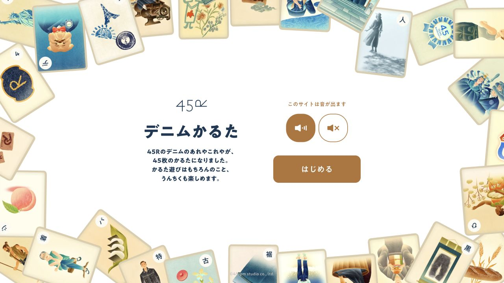
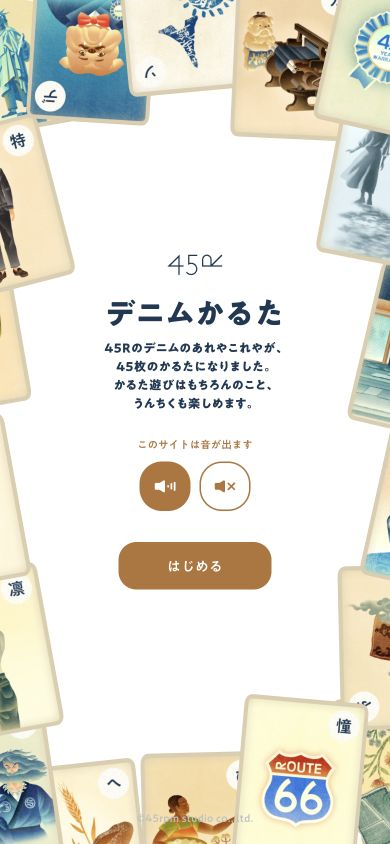

# 45R Denim Karuta · 品牌卡牌

- 标识：45r-denim-karuta
- 来源：https://45r.jp/ja/45denim-karuta/
- 研究日期：2026-10-05
- 适用范围：适合品牌知识、文化科普与轻量教学；需要成系列插画和可拆分的小知识。
- 证据范围：实际渲染截图、可见 DOM 样式采样及下文列明的操作；不是整站审计。
- 收录依据：[Awwwards Site of the Day：2025-03-30；Developer Award](https://www.awwwards.com/sites/45r-denim-karuta)。奖项针对当时的网站作品，不等于本次子页面或最新版本单独获奖。

插画卡牌围出中央留白，把牛仔知识转为可开始、可练习的小型互动体验。

## 视觉证据

桌面：1280×720，文档滚动坐标 (0, 0)。嵌套容器或画布的内部位置以截图为准。

窄屏：390×844，文档滚动坐标 (0, 0)。嵌套容器或画布的内部位置以截图为准。

- [补充截图：mobile-practice](screenshots/mobile-practice.jpg)：进入后的练习题与引导提示。

## 可观察的设计关系

1. **观察与分析**：大量卡牌沿四边形成框景，标题和开始按钮留在白色中心；数量感来自边缘重复，任务入口仍很简单。
2. **观察与分析**：标题用深蓝、操作用棕色，插画里的多种颜色不进入每个控件；控制色与叙事色有区分。
3. **观察与分析**：桌面说明与声音/开始操作左右并排，手机上下堆叠；练习页用气泡提示解释玩法，先教一次再进入正式内容。

## 实测参数

以下是对应 DOM 节点的计算样式与边界盒，单位为 CSS px；只作为定位证据，不自动等于整个组件或最终图形尺寸。截图与样式先后采样，动态过渡可能存在差异。

| 状态与元素 | 字号 / 行高 | 边界盒宽×高 | 圆角 | 证据 |
| --- | --- | --- | --- | --- |
| desktop · H1 デニムかるた | 40.7015px / 44.7716px | 244.2 × 44.8 | 0px | [elements[2]](evidence-desktop.json) |
| mobile · H1 デニムかるた | 29.8368px / 32.8204px | 179.0 × 32.8 | 0px | [elements[2]](evidence-mobile.json) |
| mobile · BUTTON はじめる | 14.0418px / 21.0626px | 152.7 × 47.4 | 17.9905px | [elements[7]](evidence-mobile.json) |

原始记录：[桌面样式](evidence-desktop.json) · [窄屏样式](evidence-mobile.json)。其他元素可能被祖先裁切、覆盖或属于隐藏状态，使用前须对照截图。

## 响应式与交互

已点击“はじめる”，进入练习题和引导气泡。未答完整套题，未验证积分、所有卡片或声音播放。

仅验证上述两种主视口，不推断 CSS 断点。未列明的交互、键盘路径、屏幕阅读器和 WCAG 合规均未验证。

## 迁移方法（设计建议）

把内容拆成一题一知识点，先做一道有反馈的练习题。插画需使用自有素材；不足时可用几何图标卡保持统一边框和尺度。中文界面可保留短标题、少量说明和显著开始按钮；音效默认提供明确开关，不让知识获取依赖声音。

## 避免照搬与已知限制

初始 DOM 同时存在尚未显示的练习元素；参数只取首页截图内标题、说明、开始按钮。此次记录日文版本，不能据此判断中文字体效果。

截图中的摄影、插画、商标和字体是研究证据，不是已授权的产品素材。迁移时使用自己的内容与合适授权的资源。
