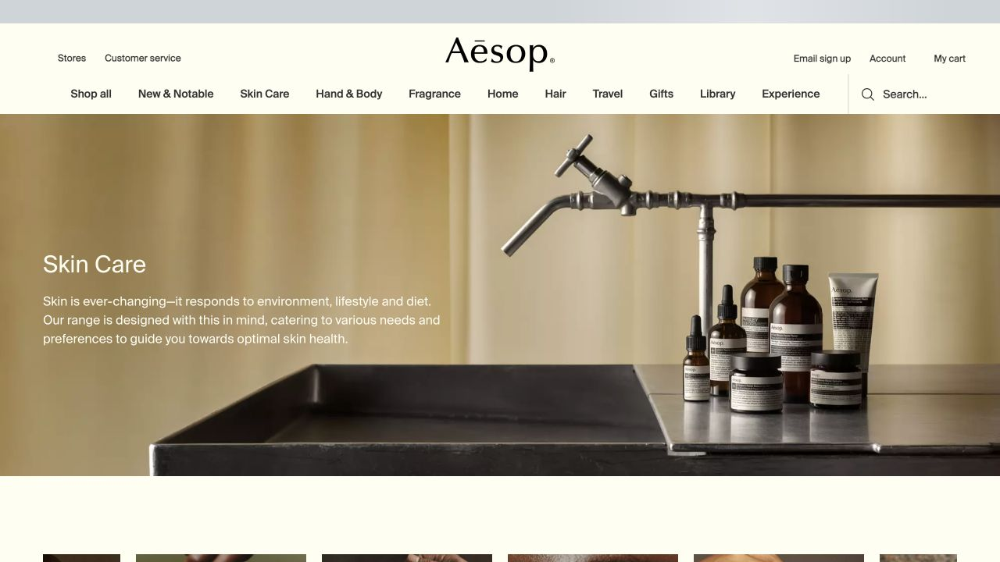
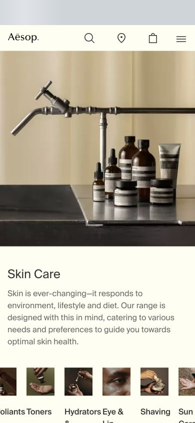

# Aesop Skin Care · 克制的影像式商品分类

- 标识：`aesop`
- 来源：https://www.aesop.com/skin-care.html
- 研究日期：2026-10-05
- 范围：所列页面的局部首屏，桌面 1280×720、窄屏 390×844。
- 适合：有高质量影像的护肤、生活方式产品分类。
- 不适合：缺少合适影像却只复制米色与留白的电商页。
- 素材依赖：统一美术方向的产品与场景照片。

## 视觉证据

截图观察：桌面大幅棕米色照片承托标题和说明；手机先呈现影像，再让文字与分类入口独立成块。

## 可观察的设计关系

- 照片承担氛围，文字与购买分类保持节制。
- 背景、肤色和木石色系接近，让商品分类页也有连贯的视觉语气。
- 分类入口在长页中承接探索，而非在首屏堆满所有 SKU。

## 实测参数

以下是指定节点的浏览器计算样式，不代表页面全局设计令牌。

| 视口 / 元素 | 字号 / 行高、字重、颜色 | 证据 |
| --- | --- | --- |
| 桌面 `h1`（Skin Care） | 30px / 39.9px，字重 400，颜色 rgb(255, 254, 242) | [桌面采样](evidence-desktop.json) |
| 窄屏 `h1`（Skin Care） | 24px / 31.92px，字重 400，颜色 rgb(51, 51, 51) | [窄屏采样](evidence-mobile.json) |

## 响应式与交互

桌面标题叠加在图像上，手机标题落在浅色文字区；字号从 30px 到 24px。未操作商品筛选和购物车。

## 迁移方法（设计建议）

先确立可授权的图片组和准确分类，再调节标题与图像关系。图上文字需要在不同照片上检查对比。

## 避免照搬与已知限制

仅记录 Skin Care 分类页的可见部分；摄影与品牌字标不能直接用作新站资产。 本次没有做完整页面、所有断点、键盘可达性或 WCAG 审计；原站可能在研究后变更。截图、商标与作品图仅作研究证据，不作为新站资产。
