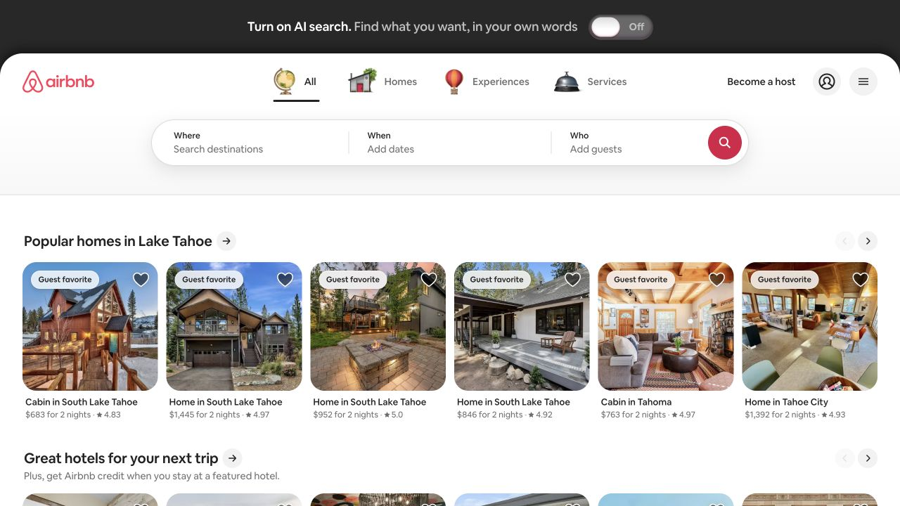
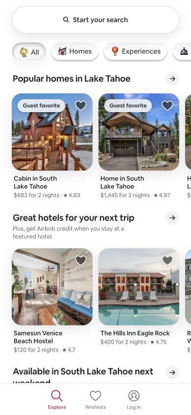

# Airbnb · 搜索驱动的住宿发现

- 标识：`airbnb`
- 来源：https://www.airbnb.com/
- 研究日期：2026-10-05
- 范围：所列页面的局部首屏，桌面 1280×720、窄屏 390×844。
- 适合：旅行、房源或多条件服务发现页。
- 不适合：没有可靠库存、地点或图片数据的展示站。
- 素材依赖：大量真实房源图片、位置、价格与可用性数据。

## 视觉证据

截图观察：桌面将搜索和分类入口置于上方，下面是横向房源组；手机把搜索收成大圆角入口、房源卡变成两列并保留底部导航。

## 可观察的设计关系

- 搜索是页面主要任务，目的地/时间/人数构成决策路径。
- 类别入口和房源卡片让用户可从浏览状态逐步收窄。
- 手机底部导航承担高频目的地，减少顶部堆叠。

## 实测参数

以下是指定节点的浏览器计算样式，不代表页面全局设计令牌。

| 视口 / 元素 | 字号 / 行高、字重、颜色 | 证据 |
| --- | --- | --- |
| 桌面 `button`（Search） | 14px / 20.02px，字重 400，颜色 rgb(34, 34, 34) | [桌面采样](evidence-desktop.json) |
| 窄屏 `button`（Start your search） | 14px / 18px，字重 500，颜色 rgb(34, 34, 34) | [窄屏采样](evidence-mobile.json) |

## 响应式与交互

390px 搜索变为圆角入口，卡片组密度调整；未输入条件、打开房源或验证筛选结果。

## 迁移方法（设计建议）

把搜索字段限定为用户真正会使用的条件；结果卡需展示对决策重要的图、地点、价格与可用性。

## 避免照搬与已知限制

房源、地理位置与价格是动态/可能个性化内容，截图不能作为固定模板数据。 本次没有做完整页面、所有断点、键盘可达性或 WCAG 审计；原站可能在研究后变更。截图、商标与作品图仅作研究证据，不作为新站资产。
