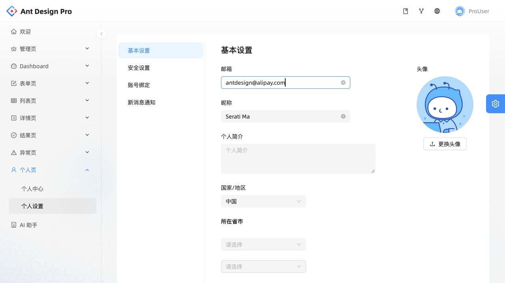
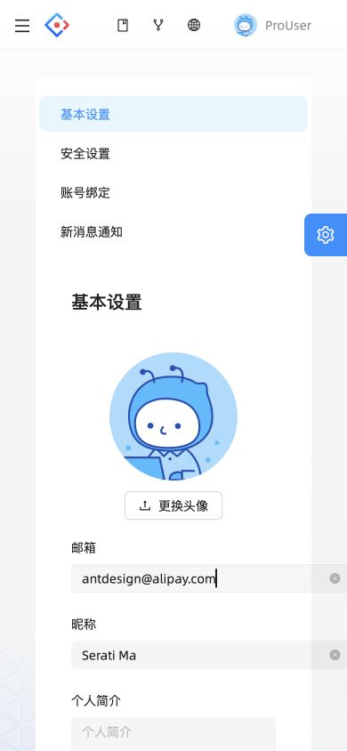

# Ant Design Pro · 中文账户设置

- 标识：ant-design-settings
- 来源：https://preview.pro.ant.design/account/settings
- 研究日期：2026-10-05
- 适用范围：适合中文管理后台及账户设置；这是官方演示数据，不是用户真实账户。
- 证据范围：实际渲染截图、可见 DOM 样式采样及下文列明的操作；不是整站审计。
- 收录依据：补齐实际任务场景；本案例不宣称获得设计奖。

全局导航、设置分类和编辑区分层，基本信息用表单，安全信息用状态列表。

## 视觉证据

桌面：1280×720，文档滚动坐标 (0, 0)。嵌套容器或画布的内部位置以截图为准。

窄屏：390×844，文档滚动坐标 (0, 0)。嵌套容器或画布的内部位置以截图为准。

- [补充截图：desktop-security](screenshots/desktop-security.jpg)：只查看安全设置分类，展示状态行与右侧动作。

## 可观察的设计关系

1. **观察与分析**：桌面外层导航管应用范围，内层菜单只管设置分类，右边显示表单；两级导航各自稳定，避免每个设置项都变成独立全页。
2. **观察与分析**：基本设置的标签在字段上方，头像区独立放在右侧；内容性质不同就分组，而不是让上传按钮挤进文字字段行。
3. **观察与分析**：切到安全设置后，布局变为“名称与状态在左、动作在右”的分隔行；无需输入的设置不硬套表单卡片。

## 实测参数

以下是对应 DOM 节点的计算样式与边界盒，单位为 CSS px；只作为定位证据，不自动等于整个组件或最终图形尺寸。截图与样式先后采样，动态过渡可能存在差异。

| 状态与元素 | 字号 / 行高 | 边界盒宽×高 | 圆角 | 证据 |
| --- | --- | --- | --- | --- |
| desktop · H1 Ant Design Pro | 18px / 32px | 130.2 × 32.0 | 0px | [elements[5]](evidence-desktop.json) |
| desktop · A 个人设置 | 14px / 40px | 56.0 × 40.0 | 0px | [elements[2]](evidence-desktop.json) |
| mobile · BUTTON 语言切换 | 14px / 56px | 36.0 × 36.0 | 6px | [elements[3]](evidence-mobile.json) |

原始记录：[桌面样式](evidence-desktop.json) · [窄屏样式](evidence-mobile.json)。其他元素可能被祖先裁切、覆盖或属于隐藏状态，使用前须对照截图。

## 响应式与交互

已切中文、进入个人设置，并从基本设置切到安全设置。没有点击更新资料、更换头像、修改密码或绑定。窄屏外侧栏收起，内部分类和头像纵向排布。

仅验证上述两种主视口，不推断 CSS 断点。未列明的交互、键盘路径、屏幕阅读器和 WCAG 合规均未验证。

## 迁移方法（设计建议）

先按用户心智拆成基本资料、安全、绑定、通知；每类只保留相关动作。中文字段标签尽量短，辅助说明放在输入附近。手机把二级分类改为紧凑选择器，避免整块纵向菜单占掉首屏；宽输入使用 max-width:100%，头像可缩小到摘要行。

## 避免照搬与已知限制

窄屏截图中邮箱输入超出内容卡宽度，采样与截图间也有异步加载差异；不将早期 MAIN 高度视为稳定表单高度。数据是演示站预置样例，未验证真实提交、权限或联动省市。

截图中的摄影、插画、商标和字体是研究证据，不是已授权的产品素材。迁移时使用自己的内容与合适授权的资源。
