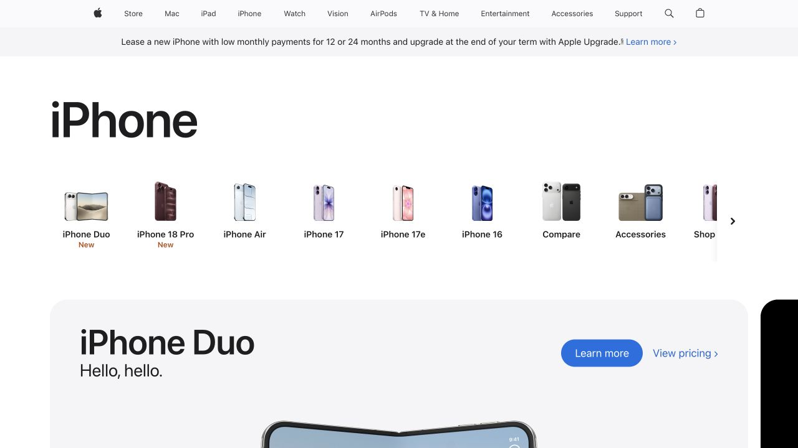
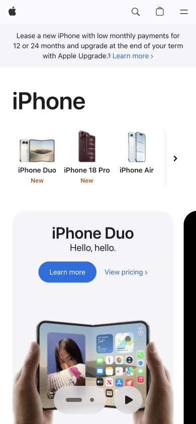

# Apple iPhone · 留白与产品阵列

- 标识：`apple-iphone`
- 来源：https://www.apple.com/iphone/
- 研究日期：2026-10-05
- 范围：所列页面的局部首屏，桌面 1280×720、窄屏 390×844。
- 适合：高质量实物产品线、品牌产品目录。
- 不适合：无产品图或需要在首屏展示大量规格的后台页面。
- 素材依赖：高清产品渲染/照片和准确型号信息。

## 视觉证据

截图观察：桌面以巨大 “iPhone” 标题和横向机型导航开场，随后进入产品画面；窄屏标题缩小，机型入口可横向浏览。

## 可观察的设计关系

- 标题以尺度和留白建立品牌节奏，产品导航再承接具体选择。
- 黑白基调把注意力让给产品图和少量行动。
- 手机端压缩标题与导航密度，而不是等比例缩小整个桌面版。

## 实测参数

以下是指定节点的浏览器计算样式，不代表页面全局设计令牌。

| 视口 / 元素 | 字号 / 行高、字重、颜色 | 证据 |
| --- | --- | --- |
| 桌面 `h1`（iPhone） | 80px / 84px，字重 600，颜色 rgb(29, 29, 31) | [桌面采样](evidence-desktop.json) |
| 窄屏 `h1`（iPhone） | 48px / 52.0077px，字重 600，颜色 rgb(29, 29, 31) | [窄屏采样](evidence-mobile.json) |

## 响应式与交互

桌面 80px H1，窄屏 48px；机型导航在手机端横向排布。未操作购买、对比或菜单。

## 迁移方法（设计建议）

有真实产品阵列时，可先用清晰的产品路径，再用大图和少量文案逐步深入。中文标题与产品名需重新排版。

## 避免照搬与已知限制

仅为当前 iPhone 类别页首屏；图片、型号和活动会更新。地区提示关闭后截图，不把其视作设计主体。 本次没有做完整页面、所有断点、键盘可达性或 WCAG 审计；原站可能在研究后变更。截图、商标与作品图仅作研究证据，不作为新站资产。
