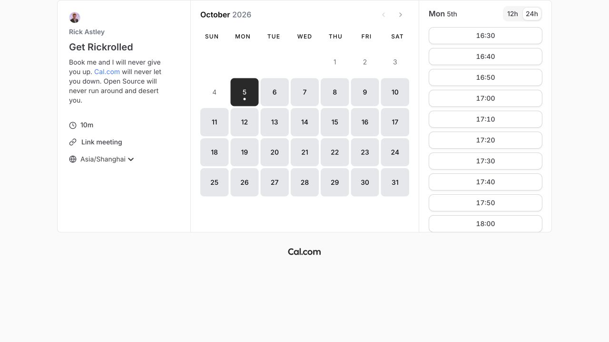
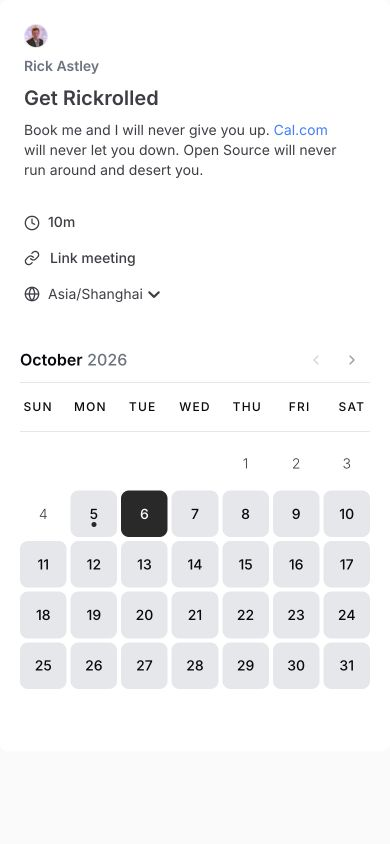

# Cal.com · 预约日历示例

- 标识：cal-booking
- 来源：https://app.cal.com/rick/get-rick-rolled/embed?layout=month_view&useSlotsViewOnSmallScreen=true&embedType=inline&embed=embed-inline-demo
- 研究日期：2026-10-05
- 适用范围：适合咨询、活动和服务预约；需要真实时区、可用日期和时段数据。
- 证据范围：实际渲染截图、可见 DOM 样式采样及下文列明的操作；不是整站审计。
- 收录依据：补齐实际任务场景；本案例不宣称获得设计奖。

桌面将活动说明、日期和时段分三栏，选定日期后只更新对应的时段列表。

## 视觉证据

桌面：1280×720，文档滚动坐标 (0, 0)。嵌套容器或画布的内部位置以截图为准。

窄屏：390×844，文档滚动坐标 (0, 0)。嵌套容器或画布的内部位置以截图为准。

- [补充截图：desktop-date](screenshots/desktop-date.jpg)：选择另一日期后，右侧显示新日期与时段。

## 可观察的设计关系

1. **观察与分析**：桌面左栏解释活动和时区，中栏月历，右栏当天时段；选择顺序与空间顺序一致，读者不必来回跳页。
2. **观察与分析**：当前日期用深色块，其他可选日期用浅色块，过去日期明显变弱；状态差异以填充和可用性表达，数字字号保持一致。
3. **观察与分析**：日期格桌面约 59px、窄屏约 47px，手机先显示说明再显示月历；活动名仍是 20px，靠重排而不是全面缩字适配。

## 实测参数

以下是对应 DOM 节点的计算样式与边界盒，单位为 CSS px；只作为定位证据，不自动等于整个组件或最终图形尺寸。截图与样式先后采样，动态过渡可能存在差异。

| 状态与元素 | 字号 / 行高 | 边界盒宽×高 | 圆角 | 证据 |
| --- | --- | --- | --- | --- |
| desktop · H1 Get Rickrolled | 20px / 28px | 232.0 × 28.0 | 0px | [elements[3]](evidence-desktop.json) |
| desktop · BUTTON 1 | 14px / 20px | 59.3 × 59.3 | 8px | [elements[10]](evidence-desktop.json) |
| mobile · BUTTON 1 | 14px / 20px | 46.6 × 46.6 | 8px | [elements[10]](evidence-mobile.json) |

原始记录：[桌面样式](evidence-desktop.json) · [窄屏样式](evidence-mobile.json)。其他元素可能被祖先裁切、覆盖或属于隐藏状态，使用前须对照截图。

## 响应式与交互

从官方 demo.cal.com 的 Inline embed 找到此演示组件，选择 10 月 6 日后 URL 和右侧日期变更，时段列表更新。没有选时段、填写信息或创建预约。

仅验证上述两种主视口，不推断 CSS 断点。未列明的交互、键盘路径、屏幕阅读器和 WCAG 合规均未验证。

## 迁移方法（设计建议）

把活动说明压缩到时长、地点/方式、时区和取消规则。日期选中后保留选中状态，再显示可用时段；空时段给明确原因和其他日期入口。中文日期标签需本地化，不能只改按钮文案而忽略时区。颜色用一主色即可，不必复制 Cal 品牌。

## 避免照搬与已知限制

窄屏只观察活动说明与月历，后续时段选择未完整覆盖。日期和可用时段会随时间改变。此处“Rick Astley”是官方嵌入演示内容，不是用户要预约的人。

截图中的摄影、插画、商标和字体是研究证据，不是已授权的产品素材。迁移时使用自己的内容与合适授权的资源。
