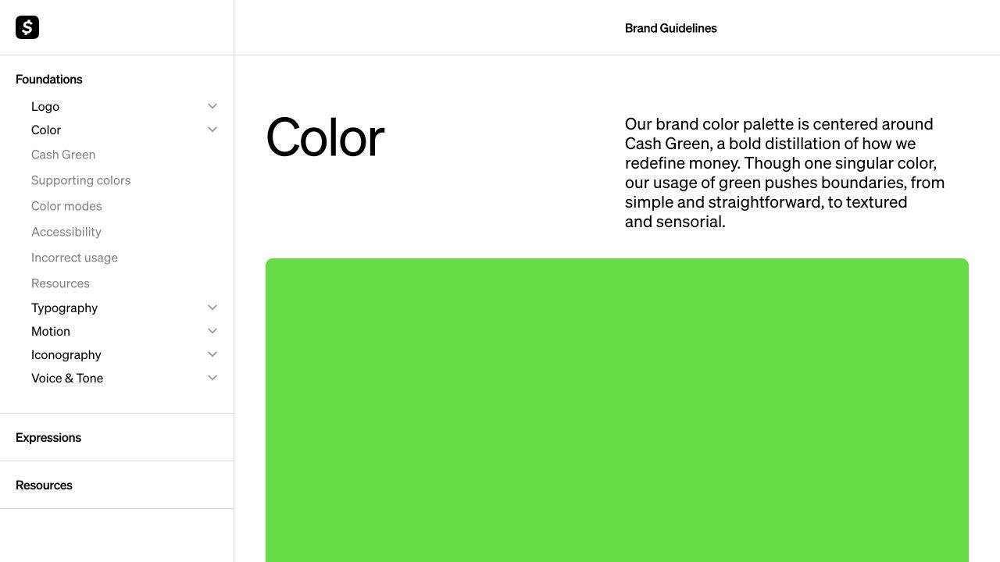
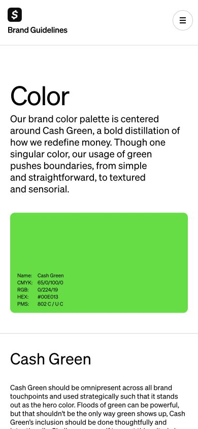

# Cash App · 颜色规范

- 标识：cash-app-guidelines
- 来源：https://design.cash.app/color
- 研究日期：2026-10-05
- 适用范围：适合设计系统和品牌规范文档；不需要把品牌绿迁移到其他产品。
- 证据范围：实际渲染截图、可见 DOM 样式采样及下文列明的操作；不是整站审计。
- 收录依据：[2026 Webby Winner 与 People’s Voice：Financial Services & Banking（整个品牌指南站）](https://winners.webbyawards.com/winners/websites-and-mobile-sites/general-desktop-mobile-sites/financial-services-banking)。奖项针对当时的网站作品，不等于本次子页面或最新版本单独获奖。

固定规范目录配合分栏说明、大色样和应用照片，把品牌规则写成可查阅手册。

## 视觉证据

桌面：1280×720，文档滚动坐标 (0, 0)。嵌套容器或画布的内部位置以截图为准。

窄屏：390×844，文档滚动坐标 (0, 0)。嵌套容器或画布的内部位置以截图为准。

- [补充截图：desktop-content](screenshots/desktop-content.jpg)：规则说明与真实应用照片相邻。

## 可观察的设计关系

1. **观察与分析**：桌面左侧约 300px 导航固定，正文标题与说明分成两栏，色样跨越正文宽度；查找、解释和展示三个层次清楚分工。
2. **观察与分析**：Color 标题 68px，介绍段落 21px，而详细说明明显更小；字号变化对应“章节—概述—规则”，不是每块都做同级卡片。
3. **观察与分析**：大色样之后才出现材质和人物照片，先定义颜色，再展示使用方式；窄屏转为标题、说明、色样的单列顺序。

## 实测参数

以下是对应 DOM 节点的计算样式与边界盒，单位为 CSS px；只作为定位证据，不自动等于整个组件或最终图形尺寸。截图与样式先后采样，动态过渡可能存在差异。

| 状态与元素 | 字号 / 行高 | 边界盒宽×高 | 圆角 | 证据 |
| --- | --- | --- | --- | --- |
| desktop · P Color | 68px / 68px | 440.0 × 68.0 | 0px | [elements[19]](evidence-desktop.json) |
| desktop · P Our brand color | 21px / 25px | 440.0 × 150.0 | 0px | [elements[20]](evidence-desktop.json) |
| mobile · P Color | 52px / 52px | 350.0 × 52.0 | 0px | [elements[4]](evidence-mobile.json) |
| mobile · P Our brand color | 19px / 23px | 350.0 × 161.0 | 0px | [elements[5]](evidence-mobile.json) |

原始记录：[桌面样式](evidence-desktop.json) · [窄屏样式](evidence-mobile.json)。其他元素可能被祖先裁切、覆盖或属于隐藏状态，使用前须对照截图。

## 响应式与交互

已直接打开 Color 子页并滚动查看 Cash Green 与 Supporting colors；窄屏目录收为右上菜单。主页加载表现不稳定，因此正文以子页为范围，未验证菜单和资源下载。

仅验证上述两种主视口，不推断 CSS 断点。未列明的交互、键盘路径、屏幕阅读器和 WCAG 合规均未验证。

## 迁移方法（设计建议）

把任何品牌规范拆为定义、使用原则、正确实例、错误实例。用自己的品牌色替换色样，照片显示颜色如何落在真实物品上；不要只写十六进制列表。中文可用系统黑体，保留章节大字和正文舒适行宽；目录较短时不必占用 300px。

## 避免照搬与已知限制

页面标注 HEX 与截图呈色不应混为一谈，颜色可能经过图层或渲染处理；本研究不据截图像素反推品牌色。未审计对比度或完整规范。

截图中的摄影、插画、商标和字体是研究证据，不是已授权的产品素材。迁移时使用自己的内容与合适授权的资源。
