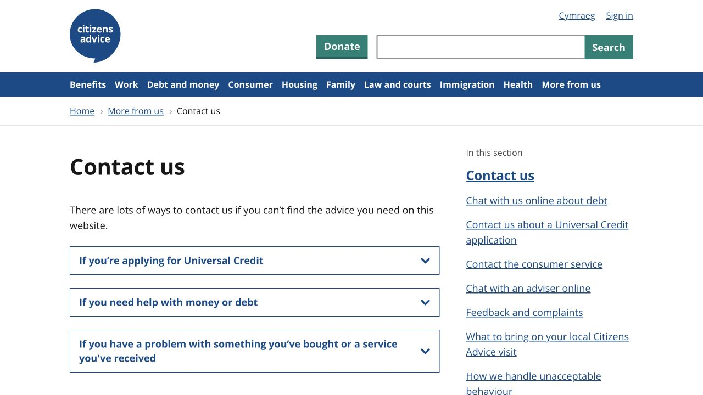
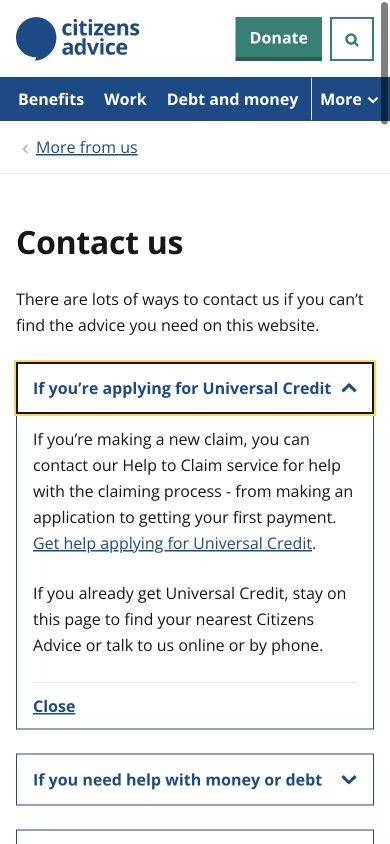

# Citizens Advice · 服务分流指南

- 标识：citizens-advice-service
- 来源：https://www.citizensadvice.org.uk/about-us/contact-us/
- 研究日期：2026-10-05
- 适用范围：适合机构服务、专业咨询和帮助中心；参考信息组织，不作为法律或福利建议来源。
- 收录依据：补齐实际任务与视觉组织方式；本案例不宣称获得设计奖。
- 证据范围：实际渲染截图、可见 DOM 采样及下文列明的操作；不是整站审计。

用用户问题命名可展开分类，按需求分流服务渠道，桌面旁栏辅助定位。

## 视觉证据

桌面：1280×720，文档滚动坐标 (0, 0)。嵌套容器内部位置以截图为准。

窄屏：390×844，文档滚动坐标 (0, 0)。嵌套容器内部位置以截图为准。

- [补充截图：desktop-expanded](screenshots/desktop-expanded.jpg)：展开一个需求分类后的说明、服务链接与关闭动作。

## 可观察的设计关系

1. **观察与分析**：Contact us 标题后先出现“正在申请某项服务”“需要金钱/债务帮助”等需求句，而不是内部部门名称；用户可以从自己的问题选择路径。
2. **观察与分析**：桌面左侧正文约 673px，右侧章节导航约 305px；具体操作解释与全站位置分开，服务入口不被复杂机构目录吞没。
3. **观察与分析**：折叠标题本身覆盖整行，展开后说明、实际服务链接和 Close 留在原组；读者能确认刚选择的类别并随时收回，不丢失上下文。
4. **观察与分析**：标题桌面 40px/52px，手机 32px/40px；折叠行从 18px 降至 16px，但主要短行仍高 52px，保持可辨认的触控入口。
5. **观察与分析**：手机主列约 358px，搜索收为图标、导航出现 More，服务问题继续单列；专业感来自清楚的路径和稳定层级，不依赖大图营销。

## 实测参数

以下是对应节点的计算样式与边界盒，单位为 CSS px；不是整页通用 token，也不证明触控区域或最终图形尺寸。数值应与同状态截图对照。

| 状态与元素 | 字号 / 行高 | 边界盒宽×高 | 圆角 | 证据 |
| --- | --- | --- | --- | --- |
| desktop · H1 Contact us | 40px / 52px | 673.3 × 52.0 | 0px | [elements[21]](evidence-desktop.json) |
| desktop · BUTTON If you’re applying | 18px / 26px | 673.3 × 52.0 | 0px | [elements[24]](evidence-desktop.json) |
| mobile · H1 Contact us | 32px / 40px | 358.0 × 40.0 | 0px | [elements[11]](evidence-mobile.json) |
| mobile · BUTTON If you’re applying | 16px / 26px | 358.0 × 52.0 | 0px | [elements[14]](evidence-mobile.json) |

原始记录：[桌面样式](evidence-desktop.json) · [窄屏样式](evidence-mobile.json)。采样只包含部分节点，祖先裁切、覆盖、字体加载与异步状态需对照截图判断。

## 响应式与交互

拒绝非必要 Cookie 并关闭确认提示；展开 Universal Credit 分类，观察说明及关闭入口，手机继承展开状态。截图中按钮点击后的焦点轮廓可见，但未用键盘验证完整焦点路径。没有发起咨询、电话、捐赠或填写资料。

仅验证上文列出的视口与操作，不推断 CSS 断点；未列明的键盘、屏幕阅读器及 WCAG 合规均未验证。

## 迁移方法（设计建议）

先用访客的需求给渠道分组，再在展开区说明适用对象、需要准备的资料、可用时间及下一步。重要时效和风险说明不能只藏在折叠内容中。中文标签写成短句，长问题允许换行；桌面旁栏可选，手机先保留任务路径。系统黑体与普通分隔线就够用，关键是联系人和服务规则真实有效。

## 避免照搬与已知限制

只研究 Contact us 的分流结构和一个展开分类，不验证源站服务资格、时效或建议准确性。手机截图未覆盖后续全部渠道与旁栏，不据此声称其他内容被删除。没有联系表单提交与成功反馈证据。

截图中的摄影、插画、商标和字体是研究证据，不是已授权的产品素材。迁移时使用自己的内容与合适授权的资源。
