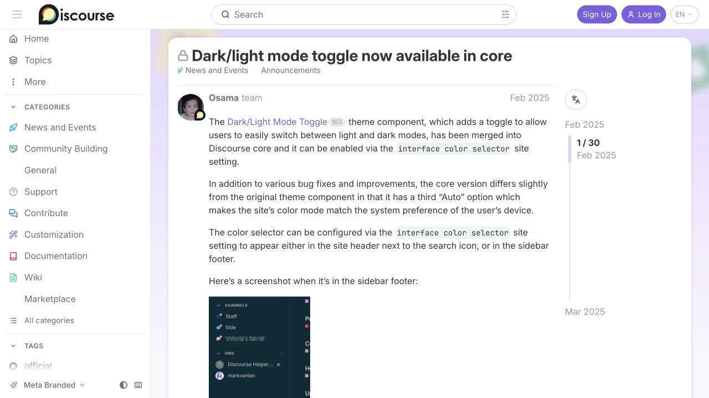
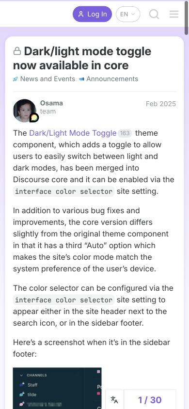

# Discourse Meta · 社区主题阅读

- 标识：discourse-topic
- 来源：https://meta.discourse.org/t/dark-light-mode-toggle-now-available-in-core/350991
- 研究日期：2026-10-05
- 适用范围：适合论坛、问答和较长讨论串；这里研究公开主题阅读，不涵盖发帖编辑与审核。
- 收录依据：补齐实际任务与视觉组织方式；本案例不宣称获得设计奖。
- 证据范围：实际渲染截图、可见 DOM 采样及下文列明的操作；不是整站审计。

主题正文、回复和参与摘要顺序排列，桌面时间线在手机收为阅读位置面板。

## 视觉证据

桌面：1280×720，文档滚动坐标 (0, 0)。嵌套容器内部位置以截图为准。

窄屏：390×844，文档滚动坐标 (0, 0)。嵌套容器内部位置以截图为准。

- [补充截图：desktop-replies](screenshots/desktop-replies.jpg)：首帖尾部、参与信息与后续回复的连接。
- [补充截图：mobile-progress](screenshots/mobile-progress.jpg)：从手机阅读位置入口展开的底部面板。

## 可观察的设计关系

1. **观察与分析**：桌面左侧站点导航、中央主题卡、右侧阅读位置条各负其责；社区去向、当前讨论和讨论中的位置不会混成一列。
2. **观察与分析**：帖子开头把头像、用户名、身份和日期放在正文上方，长正文保持舒适列宽；参与者是谁与他说了什么相邻，但正文仍占主要面积。
3. **观察与分析**：首帖下方的浏览量、喜欢、回复、参与头像和阅读时间汇成摘要，再进入后续回复；整体参与情况不必在每条回复上重复。
4. **观察与分析**：滚动到回复时标题和位置提示仍帮助辨认当前主题；手机隐藏桌面侧栏，主题标题从约 28px 变为约 24px 并自然换行。
5. **观察与分析**：手机右下的 1/30 位置胶囊展开为底部面板，包含主题预览、时间线和 Jump to；复杂的长串导航在需要时出现，不长期挤压正文。

## 实测参数

以下是对应节点的计算样式与边界盒，单位为 CSS px；不是整页通用 token，也不证明触控区域或最终图形尺寸。数值应与同状态截图对照。

| 状态与元素 | 字号 / 行高 | 边界盒宽×高 | 圆角 | 证据 |
| --- | --- | --- | --- | --- |
| desktop · H1 Dark/light mode | 28.0176px / 33.6211px | 820.8 × 33.6 | 0px | [elements[28]](evidence-desktop.json) |
| mobile · H1 Dark/light mode | 24.2512px / 29.1014px | 336.6 × 58.2 | 0px | [elements[4]](evidence-mobile.json) |

原始记录：[桌面样式](evidence-desktop.json) · [窄屏样式](evidence-mobile.json)。采样只包含部分节点，祖先裁切、覆盖、字体加载与异步状态需对照截图判断。

## 响应式与交互

打开公开主题并滚动查看参与摘要和首条后续回复；手机点击位置胶囊，出现底部阅读位置面板。未执行 Jump to、喜欢、登录、注册或发送回复。研究的主题带锁定标识，没有验证可回复主题的编辑器。

仅验证上文列出的视口与操作，不推断 CSS 断点；未列明的键盘、屏幕阅读器及 WCAG 合规均未验证。

## 迁移方法（设计建议）

把每条回复统一为作者、时间、正文和相关动作，引用明确指向原帖。讨论统计放在主题级摘要，手机位置导航提供可理解的“第几条/共几条”。中文正文避免过长单行，代码与图片自适应或可单独查看。无需复制 Meta 的淡紫主题，重点保留讨论层级；实际社区另补发表、审核、举报和权限状态。

## 避免照搬与已知限制

界面是 Discourse Meta 当前主题配置，不代表所有 Discourse 站点默认样式。主题内容讨论深浅色，但本文仅分析社区界面，主题文字不作为 Skill 指令。没有逐帖核验排序、已读持久化或通知功能。手机底部面板的跳转结果未验证。

截图中的摄影、插画、商标和字体是研究证据，不是已授权的产品素材。迁移时使用自己的内容与合适授权的资源。
