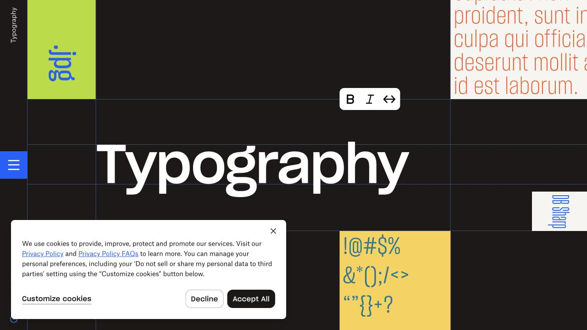
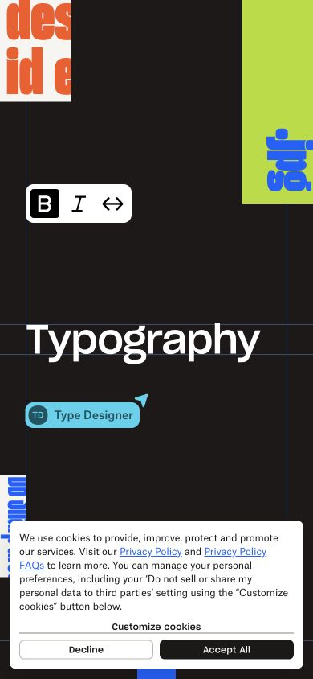

# Dropbox Brand · 交互字样

- 标识：dropbox-brand
- 来源：https://brand.dropbox.com/typography
- 研究日期：2026-10-05
- 适用范围：适合字体、品牌手册和视觉实验展示；不适合长文阅读或高频业务操作。
- 证据范围：实际渲染截图、可见 DOM 样式采样及下文列明的操作；不是整站审计。
- 收录依据：[2025 Webby Winner：Best User Experience、Best Responsive/Adaptive Design for Mobile；Visual Design–Function 仅为提名](https://winners.webbyawards.com/2025/websites-and-mobile-sites/features-design/best-visual-design-function/333662/dropbox-brand-website)。奖项针对当时的网站作品，不等于本次子页面或最新版本单独获奖。

把品牌字体做成可操作的展品，巨幅字样与彩色样本分布在深色网格中。

## 视觉证据

桌面：1280×720，文档滚动坐标 (0, 0)。嵌套容器或画布的内部位置以截图为准。

窄屏：390×844，文档滚动坐标 (0, 0)。嵌套容器或画布的内部位置以截图为准。

- [补充截图：desktop-bold](screenshots/desktop-bold.jpg)：点击加粗后的字样，左下 Cookie 提示仍在。

## 可观察的设计关系

1. **观察与分析**：中间大字样占据连续网格，周围小样本以不同颜色和字形提供对照；同一主题用尺度差异形成展览感。
2. **观察与分析**：B、I、宽度控制悬在样本附近，读者能直接改变眼前对象；比把所有规则写成段落更能解释变量。
3. **观察与分析**：窄屏重新组织样本与工具的位置，保留大字样的张力；这依赖展示内容可被裁切，不适用于重要正文。

## 实测参数

以下是对应 DOM 节点的计算样式与边界盒，单位为 CSS px；只作为定位证据，不自动等于整个组件或最终图形尺寸。截图与样式先后采样，动态过渡可能存在差异。

| 状态与元素 | 字号 / 行高 | 边界盒宽×高 | 圆角 | 证据 |
| --- | --- | --- | --- | --- |
| desktop · BUTTON Bold weight toggle | 14px / 20px | 36.0 × 36.0 | 4px | [elements[4]](evidence-desktop.json) |
| mobile · BUTTON Bold weight toggle | 14px / 20px | 36.0 × 36.0 | 4px | [elements[4]](evidence-mobile.json) |

原始记录：[桌面样式](evidence-desktop.json) · [窄屏样式](evidence-mobile.json)。其他元素可能被祖先裁切、覆盖或属于隐藏状态，使用前须对照截图。

## 响应式与交互

已点击 Bold weight toggle 并保存变粗后的状态。移动图继承该状态；斜体、字宽、完整导航和键盘操作未验证。

仅验证上述两种主视口，不推断 CSS 断点。未列明的交互、键盘路径、屏幕阅读器和 WCAG 合规均未验证。

## 迁移方法（设计建议）

可把主标题换成自有字体或品牌形状，旁边只保留两三个有可见反馈的控制。优先保留“操作与样本相邻”的关系。没有可变字体时用常规/粗体对比，不冒充支持字宽轴；中文用有授权的字体并降低字数。

## 避免照搬与已知限制

Cookie 浮层未能关闭，左下或底部区域被遮挡。大标题含变换和分字层，DOM font-size 29.2px 不等于最终视觉字号；仅将按钮尺寸当可靠控件实测。

截图中的摄影、插画、商标和字体是研究证据，不是已授权的产品素材。迁移时使用自己的内容与合适授权的资源。
