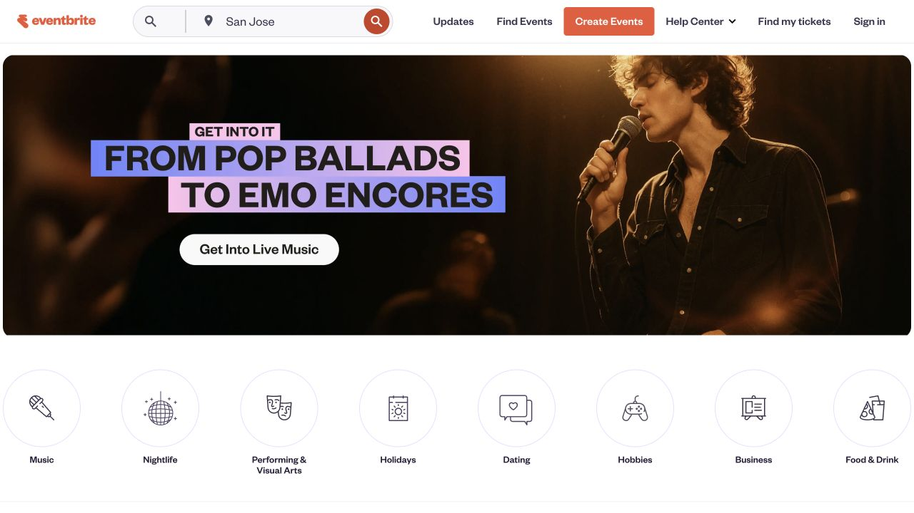

# Eventbrite · 地点与时间导向的活动发现

- 标识：`eventbrite`
- 来源：https://www.eventbrite.com/
- 研究日期：2026-10-05
- 范围：所列页面的局部首屏，桌面 1280×720、窄屏 390×844。
- 适合：本地活动、讲座、展览与票务探索。
- 不适合：活动很少却复制复杂筛选和分类结构。
- 素材依赖：活动海报、地点、时间和票务状态。

## 视觉证据

截图观察：搜索与地点入口之后是活动推广横幅、圆形类别入口和时间筛选；手机进一步压缩顶部入口。

## 可观察的设计关系

- 地点和时间是用户首先需要确定的查询条件。
- 活动类别通过图标和文本形成快捷入口。
- 列表筛选紧接发现内容，帮助从灵感转向实际选择。

## 实测参数

以下是指定节点的浏览器计算样式，不代表页面全局设计令牌。

| 视口 / 元素 | 字号 / 行高、字重、颜色 | 证据 |
| --- | --- | --- |
| 桌面 `button`（All） | 14px / 20px，字重 500，颜色 rgb(54, 89, 227) | [桌面采样](evidence-desktop.json) |
| 窄屏 `button`（All） | 16px / 24px，字重 500，颜色 rgb(54, 89, 227) | [窄屏采样](evidence-mobile.json) |

## 响应式与交互

手机上搜索入口压缩，类别入口仍保留；“All”筛选按钮样式在两种视口不同。未实际搜索、订票或筛选。

## 迁移方法（设计建议）

先确定活动密度和用户决策字段，再排搜索、类别和时间筛选；卡片里时间和地点不能被海报压过。

## 避免照搬与已知限制

首页活动、地点与推广横幅动态变化；本记录不覆盖支付或退票。 本次没有做完整页面、所有断点、键盘可达性或 WCAG 审计；原站可能在研究后变更。截图、商标与作品图仅作研究证据，不作为新站资产。
