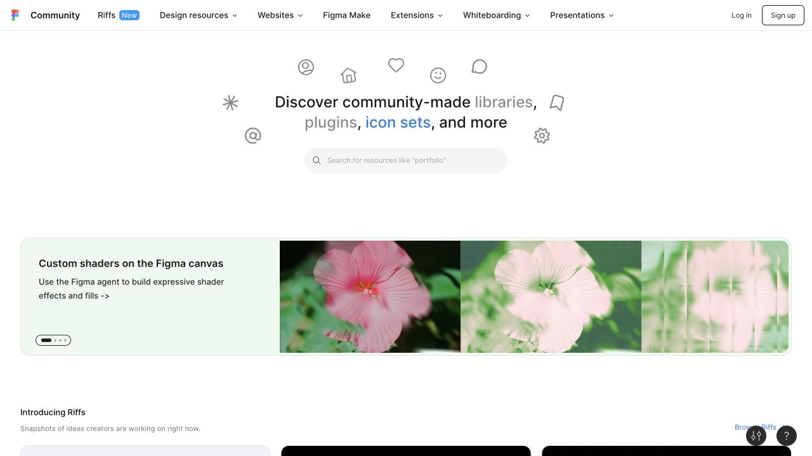
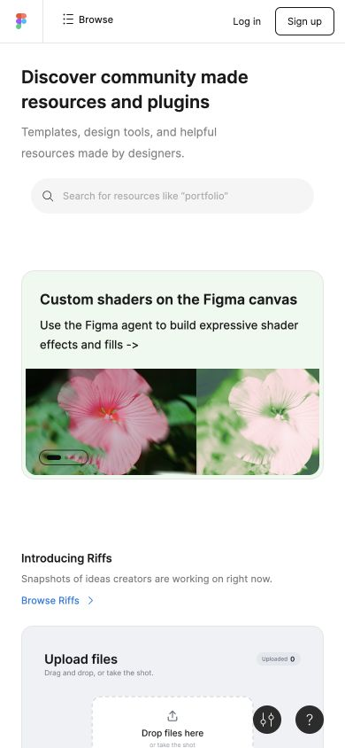

# Figma Community · 资源搜索与精选并置

- 标识：`figma-community`
- 来源：https://www.figma.com/community
- 研究日期：2026-10-05
- 范围：所列页面的局部首屏，桌面 1280×720、窄屏 390×844。
- 适合：插件、模板、设计资源、素材社区。
- 不适合：资源数量不足却复制大型市场入口。
- 素材依赖：真实资源预览、作者与类别元数据。

## 视觉证据

截图观察：中性背景与居中搜索句引导查找，下面是精选资源横幅和卡片；手机收缩导航并垂直浏览。

## 可观察的设计关系

- 搜索意图与策展发现并列，照顾目标明确和随意浏览两类用户。
- 资源预览面积较大，但作者、类型和行动仍需要可读。
- 界面颜色克制，使来自不同创作者的资源不互相争夺。

## 实测参数

以下是指定节点的浏览器计算样式，不代表页面全局设计令牌。

| 视口 / 元素 | 字号 / 行高、字重、颜色 | 证据 |
| --- | --- | --- |
| 桌面 `h1`（Discover） | 24px / 32px，字重 500，颜色 rgba(0, 0, 0, 0.898) | [桌面采样](evidence-desktop.json) |
| 窄屏 `h1`（Discover） | 20px / 28px，字重 600，颜色 rgba(0, 0, 0, 0.898) | [窄屏采样](evidence-mobile.json) |

## 响应式与交互

标题桌面 24px、手机 20px；手机导航显著压缩。未下载、筛选或安装资源。

## 迁移方法（设计建议）

先定义资源类型、搜索字段和预览信息；精选位应基于真实内容，避免伪造作者和下载量。

## 避免照搬与已知限制

精选资源和活动横幅会更新；研究范围为社区首页，不代表编辑器设计系统。 本次没有做完整页面、所有断点、键盘可达性或 WCAG 审计；原站可能在研究后变更。截图、商标与作品图仅作研究证据，不作为新站资产。
