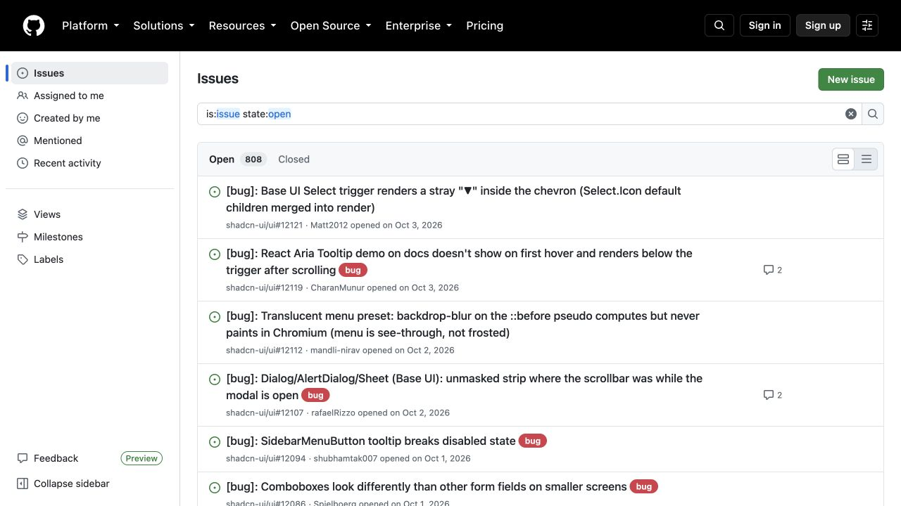
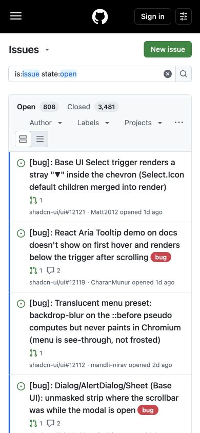

# GitHub Issues · 高密度任务列表

- 标识：`github-issues`
- 来源：https://github.com/shadcn-ui/ui/issues
- 研究日期：2026-10-05
- 范围：所列页面的局部首屏，桌面 1280×720、窄屏 390×844。
- 适合：工单、问题追踪、审批和运营列表。
- 不适合：只需展示品牌故事的营销页。
- 素材依赖：状态图标、标签和真实字段；无需大型装饰图片。

## 视觉证据

截图观察：桌面版有全局导航、局部侧栏、搜索/状态筛选和密集问题行；窄屏收起侧栏，列表成为主轴。

## 可观察的设计关系

- 问题标题、状态、标签和时间等元数据在同一行内分层，便于快速扫读。
- 全局导航与工作区导航分级，避免把所有入口挤进一个页眉。
- 窄屏保留核心搜索与问题列表，次级导航退后。

## 实测参数

以下是指定节点的浏览器计算样式，不代表页面全局设计令牌。

| 视口 / 元素 | 字号 / 行高、字重、颜色 | 证据 |
| --- | --- | --- |
| 桌面 `h1`（Issues） | 20px / 30px，字重 600，颜色 rgb(31, 35, 40) | [桌面采样](evidence-desktop.json) |
| 窄屏 `h3`（[bug]） | 16px / 24px，字重 500，颜色 rgb(31, 35, 40) | [窄屏采样](evidence-mobile.json) |

## 响应式与交互

390px 下侧栏不在首屏，问题行纵向排布。未实际操作筛选、搜索、标签与键盘导航。

## 迁移方法（设计建议）

先定义每行的主字段和辅助字段，再确定筛选与批量操作位置。颜色应配合文字与图标表达状态，不单靠颜色。

## 避免照搬与已知限制

仅研究公开 Issues 列表；未覆盖新建问题、评论、权限或完整 GitHub 设计系统。 本次没有做完整页面、所有断点、键盘可达性或 WCAG 审计；原站可能在研究后变更。截图、商标与作品图仅作研究证据，不作为新站资产。
