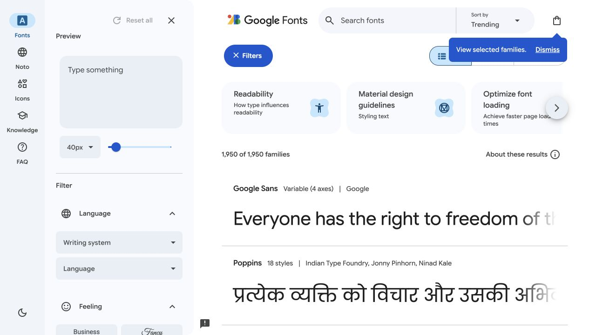
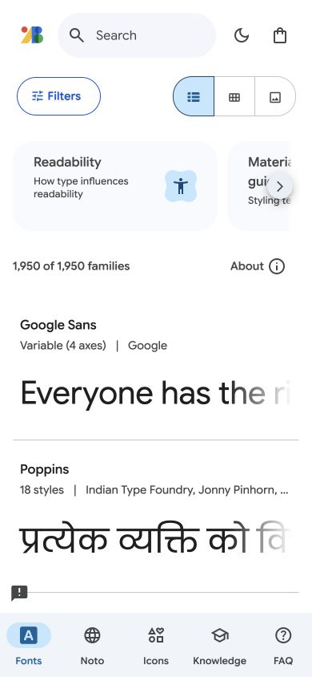

# Google Fonts · 字体发现

- 标识：google-fonts
- 来源：https://fonts.google.com/
- 研究日期：2026-10-05
- 适用范围：适合字体、图标等可直接预览的资源库；不适合只有几项资源的小页面。
- 证据范围：实际渲染截图、可见 DOM 样式采样及下文列明的操作；不是整站审计。
- 收录依据：[2024 Webby Winner：Best User Interface](https://winners.webbyawards.com/winners/websites-and-mobile-sites/features-design/best-user-interface)。奖项针对当时的网站作品，不等于本次子页面或最新版本单独获奖。

侧栏负责筛选，主区域用真实字样直接比较字体，窄屏将筛选收进抽屉。

## 视觉证据

桌面：1280×720，文档滚动坐标 (0, 0)。嵌套容器或画布的内部位置以截图为准。

窄屏：390×844，文档滚动坐标 (0, 0)。嵌套容器或画布的内部位置以截图为准。

- [补充截图：mobile-filter](screenshots/mobile-filter.jpg)：窄屏筛选抽屉展开，可与正常结果页比较。

## 可观察的设计关系

1. **观察与分析**：桌面最左是用途导航，第二列是预览和筛选，剩余宽度留给字体样张；工具和被比较对象分开，避免每张结果卡重复控制器。
2. **观察与分析**：筛选分组标题只有 14px，而样张承担视觉主角；层级靠任务角色和留白建立，不靠所有文字同时放大。
3. **观察与分析**：390px 窄屏把用途导航放到底部，筛选改为可关闭抽屉；保持结果列表有足够宽度，而不是缩小三栏。

## 实测参数

以下是对应 DOM 节点的计算样式与边界盒，单位为 CSS px；只作为定位证据，不自动等于整个组件或最终图形尺寸。截图与样式先后采样，动态过渡可能存在差异。

| 状态与元素 | 字号 / 行高 | 边界盒宽×高 | 圆角 | 证据 |
| --- | --- | --- | --- | --- |
| desktop · H2 Preview | 14px / 20px | 53.6 × 20.0 | 0px | [elements[8]](evidence-desktop.json) |
| desktop · TEXTAREA Preview text | 16px / 24px | 264.0 × 156.0 | 16px | [elements[9]](evidence-desktop.json) |
| mobile · BUTTON tune  Filters | 14px / 24px | 105.2 × 48.0 | 50px | [elements[9]](evidence-mobile.json) |

原始记录：[桌面样式](evidence-desktop.json) · [窄屏样式](evidence-mobile.json)。其他元素可能被祖先裁切、覆盖或属于隐藏状态，使用前须对照截图。

## 响应式与交互

已检查筛选抽屉打开和关闭，关闭后可见字体结果；保存 mobile-filter 状态。未逐项测试筛选逻辑、下载、深色模式或键盘导航。

仅验证上述两种主视口，不推断 CSS 断点。未列明的交互、键盘路径、屏幕阅读器和 WCAG 合规均未验证。

## 迁移方法（设计建议）

迁移时先做一个能同时影响全部结果的预览区，再做两三项真正改变结果的筛选。中文字体库用同一句包含标点、数字、汉字的样张比较；界面文字可用系统无衬线，样张字体单独加载。无预览素材时改用文字列表，不伪造视觉样本。

## 避免照搬与已知限制

桌面右上有小提示浮层。旧采样可能含横向屏外元素，参数仅选截图内明确可见的控件；不把字体样张的字体当全站 UI 字体。

截图中的摄影、插画、商标和字体是研究证据，不是已授权的产品素材。迁移时使用自己的内容与合适授权的资源。
