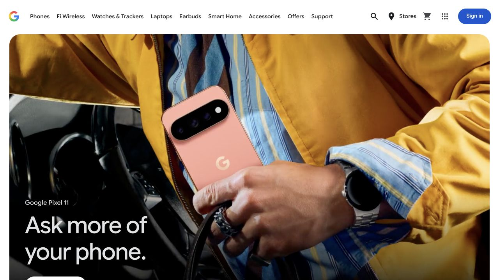

# Google Store · 产品商店

- 标识：google-store
- 来源：https://store.google.com/?hl=en-US
- 研究日期：2026-10-05
- 适用范围：适合少数产品家族的品牌商店；依赖高质量生活摄影及统一商品图。
- 证据范围：实际渲染截图、可见 DOM 样式采样及下文列明的操作；不是整站审计。
- 收录依据：[2026 Webby People’s Voice：Best User Interface](https://winners.webbyawards.com/winners/websites-and-mobile-sites/features-design/best-user-interface)。奖项针对当时的网站作品，不等于本次子页面或最新版本单独获奖。

生活场景首屏引出产品，随后以统一商品图和独立价格行完成比较。

## 视觉证据

桌面：1280×720，文档滚动坐标 (0, 0)。嵌套容器或画布的内部位置以截图为准。

窄屏：390×844，文档滚动坐标 (0, 0)。嵌套容器或画布的内部位置以截图为准。

- [补充截图：desktop-content](screenshots/desktop-content.jpg)：品牌首屏之后的商品比较横列。
- [补充截图：mobile-menu](screenshots/mobile-menu.jpg)：展开后的图文分类菜单。

## 可观察的设计关系

1. **观察与分析**：首屏影像占据大部分面积，白字集中在较暗区域，产品处于人物使用场景中；品牌故事先于规格和价格。
2. **观察与分析**：下方商品横列把图片、名称、价格、优惠、购买入口分层，所有商品共享相近图框；比较任务在统一尺度里进行。
3. **观察与分析**：手机端把横向分类导航换成菜单，每行菜单同时放名称与小产品图；窄屏主标题实测 32px、行高 40px，而操作仍保持清楚。桌面首屏处于动态状态，当前样式采样没有捕获对应标题，不作字号数值比较。

## 实测参数

以下是对应 DOM 节点的计算样式与边界盒，单位为 CSS px；只作为定位证据，不自动等于整个组件或最终图形尺寸。截图与样式先后采样，动态过渡可能存在差异。

| 状态与元素 | 字号 / 行高 | 边界盒宽×高 | 圆角 | 证据 |
| --- | --- | --- | --- | --- |
| mobile · H2 Ask more of your phone. | 32px / 40px | 342.0 × 80.0 | 0px | [elements[7]](evidence-mobile.json) |
| mobile · BUTTON Main Menu | 16px / normal | 40.0 × 52.0 | 100px | [elements[0]](evidence-mobile.json) |

原始记录：[桌面样式](evidence-desktop.json) · [窄屏样式](evidence-mobile.json)。其他元素可能被祖先裁切、覆盖或属于隐藏状态，使用前须对照截图。

## 响应式与交互

已打开窄屏 Main Menu，观察带产品小图的分类列表；未进入购买流程。首屏素材有动态帧变化，桌面与手机截图不保证同一帧。

仅验证上述两种主视口，不推断 CSS 断点。未列明的交互、键盘路径、屏幕阅读器和 WCAG 合规均未验证。

## 迁移方法（设计建议）

可用于消费电子或家居品牌：一张场景图建立用途，后接规格一致的商品卡。文字压图时给局部渐变遮罩并检查每一帧对比度；无视频时用静态图。商品数量多时补搜索和筛选，不照搬只有少量类别的导航。中文标题控制两三行，价格独立展示。

## 避免照搬与已知限制

奖项针对网站在获奖时的版本，当前商品和活动已可能变化。本案例不核验商品规格、优惠或最新价格。

截图中的摄影、插画、商标和字体是研究证据，不是已授权的产品素材。迁移时使用自己的内容与合适授权的资源。
