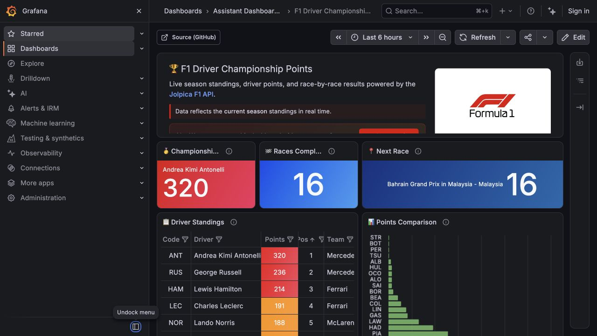
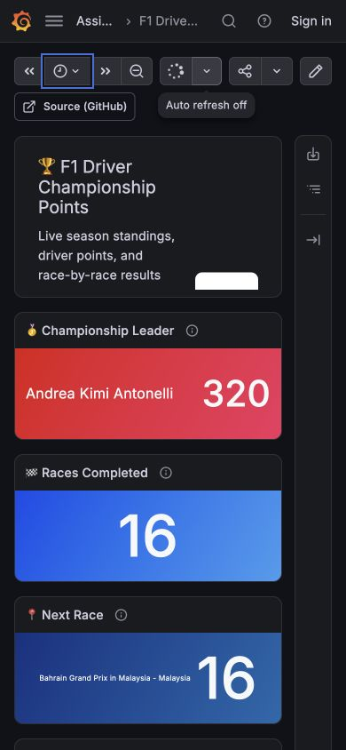

# Grafana Play · 数据仪表盘

- 标识：grafana-dashboard
- 来源：https://play.grafana.org/d/ma7w5nw/f1-driver-championship-points
- 研究日期：2026-10-05
- 适用范围：适合监控、运营和统计后台；本例是官方公开沙盒，不代表所有 Grafana 默认布局。
- 证据范围：实际渲染截图、可见 DOM 样式采样及下文列明的操作；不是整站审计。
- 收录依据：补齐实际任务场景；本案例不宣称获得设计奖。

统一时间工具条下先放摘要指标，再用表格和图表解释构成与差异。

## 视觉证据

桌面：1280×720，文档滚动坐标 (0, 0)。嵌套容器或画布的内部位置以截图为准。

窄屏：390×844，文档滚动坐标 (0, 0)。嵌套容器或画布的内部位置以截图为准。

- [补充截图：desktop-time](screenshots/desktop-time.jpg)：中间宽度的时间范围弹层（真实尺寸见证据）。

## 可观察的设计关系

1. **观察与分析**：全局导航与面包屑留在边缘，刷新和时间范围集中于内容上方；改变数据范围不需要分别操作每个图表。
2. **观察与分析**：顶部指标卡突出少数数字，下面以表格和条形图并置解释相同主题；“当前怎样”和“为何这样”形成两层。
3. **观察与分析**：深色底上以细边框划分面板，彩色数据区域集中在关键指标；手机变成纵向面板，长标题和顶部介绍出现截断，密度代价可见。

## 实测参数

以下是对应 DOM 节点的计算样式与边界盒，单位为 CSS px；只作为定位证据，不自动等于整个组件或最终图形尺寸。截图与样式先后采样，动态过渡可能存在差异。

| 状态与元素 | 字号 / 行高 | 边界盒宽×高 | 圆角 | 证据 |
| --- | --- | --- | --- | --- |
| mobile · H2 🏆 F1 Driver Championship Points | 19.6px / 22.8667px | 157.0 × 68.6 | 0px | [elements[18]](evidence-mobile.json) |
| mobile · BUTTON Time range selected: Last 6 hours | 14px / 30px | 52.0 × 32.0 | 0px | [elements[9]](evidence-mobile.json) |

原始记录：[桌面样式](evidence-desktop.json) · [窄屏样式](evidence-mobile.json)。其他元素可能被祖先裁切、覆盖或属于隐藏状态，使用前须对照截图。

## 响应式与交互

已打开时间范围选择器并用 Escape 关闭；未改保存的仪表盘或登录。滚动时部分面板仍加载，未将空面板截图作为完成的数据展示。

仅验证上述两种主视口，不推断 CSS 断点。未列明的交互、键盘路径、屏幕阅读器和 WCAG 合规均未验证。

## 迁移方法（设计建议）

按任务选三四个核心指标，下接能解释它们的分组图或明细表。颜色必须表示状态或系列，避免每张 KPI 用无含义渐变。中文可用系统黑体，指标值保留对齐；手机优先摘要，复杂表格给独立详情页。错误、无数据和刷新状态应单独设计。

## 避免照搬与已知限制

数据来自演示页面，未核验赛事事实。desktop-time 截图实际为 552×634 的中间宽度，不是 1280px 桌面；JSON 保留真实视口。未验证全图表、导出、编辑及告警流程。

截图中的摄影、插画、商标和字体是研究证据，不是已授权的产品素材。迁移时使用自己的内容与合适授权的资源。
