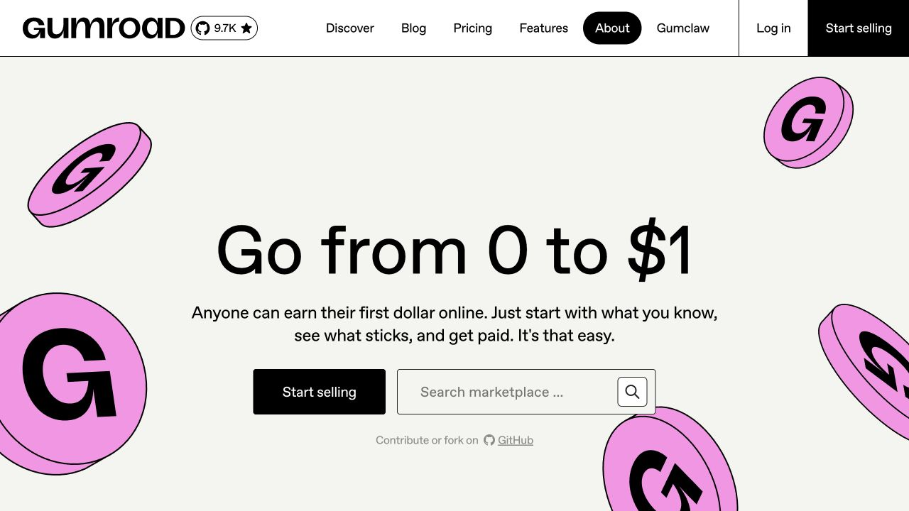
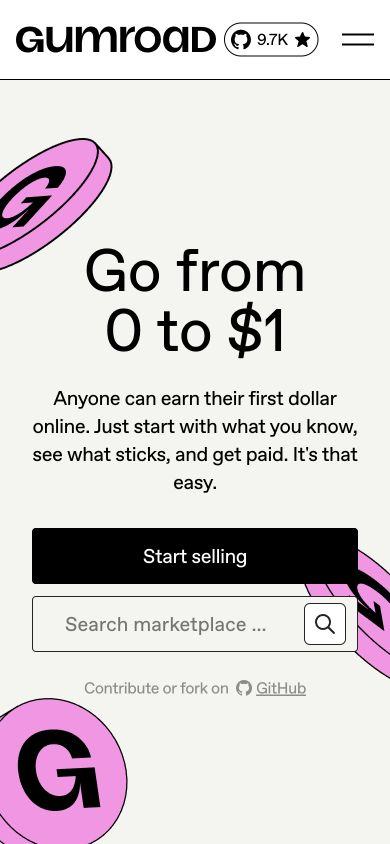

# Gumroad · 直接承诺与活泼边缘装饰

- 来源：https://gumroad.com/
- 研究日期：2026-10-04
- 范围：公开主页首屏；桌面 1280×720、窄屏 390×844，页面顶部。
- 适合：创作者主页、数字产品入口、轻量课程与个人业务介绍。
- 不适合：高密度后台、需要克制可信但缺乏匹配品牌基础的严肃业务。
- 素材依赖：短而有力的文案；可选原创插画。不要复制 Gumroad 的字标和硬币图案。

## 视觉证据

大标题居中，主行动是黑色实心按钮，搜索入口与其并列。粉色硬币分布在边缘，中心文字区域保持明确。窄屏转为上下排列，并裁切部分装饰。

## 可观察的设计关系

- 中央是极简价值承诺，解释段落与行动紧随其后；周边插画增加气质而不承载必要信息。
- 黑色细边与大面积浅底形成明确平面感，首屏没有依赖重阴影。
- 导航和行动采用不同尺度，主要行动面积明显更大。
- 我的判断：粗放的形象和直接文案适合鼓励开始尝试，但不能因此把所有组件都做成夸张大块。

## 实测参数

| 元素 | 实测值 | 来源 |
| --- | --- | --- |
| BODY 背景 | rgb(244,244,240)，即 #f4f4f0 | [桌面样式](evidence-desktop.json) |
| 桌面 H1 | 96px / 96px；字重 400；字距 -0.4px | 同上 |
| 首屏 Start selling | 20px / 28px；高 64px；圆角 4px；黑底白字 | 同上，y=520px 的链接 |
| 桌面导航 | 18px / 28px | 同上 |
| 窄屏 H1 | 60px / 60px；两行 | [窄屏样式](evidence-mobile.json) |
| 窄屏主行动 | x=32px；宽 326px；高 56px | 同上 |

字体声明为 `ABC Favorit`。粉色属于图像内容，本次没有读取其原始色值，不将截图近似颜色冒充设计 token。极大的导航圆角值表达胶囊外形，迁移时无需保留数值本身。

## 响应式与交互

390px 宽时导航收起，标题断为两行，主按钮和搜索框上下排列。两者保持清楚的可点击区域，装饰在画面边缘裁切。

没有执行搜索、注册、售卖或移动菜单；截图中某个导航项出现黑色胶囊状态，只作为本次捕获状态，不推断为首页的固定选中项。

## 迁移方法（设计建议）

保留短标题、浅底、强黑色行动和一组原创装饰，就能迁移基本关系。若没有插画，可以改用与内容有关的简单几何图案，但不要让图案压住正文或操作。

中文首屏通常需要比 96px 更克制的字号；先确认标题是否能在目标屏幕内完整表达。可用系统无衬线字体替代，并根据字面宽度重新排版。创作者主页不必照搬市场搜索，可换成作品分类或一个明确入口。

## 限制

本案例仅涵盖公开主页首屏，不包含商品详情、支付和卖家后台，也没有验证搜索逻辑与完整可访问性。
