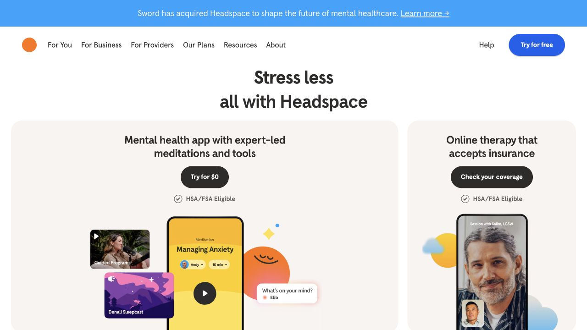
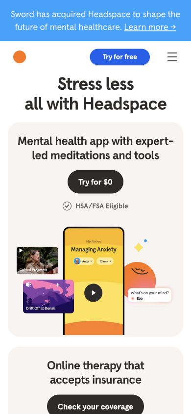

# Headspace · 柔和卡片的健康服务导览

- 标识：`headspace`
- 来源：https://www.headspace.com/
- 研究日期：2026-10-05
- 范围：所列页面的局部首屏，桌面 1280×720、窄屏 390×844。
- 适合：冥想、健康内容、面向不同服务对象的入口。
- 不适合：严肃临床决策或需要高密度数据的工作台。
- 素材依赖：原创柔和插画、真实产品画面和清楚服务说明。

## 视觉证据

截图观察：大标题之后用暖色大圆角服务卡、插画与产品画面呈现不同入口；手机把卡片顺序堆叠。

## 可观察的设计关系

- 暖色背景和较宽松间距营造平静节奏，但行动按钮仍清楚可见。
- 不同服务对象由卡片分区，不把所有价值塞进一张大图。
- 插画与产品截图说明用途，避免仅靠抽象渐变。

## 实测参数

以下是指定节点的浏览器计算样式，不代表页面全局设计令牌。

| 视口 / 元素 | 字号 / 行高、字重、颜色 | 证据 |
| --- | --- | --- |
| 桌面 `h2`（all with Headspace） | 40px / 44px，字重 700，颜色 rgb(45, 44, 43) | [桌面采样](evidence-desktop.json) |
| 窄屏 `h2`（all with Headspace） | 36px / 36px，字重 700，颜色 rgb(45, 44, 43) | [窄屏采样](evidence-mobile.json) |

## 响应式与交互

采样标题桌面 40px、手机 36px；卡片在手机端纵向排列。未测试课程、订阅与登录。

## 迁移方法（设计建议）

先梳理服务入口和真实内容，再用柔和色块与原创图形承载。健康文案必须具体，不能让视觉暗示代替事实。

## 避免照搬与已知限制

首屏带有公司消息横幅；不代表临床建议或完整产品流程，插画不可直接移用。 本次没有做完整页面、所有断点、键盘可达性或 WCAG 审计；原站可能在研究后变更。截图、商标与作品图仅作研究证据，不作为新站资产。
