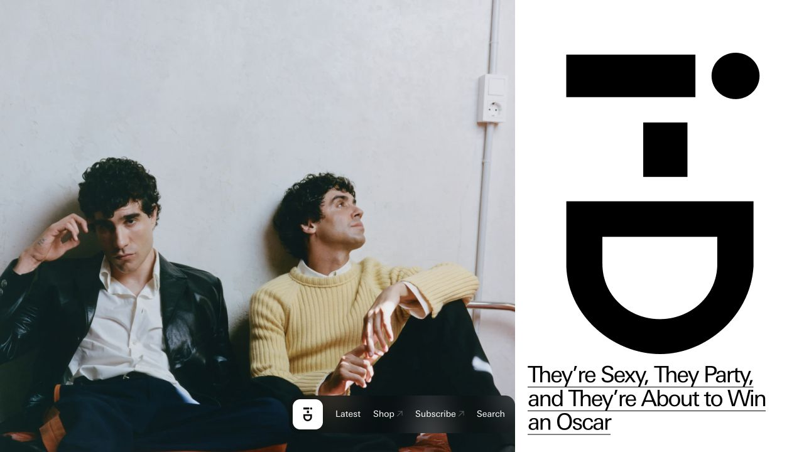

# i-D · 时尚杂志

- 标识：i-d
- 来源：https://i-d.co/
- 研究日期：2026-10-05
- 适用范围：适合有强摄影与编辑选题的杂志；不适合以检索效率为首要目标的资料站。
- 证据范围：实际渲染截图、可见 DOM 样式采样及下文列明的操作；不是整站审计。
- 收录依据：[2025 Webby Winner：Magazine or Publication；Cultural Blog/Website 为提名](https://winners.webbyawards.com/2025/websites-and-mobile-sites/general-desktop-mobile-sites/cultural-blogwebsite/321852/id)。奖项针对当时的网站作品，不等于本次子页面或最新版本单独获奖。

大幅人物摄影与夸张刊名字形并列，文章流和快讯流形成不同阅读速度。

## 视觉证据

桌面：1280×720，文档滚动坐标 (0, 0)。嵌套容器或画布的内部位置以截图为准。

窄屏：390×844，文档滚动坐标 (0, 0)。嵌套容器或画布的内部位置以截图为准。

- [补充截图：desktop-content](screenshots/desktop-content.jpg)：文章和快讯的双栏入口。

## 可观察的设计关系

1. **观察与分析**：桌面首屏左边照片约占三分之二，右侧是巨大刊名和文章标题；刊名作为图形使用，与照片共同构成封面。
2. **观察与分析**：正文延续宽文章栏、窄快讯栏：长内容用大图，短消息用日期和文字；相同网站容纳两种阅读节奏。
3. **观察与分析**：导航是贴近底部的小浮条，不占大块顶栏；手机把封面照片和标题上下排列，标题从 36px 调到 28px，保留紧凑行距。

## 实测参数

以下是对应 DOM 节点的计算样式与边界盒，单位为 CSS px；只作为定位证据，不自动等于整个组件或最终图形尺寸。截图与样式先后采样，动态过渡可能存在差异。

| 状态与元素 | 字号 / 行高 | 边界盒宽×高 | 圆角 | 证据 |
| --- | --- | --- | --- | --- |
| desktop · A They’re Sexy, They Party | 36px / 37.8px | 378.9 × 111.6 | 0px | [elements[7]](evidence-desktop.json) |
| mobile · A They’re Sexy, They Party | 28px / 29.4px | 339.5 × 57.4 | 0px | [elements[7]](evidence-mobile.json) |

原始记录：[桌面样式](evidence-desktop.json) · [窄屏样式](evidence-mobile.json)。其他元素可能被祖先裁切、覆盖或属于隐藏状态，使用前须对照截图。

## 响应式与交互

已关闭 Cookie 提示并滚动查看文章/快讯双栏。曾点击 Latest，但当时隐私层遮挡，未将该次点击算作锚点成功；搜索和订阅未验证。

仅验证上述两种主视口，不推断 CSS 断点。未列明的交互、键盘路径、屏幕阅读器和 WCAG 合规均未验证。

## 迁移方法（设计建议）

先区分长文与快讯，不把所有内容塞进同一网格。用自有刊名和摄影做一个强封面，后面回到能连续阅读的标题和摘要。中文可用常规黑体替代窄西文字体，并增加一点行距；没有独家摄影时不要靠放大 Logo 弥补内容不足。

## 避免照搬与已知限制

窄屏首屏主要为封面和快讯，不能据此断言完整文章流的排序。浮动导航可能遮挡底部内容，迁移时应预留空间。

截图中的摄影、插画、商标和字体是研究证据，不是已授权的产品素材。迁移时使用自己的内容与合适授权的资源。
