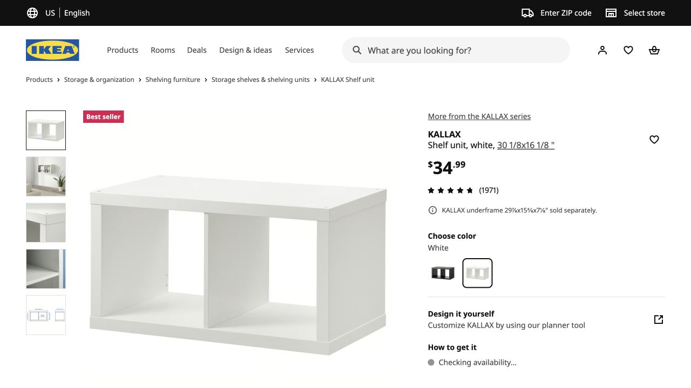
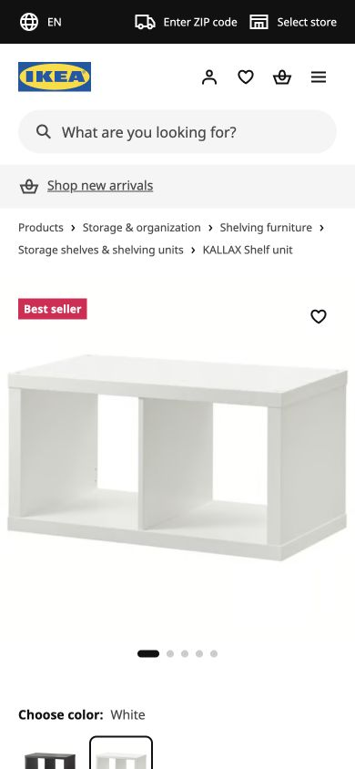
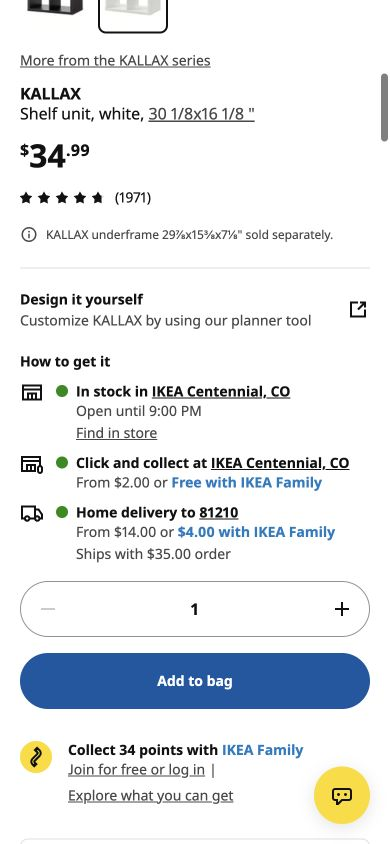

# IKEA · KALLAX · 信息完整的商品详情

- 标识：`ikea-product`
- 来源：https://www.ikea.com/us/en/p/kallax-shelf-unit-white-90301555/
- 研究日期：2026-10-05
- 范围：所列页面的局部首屏，桌面 1280×720、窄屏 390×844。
- 适合：电商商品详情、规格选择、履约说明。
- 不适合：没有真实商品照片或无法提供价格/库存信息的页面。
- 素材依赖：商品照片、规格与配送/库存数据。

## 视觉证据

截图观察：桌面左侧为产品图，右侧为价格、规格和购买/履约信息；手机先看大图，再往下阅读购买信息。

## 可观察的设计关系

- 大图先建立商品认知，价格和购买动作在同一信息区形成下一步。
- 颜色、评分、安装及送货等信息与商品主描述分层，不把所有信息压在标题里。
- 商品页把“能否获得商品”的物流信息放在显眼位置。

## 实测参数

以下是指定节点的浏览器计算样式，不代表页面全局设计令牌。

| 视口 / 元素 | 字号 / 行高、字重、颜色 | 证据 |
| --- | --- | --- |
| 桌面 `h1`（KALLAX） | 16px / 20px，字重 700，颜色 rgb(17, 17, 17) | [桌面采样](evidence-desktop.json) |
| 窄屏 `h1`（KALLAX） | 16px / 20px，字重 700，颜色 rgb(17, 17, 17) | [窄屏采样](evidence-mobile.json) |

## 响应式与交互

390px 首屏以图片为主；另存了下滚后的购买信息截图。未提交购物车、改变规格或验证库存。

## 迁移方法（设计建议）

将图片区、商品决策区和履约区分开；移动端要检查价格和购买按钮在真实滚动流程中的可发现性。

## 避免照搬与已知限制

价格、库存、配送地和评价是动态数据；截图只记录当时状态，不能直接复用数字或品牌照片。 本次没有做完整页面、所有断点、键盘可达性或 WCAG 审计；原站可能在研究后变更。截图、商标与作品图仅作研究证据，不作为新站资产。
