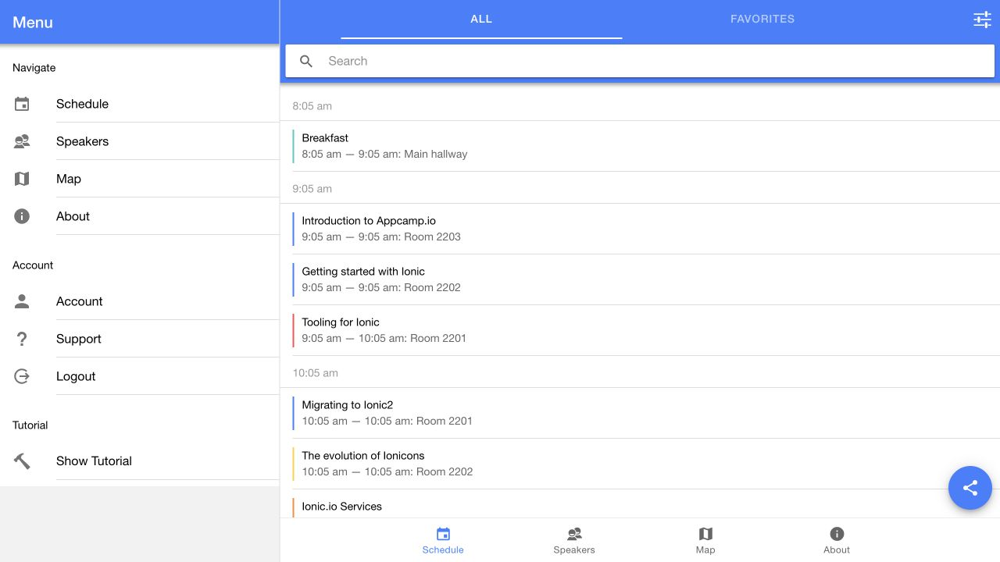
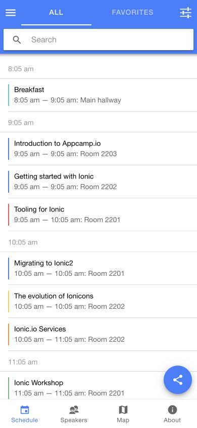

# Ionic Conference · 移动议程

- 标识：ionic-conference
- 来源：https://ionic-react-conference-app.firebaseapp.com/schedule
- 研究日期：2026-10-05
- 适用范围：适合会议议程、课程安排和移动任务列表；本例为公开演示的旧部署版本。
- 收录依据：补齐实际任务与视觉组织方式；本案例不宣称获得设计奖。
- 证据范围：实际渲染截图、可见 DOM 采样及下文列明的操作；不是整站审计。

按时间分组的议程列表配合底部导航，手机筛选使用独立全屏面板。

## 视觉证据

桌面：1280×720，文档滚动坐标 (0, 0)。嵌套容器内部位置以截图为准。

窄屏：390×844，文档滚动坐标 (0, 0)。嵌套容器内部位置以截图为准。

- [补充截图：mobile-filter](screenshots/mobile-filter.jpg)：全屏主题筛选面板；开关的筛选结果未测试。

## 可观察的设计关系

1. **观察与分析**：议程先按小时分组，再用细彩色竖线标记主题，标题、时间和地点保持固定行结构；颜色补充分类，而非替代必要文字。
2. **观察与分析**：搜索始终位于列表上方，All/Favorites 切换与主题筛选分开；快速查找、收藏范围和复杂条件是三种不同粒度的控制。
3. **观察与分析**：390px 视口将侧边菜单收进顶部按钮，底部 Schedule、Speakers、Map、About 承担主要去向；桌面可显示侧栏，但列表与底部目的地仍可辨认。
4. **观察与分析**：手机筛选覆盖整个页面，每行左侧分类名、右侧开关，上方固定 Cancel/Done；通过专用操作面板保持长列表的触控空间。
5. **观察与分析**：议程标题两种宽度均为 14px，搜索输入高 42px；内容密度靠行组织保持，移动适配主要依赖导航位置和列表宽度。

## 实测参数

以下是对应节点的计算样式与边界盒，单位为 CSS px；不是整页通用 token，也不证明触控区域或最终图形尺寸。数值应与同状态截图对照。

| 状态与元素 | 字号 / 行高 | 边界盒宽×高 | 圆角 | 证据 |
| --- | --- | --- | --- | --- |
| desktop · INPUT Search | 16px / 30px | 907.6 × 42.0 | 2px | [elements[0]](evidence-desktop.json) |
| desktop · H3 Breakfast | 14px / normal | 877.6 × 17.0 | 0px | [elements[1]](evidence-desktop.json) |
| mobile · INPUT Search | 16px / 30px | 376.0 × 42.0 | 2px | [elements[0]](evidence-mobile.json) |
| mobile · H3 Breakfast | 14px / normal | 346.0 × 17.0 | 0px | [elements[1]](evidence-mobile.json) |

原始记录：[桌面样式](evidence-desktop.json) · [窄屏样式](evidence-mobile.json)。采样只包含部分节点，祖先裁切、覆盖、字体加载与异步状态需对照截图判断。

## 响应式与交互

已打开手机 Filter Sessions 面板，并 Cancel 返回议程。点击 Speakers 后导航状态和 URL 改变，但内容未成功加载，因此未将该空白页收入完成截图。未应用筛选、收藏、分享、登录或打开地图。

仅验证上文列出的视口与操作，不推断 CSS 断点；未列明的键盘、屏幕阅读器及 WCAG 合规均未验证。

## 迁移方法（设计建议）

先把数据按日期和时间排序，标题、时段、地点使用一致模板。类别颜色配文字或图例，底部导航限于三至五个高频目的地。筛选面板应保留取消/应用区别并能清除全部条件。中文名称较长时允许两行，时间以本地格式展示；不依赖大会照片也能成立。地图、提醒和分享只有真实实现时才出现。

## 避免照搬与已知限制

官方 ionic-react-conference-app 仓库链接此部署，但实际页面标题为 Ionic Stencil Conference App；本案例只描述看到的部署界面，不把它当最新 React/Ionic 版本证明。部分组件使用 Shadow DOM，采样不含所有内部样式。议程时间来自虚构旧示例，未核验内容。未测试软键盘和安全区。

截图中的摄影、插画、商标和字体是研究证据，不是已授权的产品素材。迁移时使用自己的内容与合适授权的资源。
