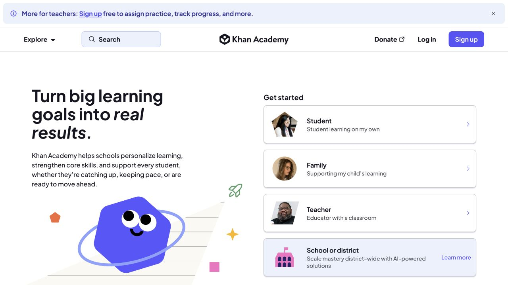
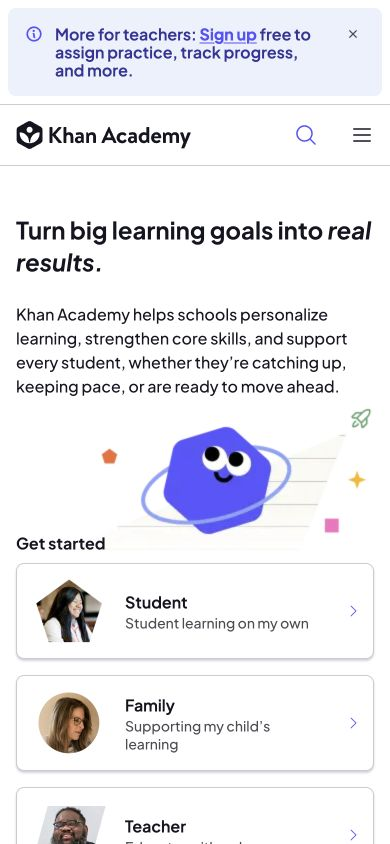

# Khan Academy · 按用户身份分流的教育首页

- 标识：`khan-academy`
- 来源：https://www.khanacademy.org/
- 研究日期：2026-10-05
- 范围：所列页面的局部首屏，桌面 1280×720、窄屏 390×844。
- 适合：面向学生、家长、教师等不同人群的服务。
- 不适合：用户目标单一却设置多余身份入口。
- 素材依赖：教育场景插画和按角色组织的内容。

## 视觉证据

截图观察：大标题与蓝紫插画说明学习目标，随后通过身份卡片分流；手机改为上下排列。

## 可观察的设计关系

- 一句清晰承诺之后提供角色入口，降低不同受众找路成本。
- 插画用于支持情绪和主题，角色标签承担实际导航。
- 正文对比和大按钮确保教育站不被装饰淹没。

## 实测参数

以下是指定节点的浏览器计算样式，不代表页面全局设计令牌。

| 视口 / 元素 | 字号 / 行高、字重、颜色 | 证据 |
| --- | --- | --- |
| 桌面 `h1`（Turn big learning） | 42px / 46.2px，字重 700，颜色 rgb(21, 21, 33) | [桌面采样](evidence-desktop.json) |
| 窄屏 `h1`（Turn big learning） | 24px / 32px，字重 700，颜色 rgb(21, 21, 33) | [窄屏采样](evidence-mobile.json) |

## 响应式与交互

主标题桌面 42px，手机 24px；身份区纵向堆叠。已关闭研究时的捐赠覆盖层；未进入课程、练习或登录。

## 迁移方法（设计建议）

只有角色确有不同任务时才分流，并给每个角色一句具体价值。插画可用原创图形替换。

## 避免照搬与已知限制

主页与活动横幅会变化；本研究不是课程内容或学习效果评估。 本次没有做完整页面、所有断点、键盘可达性或 WCAG 审计；原站可能在研究后变更。截图、商标与作品图仅作研究证据，不作为新站资产。
