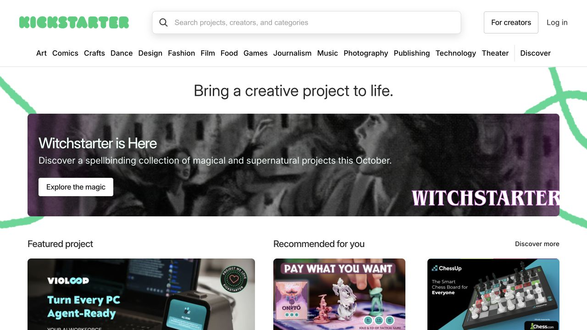
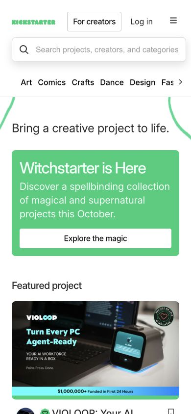

# Kickstarter · 创意项目策展

- 标识：`kickstarter`
- 来源：https://www.kickstarter.com/
- 研究日期：2026-10-05
- 范围：所列页面的局部首屏，桌面 1280×720、窄屏 390×844。
- 适合：创意项目发现、作品众筹、专题活动入口。
- 不适合：没有项目故事、进度或可信封面的空卡片墙。
- 素材依赖：项目封面、创作者故事与进度信息。

## 视觉证据

截图观察：绿色品牌导航之后是简洁使命语、当期专题横幅和精选项目卡；窄屏顺序堆叠。

## 可观察的设计关系

- 使命句给出平台语境，专题横幅负责当期焦点，项目卡负责探索。
- 项目封面和简要元信息共同帮助判断，不让装饰图替代项目信息。
- 类别导航让内容足够多时仍有可探索路径。

## 实测参数

以下是指定节点的浏览器计算样式，不代表页面全局设计令牌。

| 视口 / 元素 | 字号 / 行高、字重、颜色 | 证据 |
| --- | --- | --- |
| 桌面 `h1`（Bring a creative） | 34px / 42px，字重 400，颜色 rgb(40, 40, 40) | [桌面采样](evidence-desktop.json) |
| 窄屏 `h1`（Bring a creative） | 24px / 30px，字重 400，颜色 rgb(40, 40, 40) | [窄屏采样](evidence-mobile.json) |

## 响应式与交互

主标题从桌面 34px 改为手机 24px；菜单收束。未测试项目详情、支持流程或类别筛选。

## 迁移方法（设计建议）

把“平台使命—当前重点—项目列表”分成清楚三层；用自己的项目故事、数据和获授权图片替换活动视觉。

## 避免照搬与已知限制

当前活动主题图和项目内容会变化；这是首页局部，不是交易流程规范。 本次没有做完整页面、所有断点、键盘可达性或 WCAG 审计；原站可能在研究后变更。截图、商标与作品图仅作研究证据，不作为新站资产。
