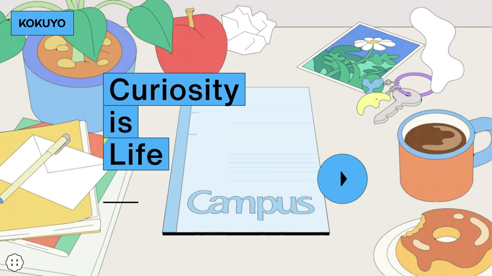
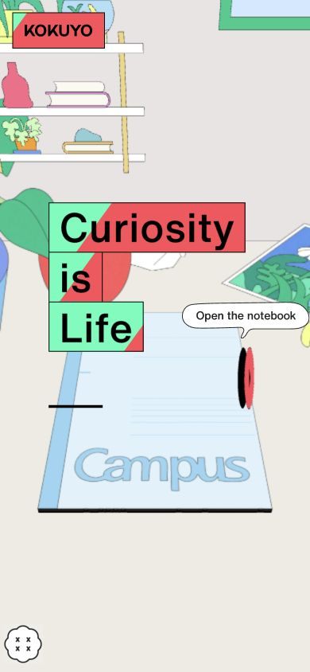

# KOKUYO · 插画叙事

- 标识：kokuyo-curiosity
- 来源：https://www.kokuyo.com/en/special/curiosity-is-life/
- 研究日期：2026-10-05
- 适用范围：适合儿童教育、文化品牌及短篇互动故事；高度依赖原创场景插画。
- 证据范围：实际渲染截图、可见 DOM 样式采样及下文列明的操作；不是整站审计。
- 收录依据：[2026 Webby People’s Voice：Corporate Communications](https://winners.webbyawards.com/2026/websites-and-mobile-sites/general-desktop-mobile-sites/corporate-communications/377358/kokuyo-curiosity-is-life)。奖项针对当时的网站作品，不等于本次子页面或最新版本单独获奖。

以桌面和笔记本构成叙事场景，用单一箭头引导进入品牌故事。

## 视觉证据

桌面：1280×720，文档滚动坐标 (0, 0)。嵌套容器或画布的内部位置以截图为准。

窄屏：390×844，文档滚动坐标 (0, 0)。嵌套容器或画布的内部位置以截图为准。

- [补充截图：mobile-story](screenshots/mobile-story.jpg)：点击入口后的过渡快照，不代表故事后续页面已完成研究。

## 可观察的设计关系

1. **观察与分析**：笔记本在场景中心，其余杯子、花盆、钥匙向边缘分布；生活物件提供语境，中心物件承接下一步行为。
2. **观察与分析**：标题拆成三个蓝色矩形，与蓝色圆形箭头相呼应；动作入口与标题共享强调色，其余插画色彩更分散。
3. **观察与分析**：窄屏仍围绕笔记本重构纵向画面，箭头和打开提示维持可识别性；不是把桌面整幅图等比缩成一张小图。

## 实测参数

以下是对应 DOM 节点的计算样式与边界盒，单位为 CSS px；只作为定位证据，不自动等于整个组件或最终图形尺寸。截图与样式先后采样，动态过渡可能存在差异。

| 状态与元素 | 字号 / 行高 | 边界盒宽×高 | 圆角 | 证据 |
| --- | --- | --- | --- | --- |
| 主场景图形 | 未取得可靠视觉字号 | 未作为组件尺寸使用 | 未测 | [原始采样](evidence-desktop.json) |

原始记录：[桌面样式](evidence-desktop.json) · [窄屏样式](evidence-mobile.json)。其他元素可能被祖先裁切、覆盖或属于隐藏状态，使用前须对照截图。

## 响应式与交互

已点击窄屏箭头，看到进入故事的过渡。只记录入口和过渡，未完成故事全流程，也未验证声音、键盘和减弱动画设置。

仅验证上述两种主视口，不推断 CSS 断点。未列明的交互、键盘路径、屏幕阅读器和 WCAG 合规均未验证。

## 迁移方法（设计建议）

先确定一个与内容有关的“可打开对象”，例如笔记本、盒子或地图，再围绕它安排故事入口。用自有插画重做场景，并给入口提供真实按钮与文字标签。若预算不足，用静态插画和普通分步页面替代复杂画布，保留视觉中心和单一行动。

## 避免照搬与已知限制

主画面由图形层构成，DOM 的不到 1px 字号属于缩放坐标体系，不能当作视觉字号。未取得可靠的插画色值、字体和动画参数。

截图中的摄影、插画、商标和字体是研究证据，不是已授权的产品素材。迁移时使用自己的内容与合适授权的资源。
