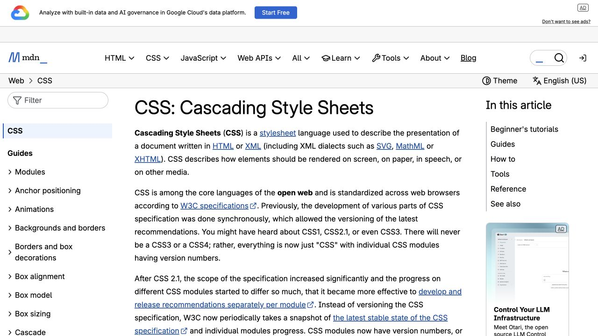
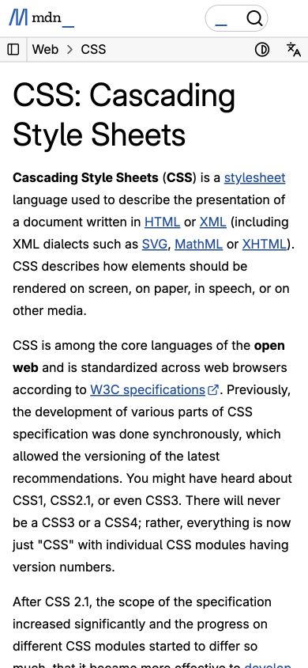

# MDN CSS 文档 · 三层导航的技术文档

- 标识：`mdn-docs`
- 来源：https://developer.mozilla.org/en-US/docs/Web/CSS
- 研究日期：2026-10-05
- 范围：所列页面的局部首屏，桌面 1280×720、窄屏 390×844。
- 适合：开发者文档、帮助中心、长篇知识库。
- 不适合：短促营销首页或不需要目录的单页介绍。
- 素材依赖：结构化章节与代码示例；不依赖装饰图。

## 视觉证据

截图观察：桌面显示左侧目录、文章正文和右侧页内导航；窄屏先保留正文，导航压缩。

## 可观察的设计关系

- 不同层级的目录承担跨文档与页内定位，正文保持稳定阅读宽度。
- 细线、浅色背景和链接色用于区分结构与可点击信息。
- 大标题下立即给出定义与入口，先回答“这是什么”。

## 实测参数

以下是指定节点的浏览器计算样式，不代表页面全局设计令牌。

| 视口 / 元素 | 字号 / 行高、字重、颜色 | 证据 |
| --- | --- | --- |
| 桌面 `h1`（CSS: Cascading） | 40px / 50px，字重 400，颜色 rgb(0, 0, 0) | [桌面采样](evidence-desktop.json) |
| 窄屏 `h1`（CSS: Cascading） | 40px / 50px，字重 400，颜色 rgb(0, 0, 0) | [窄屏采样](evidence-mobile.json) |

## 响应式与交互

窄屏出现 Toggle navigation，文章改为单列。未点击折叠目录，也未测试搜索与代码示例。

## 迁移方法（设计建议）

先建立可靠的章节树和锚点，再排版。长文应有明显标题级别、代码块、反馈与版本信息；移动端优先正文。

## 避免照搬与已知限制

本次为 CSS 概览页的首屏；不代表 MDN 所有文章模板和完整可访问性规范。 本次没有做完整页面、所有断点、键盘可达性或 WCAG 审计；原站可能在研究后变更。截图、商标与作品图仅作研究证据，不作为新站资产。
