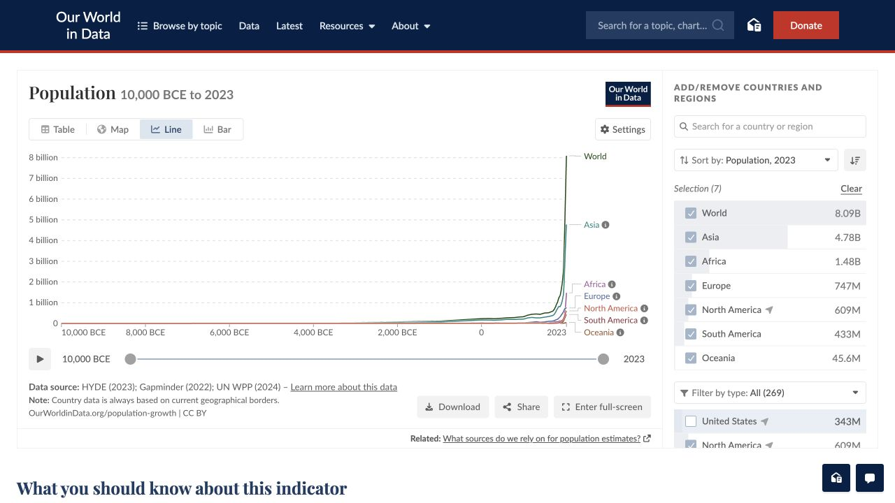
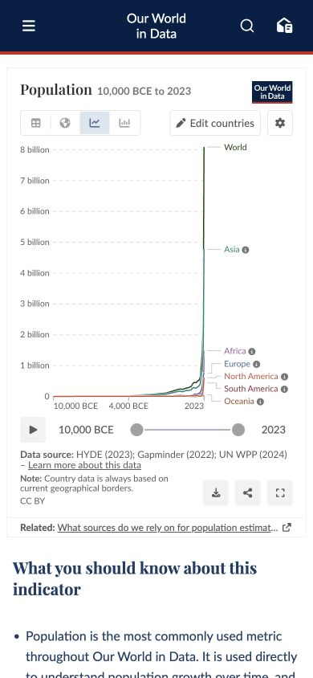

# Our World in Data · 图表优先的数据页面

- 标识：`our-world-in-data`
- 来源：https://ourworldindata.org/grapher/population
- 研究日期：2026-10-05
- 范围：所列页面的局部首屏，桌面 1280×720、窄屏 390×844。
- 适合：数据探索、指标专题、研究报告交互图。
- 不适合：没有可信数据来源或需要遮蔽不确定性的营销图表。
- 素材依赖：数据、时间/地区定义、图表生成能力与来源说明。

## 视觉证据

截图观察：深蓝站点页眉之下，桌面让主图表与地区选择并列；窄屏把图表放满宽度，地区选择收进按钮。

## 可观察的设计关系

- 标题、图表、控制项与来源说明形成完整解释链。
- 颜色用于多条数据系列及交互状态，图表之外维持克制。
- 复杂控制在窄屏后置，但保留“Edit countries”入口。

## 实测参数

以下是指定节点的浏览器计算样式，不代表页面全局设计令牌。

| 视口 / 元素 | 字号 / 行高、字重、颜色 | 证据 |
| --- | --- | --- |
| 桌面 `h1`（Population） | 25px / 30px，字重 600，颜色 rgb(45, 46, 45) | [桌面采样](evidence-desktop.json) |
| 窄屏 `h1`（Population） | 18px / 19.8px，字重 600，颜色 rgb(45, 46, 45) | [窄屏采样](evidence-mobile.json) |

## 响应式与交互

390px 下图表成为主区域，国家选择由侧栏变为按钮。未点击国家、图表类型与导出。

## 迁移方法（设计建议）

先确保数据含义、轴、单位和来源清楚，再设计筛选。小屏不要直接缩小桌面图表，应重排图例和控制。

## 避免照搬与已知限制

这是单个 Population 图表页快照；数据年份、默认地区和视觉状态可能变化。 本次没有做完整页面、所有断点、键盘可达性或 WCAG 审计；原站可能在研究后变更。截图、商标与作品图仅作研究证据，不作为新站资产。
