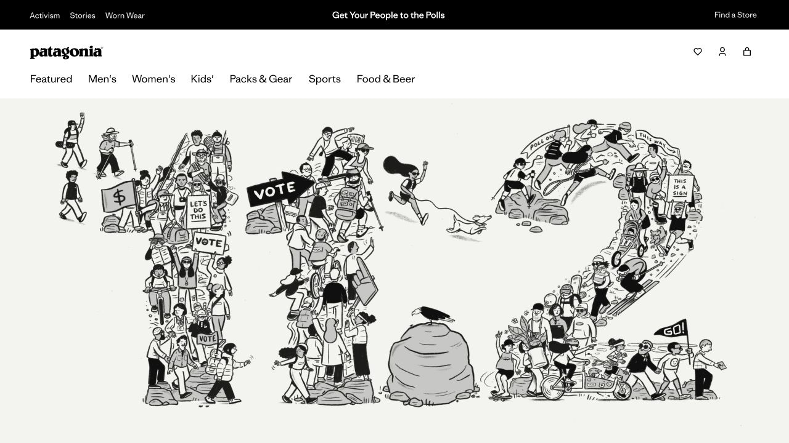
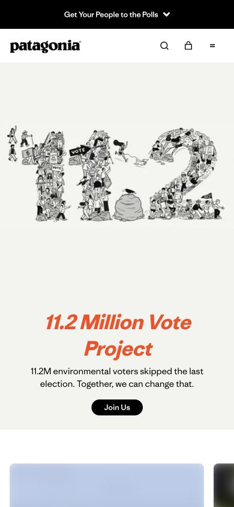

# Patagonia · 议题驱动的品牌首页

- 标识：`patagonia`
- 来源：https://www.patagonia.com/home/
- 研究日期：2026-10-05
- 范围：所列页面的局部首屏，桌面 1280×720、窄屏 390×844。
- 适合：具有真实公共议题与明确行动的品牌活动。
- 不适合：没有真实行动基础却借用公益叙事或原活动视觉。
- 素材依赖：原创活动插画、可核实行动信息与品牌资产。

## 视觉证据

截图观察：黑色导航下以大幅原创活动图和极大的标题作为首屏，手机改成较紧凑的单列叙事。

## 可观察的设计关系

- 首页优先传达一项当前行动，再引导进入商品与其他内容。
- 高对比标题和较少按钮让行动焦点明确。
- 活动艺术占据主画面，导航退居其后。

## 实测参数

以下是指定节点的浏览器计算样式，不代表页面全局设计令牌。

| 视口 / 元素 | 字号 / 行高、字重、颜色 | 证据 |
| --- | --- | --- |
| 桌面 `h1`（11.2 Million） | 64px / 70.4px，字重 500，颜色 rgb(0, 0, 0) | [桌面采样](evidence-desktop.json) |
| 窄屏 `h1`（11.2 Million） | 40px / 44px，字重 500，颜色 rgb(0, 0, 0) | [窄屏采样](evidence-mobile.json) |

## 响应式与交互

主标题桌面 64px、手机 40px；手机图文重新排列。未测试活动链接、购物或移动菜单。

## 迁移方法（设计建议）

如果确有议题，先写清可验证的行动及其证据，再设计一张原创主视觉；不借原公益主题装饰销售。

## 避免照搬与已知限制

研究的是 2026-10-05 当时活动首页；活动数字、图像和时效信息不可复用。 本次没有做完整页面、所有断点、键盘可达性或 WCAG 审计；原站可能在研究后变更。截图、商标与作品图仅作研究证据，不作为新站资产。
