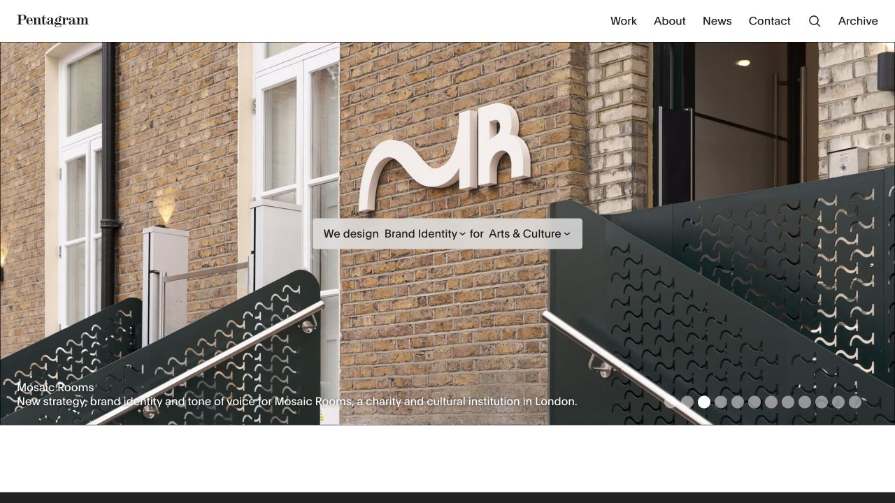
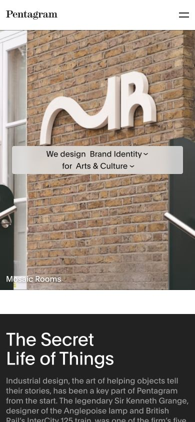

# Pentagram · 作品主导的展示界面

- 来源：https://www.pentagram.com/
- 研究日期：2026-10-04
- 窄屏截图补拍：2026-10-05；替换轮播过渡帧，保留原布局样式采样。
- 范围：主页轮播与开头内容；桌面 1280×720、窄屏 390×844。
- 适合：设计、摄影、建筑、艺术和具有优秀项目图的作品集。
- 不适合：没有视觉作品的纯文字介绍、表格工作台、需要长说明才能理解的操作界面。
- 素材依赖：高。必须有可用的作品图片，并为每张图安排合适裁切和文字对比。

## 视觉证据

作品图承担首屏的大多数面积，顶部导航保持简洁，项目名称和说明贴近图像下沿。居中的工作类别入口是功能，不只是装饰性标语。轮播动态切换，因此两张截图可能展示不同项目。

## 可观察的设计关系

- 界面大部分使用中性黑白，项目自身的图像决定页面颜色；无需另做一套强烈品牌渐变。
- 图片接近通栏，说明相对紧凑，作品优先于自我介绍。
- 分类入口以一句话组织两个选择维度，将查找作品的任务融入页面。
- 我的判断：这种表现成立的前提是图片足够有信息。空素材情况下复制大图布局会把不足放大。

## 实测参数

| 元素 | 实测值 | 来源 |
| --- | --- | --- |
| 页面 HTML 背景 | rgb(255,255,255) | [桌面样式](evidence-desktop.json) |
| BODY 文字声明 | `Plain, Arial, sans-serif`；19px / 25px；rgb(26,26,26) | 同上 |
| 桌面站标所在区域 | x=24px、y=18px、高24px | 同上；站标外形不能由容器字体推断 |
| 桌面轮播圆点 | 18×18px；圆角 9999px | 同上，view slide 按钮 |

窄屏参数见 [窄屏样式](evidence-mobile.json)。原始采样包含多个非当前幻灯片、隐藏导航和重复头部，不能把它们都当成同屏视觉内容。准确的图片主体裁切需要看截图，而非只看父元素字体与颜色。

## 响应式与交互

观察到轮播自动换图，曾点击第一张轮播控制并看到对应项目图。文字、图片和过渡可能短暂叠加，最终首屏截图重新采集以避免使用过渡帧。窄屏项目图改用更适合纵向的裁切，类别入口纵向占用更多空间。

没有验证筛选结果、搜索、项目详情导航、轮播暂停机制或键盘可用性。不能据此保证自动轮播适合新项目。

## 迁移方法（设计建议）

从一个真实项目的大图、项目名和一句说明开始，导航只放必要入口。为图片提供适合窄屏的构图，而不是简单缩小桌面图片。图上文字对比不足时移到图下，或提供足够的遮罩。

项目较少时直接使用静态主图和作品列表，避免为了模仿而加入自动轮播。项目较多且分类真实有用时，再引入筛选。系统 Arial 或无衬线字体即可支撑功能文字，品牌字标用自己的资产。

## 限制

这是作品展示的局部参考，不是可复制的 Pentagram 模板。原作品图只保留在研究截图中，不提供独立可用于成品的素材。
