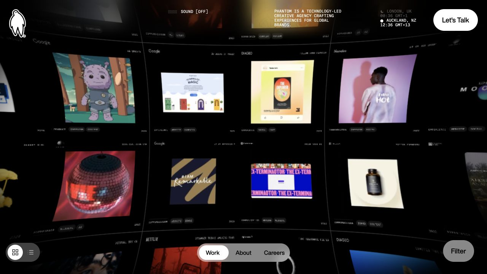
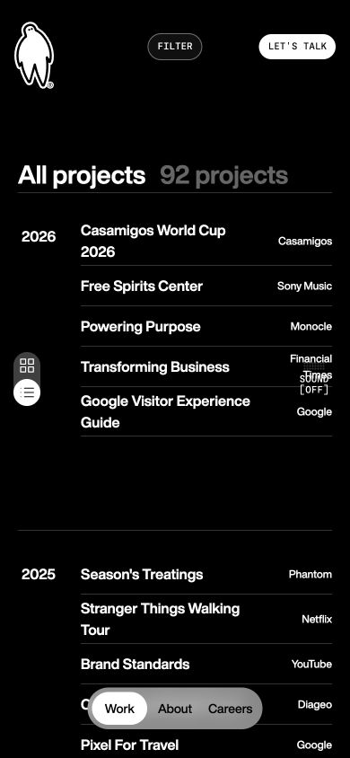

# Phantom · 作品墙与目录

- 标识：phantom
- 来源：https://www.phantom.land/
- 研究日期：2026-10-05
- 适用范围：适合拥有大量项目的创意机构；小作品集或低性能设备应优先保留普通列表。
- 证据范围：实际渲染截图、可见 DOM 样式采样及下文列明的操作；不是整站审计。
- 收录依据：[Awwwards Site of the Day：2025-06-02；当前页面内容已更新](https://www.awwwards.com/websites/web-design-agency/?page=31)。奖项针对当时的网站作品，不等于本次子页面或最新版本单独获奖。

同一批作品提供沉浸图墙和按年份排列的文字目录，兼顾浏览与快速定位。

## 视觉证据

桌面：1280×720，文档滚动坐标 (0, 0)。嵌套容器或画布的内部位置以截图为准。

窄屏：390×844，文档滚动坐标 (0, 0)。嵌套容器或画布的内部位置以截图为准。

- [补充截图：desktop-list](screenshots/desktop-list.jpg)：切换后的年份—项目—客户目录。

## 可观察的设计关系

1. **观察与分析**：图墙用黑底、透视和多幅动态作品制造包围感，导航悬在边缘；图像承担气质，控件保持少量稳定入口。
2. **观察与分析**：切到列表后，年份独立为左栏，项目名居中、客户名靠右；从感性浏览切换到精确查找，无需换一批内容。
3. **观察与分析**：窄屏列表保留年份和项目分组，长项目名换行，底部导航仍常驻；客户栏和浮动声音控件出现拥挤，说明桌面密度不能机械下放。

## 实测参数

以下是对应 DOM 节点的计算样式与边界盒，单位为 CSS px；只作为定位证据，不自动等于整个组件或最终图形尺寸。截图与样式先后采样，动态过渡可能存在差异。

| 状态与元素 | 字号 / 行高 | 边界盒宽×高 | 圆角 | 证据 |
| --- | --- | --- | --- | --- |
| desktop-list · H2 All projects | 28px / 24px | 142.1 × 24.0 | 0px | [elements[0]](evidence-desktop-list.json) |
| desktop-list · H3 Casamigos World Cup | 16px / normal | 203.4 × 24.0 | 0px | [elements[4]](evidence-desktop-list.json) |
| mobile · H3 Casamigos World Cup | 16px / normal | 200.0 × 48.0 | 0px | [elements[4]](evidence-mobile.json) |

原始记录：[桌面样式](evidence-desktop.json) · [窄屏样式](evidence-mobile.json)。其他元素可能被祖先裁切、覆盖或属于隐藏状态，使用前须对照截图。

## 响应式与交互

已关闭 Cookie 提示并从左下图墙按钮切到列表，状态确实变化。声音保持关闭，未进入每个项目或验证筛选、键盘和性能。

仅验证上述两种主视口，不推断 CSS 断点。未列明的交互、键盘路径、屏幕阅读器和 WCAG 合规均未验证。

## 迁移方法（设计建议）

先用同一项目数据实现网格/列表双视图，再决定是否需要透视效果。普通作品集可以用静态图片网格代替 WebGL，保留年份、项目、客户三字段。中文标题限制宽度并允许换行；手机可把客户移到项目副行，避免三列挤压。

## 避免照搬与已知限制

图墙主要为图形层，DOM 同时含隐藏列表；参数取 desktop-list 和 mobile 的可见列表，不把隐藏标题用于图墙布局。高成本动效只作为可选参考。

截图中的摄影、插画、商标和字体是研究证据，不是已授权的产品素材。迁移时使用自己的内容与合适授权的资源。
