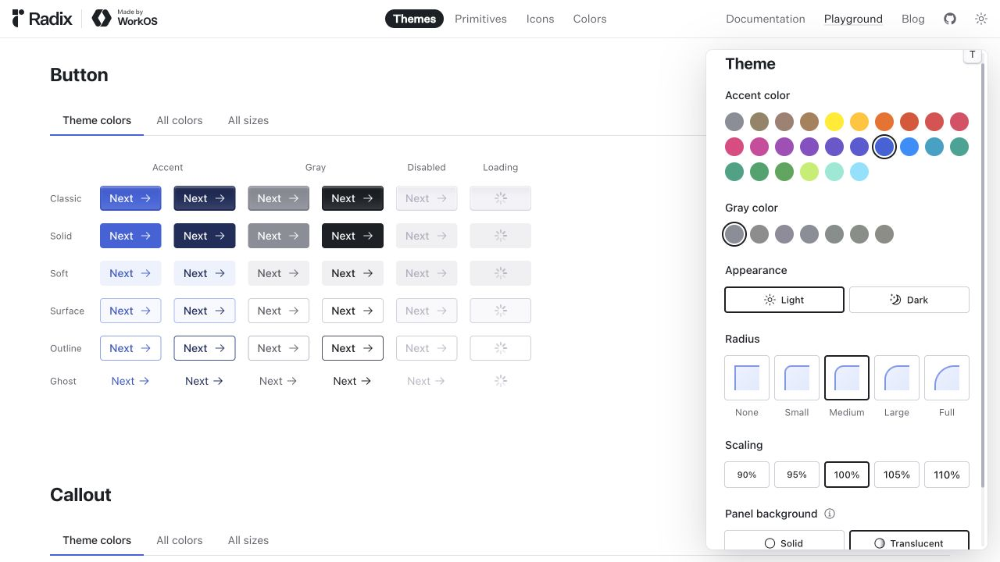
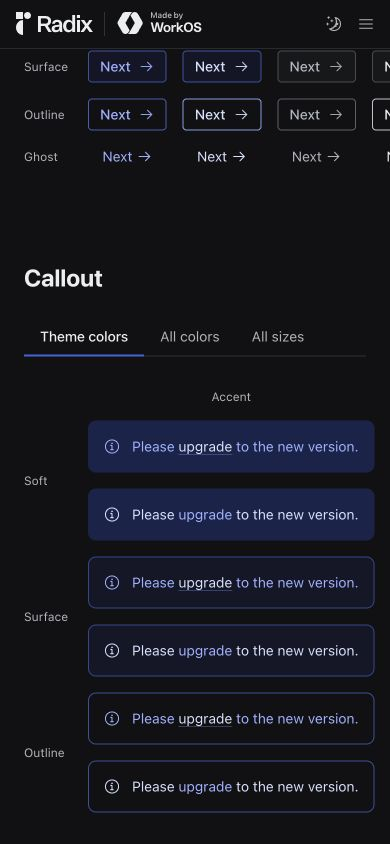

# Radix Themes · 主题与按钮状态

- 标识：radix-theme-states
- 来源：https://www.radix-ui.com/themes/playground#button
- 研究日期：2026-10-05
- 适用范围：适合补充组件状态和主题映射；这是设计系统示例，不能单独当作完整网站布局。
- 收录依据：补齐实际任务与视觉组织方式；本案例不宣称获得设计奖。
- 证据范围：实际渲染截图、可见 DOM 采样及下文列明的操作；不是整站审计。

把按钮变体、禁用和加载状态排列成矩阵，并切换浅色与深色主题比较。

## 视觉证据

桌面：1280×720，文档滚动坐标 (0, 2064.5)。嵌套容器内部位置以截图为准。

窄屏：390×844，文档滚动坐标 (0, 2064.5)。嵌套容器内部位置以截图为准。

窄屏主图继承深色主题和文档滚动位置，展示矩阵尾部与 Callout；不是首屏，也不是桌面同一位置的等价对比。

- [补充截图：desktop-dark](screenshots/desktop-dark.jpg)：与浅色相同按钮矩阵的深色状态。

## 可观察的设计关系

1. **观察与分析**：桌面按 Classic、Solid、Soft、Surface、Outline、Ghost 排行，按 Accent、Gray、Disabled、Loading 排列；风格和状态成为两个可比较的维度，而不是随意挑几颗漂亮按钮。
2. **观察与分析**：主强调、灰色、禁用和加载在同一变体中共享形状，填充、文字对比和旋转指示承担不同状态；按钮尺寸稳定，状态变化不需要重新排版。
3. **观察与分析**：切到深色后，同一结构保持，页面底色、灰色按钮和强调文字的对比关系变化；深色主题是语义颜色重新映射，不是简单把页面套黑背景。
4. **观察与分析**：窄屏下展示矩阵仍有横向裁切，后面的 Callout 示例纵向排列；组件局部尺寸可以参考，示例页的窄屏矩阵不能直接作为产品布局。
5. **观察与分析**：窄屏采样中的 Next 按钮为 32px 高、文字 14px/20px，说明这是紧凑组件演示；手机产品是否需要更大触控区域必须另行决定。

## 实测参数

以下是对应节点的计算样式与边界盒，单位为 CSS px；不是整页通用 token，也不证明触控区域或最终图形尺寸。数值应与同状态截图对照。

| 状态与元素 | 字号 / 行高 | 边界盒宽×高 | 圆角 | 证据 |
| --- | --- | --- | --- | --- |
| mobile · BUTTON Next | 14px / 20px | 78.7 × 32.0 | 4px | [elements[11]](evidence-mobile.json) |
| mobile · H1 Callout | 24px / 30px | 78.8 × 30.0 | 0px | [elements[45]](evidence-mobile.json) |

原始记录：[桌面样式](evidence-desktop.json) · [窄屏样式](evidence-mobile.json)。采样只包含部分节点，祖先裁切、覆盖、字体加载与异步状态需对照截图判断。

## 响应式与交互

定位 Button 章节，点击主题 Light/Dark 选项，保存相同按钮矩阵的两种主题。禁用和加载是官方预置示例，不是本次触发真实提交产生的状态。手机继承深色主题并显示矩阵尾部和 Callout；未完成键盘与屏幕阅读器测试。

仅验证上文列出的视口与操作，不推断 CSS 断点；未列明的键盘、屏幕阅读器及 WCAG 合规均未验证。

## 迁移方法（设计建议）

作为主参考的补充使用：先定义 default、hover/focus、disabled、loading、success/error 等业务需要的状态，再制定 light/dark 的背景、文字、边框和强调语义 token。加载保留按钮标签或清楚的辅助名称，防止重复提交；禁用原因应在附近可见。中文可用系统黑体，不依赖演示站字体。迁移紧凑控件时重新检查触控面积和对比度。

## 避免照搬与已知限制

桌面主题调节浮层遮住一部分示例；桌面第一批 65 个 DOM 样本主要是调节器，不能从它们推导下面按钮的所有参数。窄屏有裁切，不能算优秀移动页面。主题切换不等于已验证 WCAG、状态持久化或操作系统主题联动。

截图中的摄影、插画、商标和字体是研究证据，不是已授权的产品素材。迁移时使用自己的内容与合适授权的资源。
