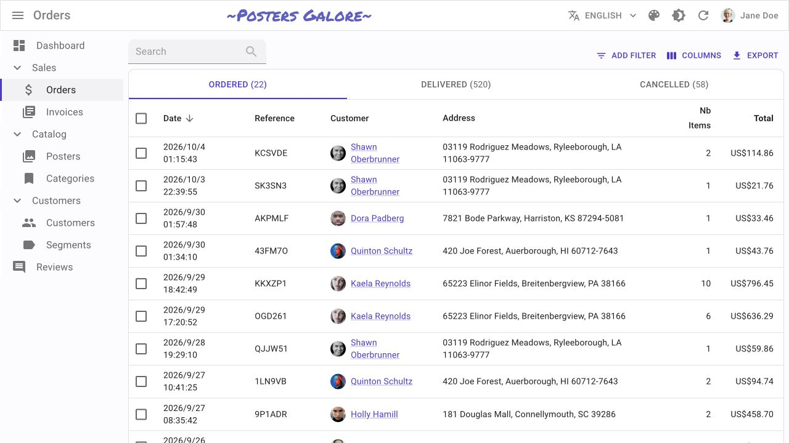
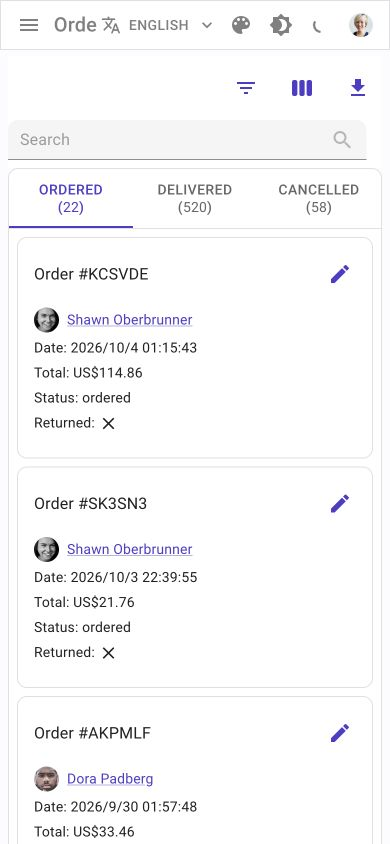

# React-admin · 订单操作后台

- 标识：react-admin-orders
- 来源：https://marmelab.com/react-admin-demo/#/orders
- 研究日期：2026-10-05
- 适用范围：适合订单、客户、工单等高频业务列表；需要一致的数据字段，不适合纯展示网站。
- 收录依据：补齐实际任务与视觉组织方式；本案例不宣称获得设计奖。
- 证据范围：实际渲染截图、可见 DOM 采样及下文列明的操作；不是整站审计。

筛选工具、订单状态和数据表分层，选中后切换批量操作，手机用摘要卡替代表格。

## 视觉证据

桌面：1280×720，文档滚动坐标 (0, 0)。嵌套容器内部位置以截图为准。

窄屏：390×844，文档滚动坐标 (0, 0)。嵌套容器内部位置以截图为准。

- [补充截图：desktop-filter](screenshots/desktop-filter.jpg)：桌面筛选条件菜单，仅打开而未应用。
- [补充截图：desktop-selected](screenshots/desktop-selected.jpg)：选中一条记录后的批量操作条，未删除。
- [补充截图：mobile-empty](screenshots/mobile-empty.jpg)：无匹配搜索后的零计数与空白区，作为缺陷证据。

## 可观察的设计关系

1. **观察与分析**：桌面先放搜索和筛选工具，再放带计数的状态标签，最后是数据表；“缩小结果范围”与“操作某条记录”占据不同层，不在每一行重复全局控件。
2. **观察与分析**：表格把日期、编号、客户、地址、件数和金额按列对齐；长地址允许换行，金额右对齐。比较同一字段比逐张读长卡更容易，代价是桌面横向宽度较大。
3. **观察与分析**：选中一条记录后，紫色批量操作条接替状态区域，显示选择数和删除入口；动作跟随选择状态，而不是常驻一排不可用危险按钮。
4. **观察与分析**：390px 下，搜索从 180px 宽变为约 315px，筛选/导出收成图标，订单表变为编号、日期、客户、总额的单列摘要；保留任务角色而改变信息组织。
5. **观察与分析**：无匹配搜索后，标签计数归零但内容区只留下空白；这是可观察的恢复路径缺陷，迁移时应加“无匹配结果”和清除筛选入口。

## 实测参数

以下是对应节点的计算样式与边界盒，单位为 CSS px；不是整页通用 token，也不证明触控区域或最终图形尺寸。数值应与同状态截图对照。

| 状态与元素 | 字号 / 行高 | 边界盒宽×高 | 圆角 | 证据 |
| --- | --- | --- | --- | --- |
| desktop · INPUT Search | 16px / 23px | 180.0 × 40.0 | 0px | [elements[26]](evidence-desktop.json) |
| desktop · BUTTON ADD FILTER | 13px / 19.5px | 106.3 × 27.5 | 10px | [elements[27]](evidence-desktop.json) |
| desktop-selected · BUTTON DELETE | 13px / 19.5px | 81.8 × 27.5 | 10px | [elements[35]](evidence-desktop-selected.json) |
| mobile · INPUT Search | 16px / 23px | 314.7 × 40.0 | 0px | [elements[7]](evidence-mobile.json) |

原始记录：[桌面样式](evidence-desktop.json) · [窄屏样式](evidence-mobile.json)。采样只包含部分节点，祖先裁切、覆盖、字体加载与异步状态需对照截图判断。

## 响应式与交互

使用官方公开演示账号 demo/demo 查看订单（页面说明数据只在本地演示并可重置）。已打开 Add filter 菜单、选中一行并看到选择数/批量操作条；未执行删除或导出。手机搜索输入无匹配的测试词，观察到零计数和空结果。筛选条件提交、列设置、排序、分页和编辑详情未完整验证。

仅验证上文列出的视口与操作，不推断 CSS 断点；未列明的键盘、屏幕阅读器及 WCAG 合规均未验证。

## 迁移方法（设计建议）

先确定列表用于比较的关键字段，再决定桌面列顺序；数值列统一单位并右对齐。手机每条记录保留三四个决策字段，其他信息进详情。批量操作应明确作用数量、权限和可撤销性；删除前的确认与业务后果另行实现。中文客户名不必沿用英文姓/名结构。系统黑体足以支撑此布局，无需模拟演示站品牌。

## 避免照搬与已知限制

数据是公开演示的虚构订单，不是用户业务资料。桌面样式采样可能包含未选中时隐藏的批量操作节点，须以 desktop-selected 截图判断其可见状态。空结果不是优秀空状态范本。未测试权限、真实后台接口、删除确认和恢复。

截图中的摄影、插画、商标和字体是研究证据，不是已授权的产品素材。迁移时使用自己的内容与合适授权的资源。
