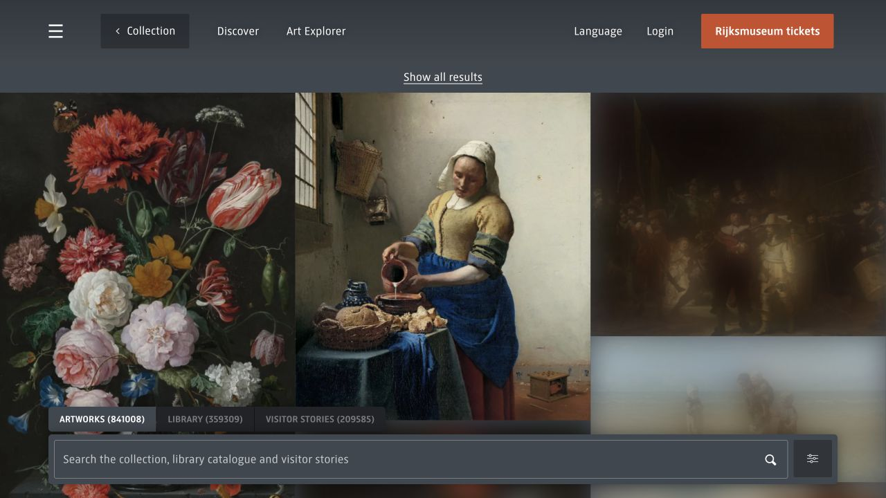
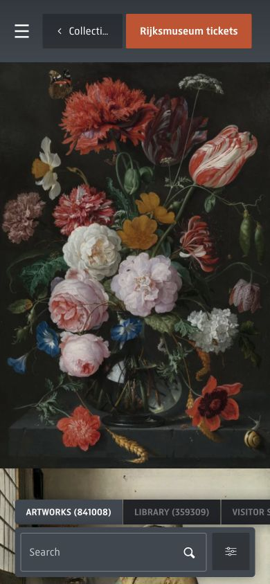

# Rijksmuseum · 艺术收藏检索

- 标识：rijksmuseum-collection
- 来源：https://www.rijksmuseum.nl/en/collection/search
- 研究日期：2026-10-05
- 适用范围：适合美术、摄影和档案收藏；需要高质量作品图和可靠元数据。
- 证据范围：实际渲染截图、可见 DOM 样式采样及下文列明的操作；不是整站审计。
- 收录依据：[2025 Webby Winner 与 People’s Voice：Best User Interface](https://winners.webbyawards.com/2025/websites-and-mobile-sites/features-design/best-user-interface/333807/rijksmuseum-collection-online)。奖项针对当时的网站作品，不等于本次子页面或最新版本单独获奖。

作品铺满浏览区域，搜索与集合切换悬在画面下方，工具退后让内容成为主角。

## 视觉证据

桌面：1280×720，文档滚动坐标 (0, 0)。嵌套容器或画布的内部位置以截图为准。

窄屏：390×844，文档滚动坐标 (0, 0)。嵌套容器或画布的内部位置以截图为准。

- [补充截图：desktop-entry](screenshots/desktop-entry.jpg)：集合入口，以巨幅作品图和 COLLECTION 标题建立进入感。

## 可观察的设计关系

1. **观察与分析**：结果页把绘画作为大块视觉单元，减少卡片外框和装饰；作品之间依靠图像边界区分，界面不与作品争夺颜色。
2. **观察与分析**：顶部导航和底部搜索带形成两个稳定操作区，中部尽量留给图像；搜索不需要穿过长列表才能找到。
3. **观察与分析**：桌面可同时比较多幅作品，390px 窄屏突出单幅作品；底部分类横向空间不足，截图存在后续分类被裁切的边界。

## 实测参数

以下是对应 DOM 节点的计算样式与边界盒，单位为 CSS px；只作为定位证据，不自动等于整个组件或最终图形尺寸。截图与样式先后采样，动态过渡可能存在差异。

| 状态与元素 | 字号 / 行高 | 边界盒宽×高 | 圆角 | 证据 |
| --- | --- | --- | --- | --- |
| desktop · BUTTON Open menu | 17.392px / normal | 50.0 × 50.0 | 0px | [elements[1]](evidence-desktop.json) |
| mobile · INPUT Search | 16px / 22px | 219.1 × 54.0 | 0px | [elements[8]](evidence-mobile.json) |

原始记录：[桌面样式](evidence-desktop.json) · [窄屏样式](evidence-mobile.json)。其他元素可能被祖先裁切、覆盖或属于隐藏状态，使用前须对照截图。

## 响应式与交互

从集合入口进入 Artworks 搜索结果，保存入口与结果页。桌面/窄屏主图均为结果页；没有登录、收藏或测试查询准确率。

仅验证上述两种主视口，不推断 CSS 断点。未列明的交互、键盘路径、屏幕阅读器和 WCAG 合规均未验证。

## 迁移方法（设计建议）

适合迁移到照片档案或作品库：统一图片裁切策略，把标题、作者、年代放进可展开详情，而非覆盖每张图。保留明确搜索入口和分类状态；移动端将长分类变成可滚动且有提示的标签条。没有足够作品图时，用常规列表优于空洞的大图墙。

## 避免照搬与已知限制

作品与结果数量会变化。底部浮层会遮住部分画面，窄屏导航文字也较拥挤；复制时应重新处理安全区和触控目标。

截图中的摄影、插画、商标和字体是研究证据，不是已授权的产品素材。迁移时使用自己的内容与合适授权的资源。
