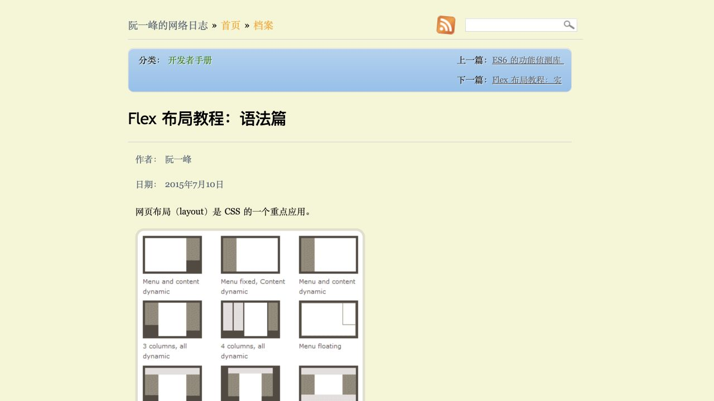
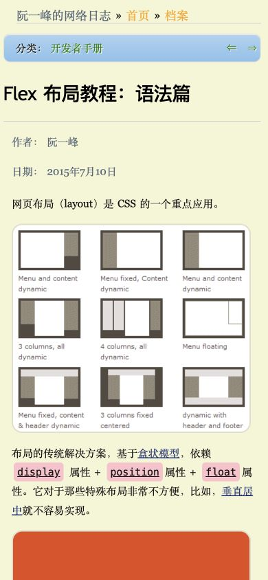

# 阮一峰博客 · 中文教程长文

- 标识：ruanyifeng-longform
- 来源：https://www.ruanyifeng.com/blog/2015/07/flex-grammar.html
- 研究日期：2026-10-05
- 适用范围：适合中文教程、技术笔记和长篇说明；研究布局，不把旧文当最新技术资料。
- 收录依据：补齐实际任务与视觉组织方式；本案例不宣称获得设计奖。
- 证据范围：实际渲染截图、可见 DOM 采样及下文列明的操作；不是整站审计。

中文正文、示意图与代码块顺序展开，目录与文章元信息保持朴素阅读层级。

## 视觉证据

桌面：1280×720，文档滚动坐标 (0, 0)。嵌套容器内部位置以截图为准。

窄屏：390×844，文档滚动坐标 (0, 0)。嵌套容器内部位置以截图为准。

- [补充截图：desktop-content](screenshots/desktop-content.jpg)：正文与概念示意图连续展开。
- [补充截图：desktop-code](screenshots/desktop-code.jpg)：下方章节、代码区和图解的阅读节奏。

## 可观察的设计关系

1. **观察与分析**：文章开头按站点路径、相邻文章、分类、标题、作者和日期排列，随后直接进入正文；元信息完整但通过较小文字和颜色退到标题之后。
2. **观察与分析**：桌面正文 16px、行高 28.8px，中文段落与图解沿同一阅读顺序展开；内容靠行距和段间留白呼吸，而不是每段套成卡片。
3. **观察与分析**：标题使用无衬线字体栈，正文采用 Georgia/serif 栈；中文实际字形取决于浏览器回退字体，不能把 Georgia 当作中文字体名称。
4. **观察与分析**：代码区以浅灰底与等宽/语法着色区别正文，章节标题通过分隔和尺度变化标记内容段；图解紧随需要解释的概念，避免只做首屏装饰。
5. **观察与分析**：390px 下正文约 15.36px/27.648px，标题约 27.648px，图片随列宽收缩；相邻文章导航更紧凑，但边缘留白也明显偏小。

## 实测参数

以下是对应节点的计算样式与边界盒，单位为 CSS px；不是整页通用 token，也不证明触控区域或最终图形尺寸。数值应与同状态截图对照。

| 状态与元素 | 字号 / 行高 | 边界盒宽×高 | 圆角 | 证据 |
| --- | --- | --- | --- | --- |
| desktop · H1 Flex 布局教程 | 28.8px / 72px | 795.4 × 78.8 | 0px | [elements[9]](evidence-desktop.json) |
| desktop · P 网页布局 | 16px / 28.8px | 782.6 × 28.8 | 0px | [elements[14]](evidence-desktop.json) |
| mobile · H1 Flex 布局教程 | 27.648px / 69.12px | 374.5 × 75.6 | 0px | [elements[6]](evidence-mobile.json) |
| mobile · P 网页布局 | 15.36px / 27.648px | 362.3 × 27.6 | 0px | [elements[11]](evidence-mobile.json) |

原始记录：[桌面样式](evidence-desktop.json) · [窄屏样式](evidence-mobile.json)。采样只包含部分节点，祖先裁切、覆盖、字体加载与异步状态需对照截图判断。

## 响应式与交互

查看文章开头、图文区、下方章节和代码区域，并检查 390px 窄屏。只有滚动阅读经过验证；相邻文章、搜索、评论和目录跳转未测试。文章发布日期为 2015-07-10，研究日期为 2026-10-05，两者不可混用。

仅验证上文列出的视口与操作，不推断 CSS 断点；未列明的键盘、屏幕阅读器及 WCAG 合规均未验证。

## 迁移方法（设计建议）

把教程拆成概念、示意图、例子、注意事项，每段只有一件事。中文正文采用明确的本地宋体或黑体回退，而非指望英文字体覆盖汉字。建议重新设置手机边距和代码溢出处理；建议值需在实际成品里验证，不能冒充本站实测。无需复制淡黄色背景，保留清晰的标题/日期和图文顺序即可。图解用自制 SVG 或有授权素材。

## 避免照搬与已知限制

桌面部分原图较宽，局部可能超出正文列；窄屏边距偏窄，不建议逐像素复制。样式采样未专门提取 PRE/CODE，所以代码区只作视觉观察，不给精确代码字体参数。旧文章中的 CSS 做法不属于本案例推荐范围。未研究整页评论与底部导航。

截图中的摄影、插画、商标和字体是研究证据，不是已授权的产品素材。迁移时使用自己的内容与合适授权的资源。
