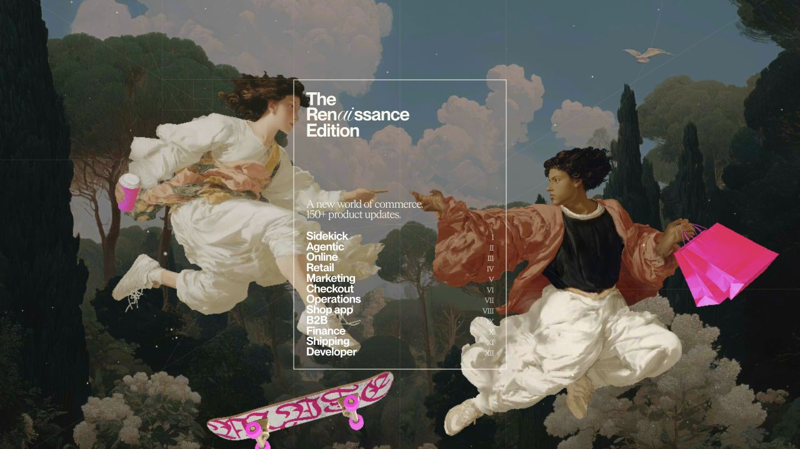
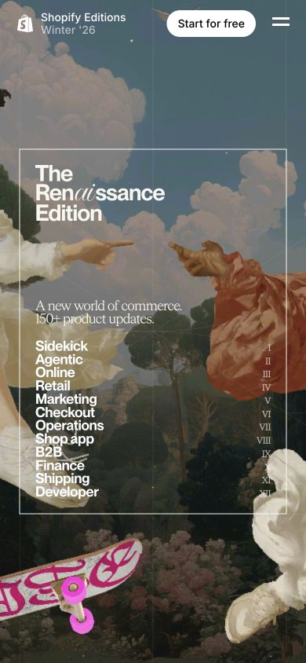

# Shopify Editions · 主题发布

- 标识：shopify-editions
- 来源：https://www.shopify.com/editions/winter2026
- 研究日期：2026-10-05
- 适用范围：适合多模块产品发布与年度报告；需要成体系的主题视觉和真实更新内容。
- 证据范围：实际渲染截图、可见 DOM 样式采样及下文列明的操作；不是整站审计。
- 收录依据：[2026 Webby Winner：Best Home Page；People’s Voice：Best Visual Design–Aesthetic](https://winners.webbyawards.com/2026/websites-and-mobile-sites/features-design/best-home-page/372642/the-renaissance-edition)。奖项针对当时的网站作品，不等于本次子页面或最新版本单独获奖。

主题插画建立发布季身份，紧凑章节目录把大量产品更新组织为可跳转长页。

## 视觉证据

桌面：1280×720，文档滚动坐标 (0, 0)。嵌套容器或画布的内部位置以截图为准。

窄屏：390×844，文档滚动坐标 (0, 0)。嵌套容器或画布的内部位置以截图为准。

- [补充截图：desktop-checkout](screenshots/desktop-checkout.jpg)：跳转后的 Checkout 章节封面。
- [补充截图：desktop-content](screenshots/desktop-content.jpg)：同章节的具体更新说明。

## 可观察的设计关系

1. **观察与分析**：首屏用大幅绘画式场景包围一个 340px 宽目录，画面复杂而操作区稳定；信息入口与背景叙事各有职责。
2. **观察与分析**：章节内的大标题负责分段，具体更新又收回到小标题和短说明；大尺度用于章节节奏，小尺度用于高密度查阅。
3. **观察与分析**：桌面正文保留侧边章节入口，更新内容分栏；窄屏首屏目录仍保持 340px 宽，以裁切背景而不是缩小文字应对宽度。

## 实测参数

以下是对应 DOM 节点的计算样式与边界盒，单位为 CSS px；只作为定位证据，不自动等于整个组件或最终图形尺寸。截图与样式先后采样，动态过渡可能存在差异。

| 状态与元素 | 字号 / 行高 | 边界盒宽×高 | 圆角 | 证据 |
| --- | --- | --- | --- | --- |
| desktop · NAV The Renaissance Edition | 14px / 21px | 340.0 × 464.0 | 0px | [elements[9]](evidence-desktop.json) |
| mobile · NAV The Renaissance Edition | 14px / 21px | 340.0 × 464.0 | 0px | [elements[20]](evidence-mobile.json) |
| desktop · H2 The Renaissance Edition | 32px / 30.4px | 165.0 × 71.5 | 0px | [elements[10]](evidence-desktop.json) |

原始记录：[桌面样式](evidence-desktop.json) · [窄屏样式](evidence-mobile.json)。其他元素可能被祖先裁切、覆盖或属于隐藏状态，使用前须对照截图。

## 响应式与交互

已点击 Checkout 章节并到达对应锚点，再滚动查看具体更新区。截图只覆盖首屏和该章节；未验证每个目录、搜索或注册。

仅验证上述两种主视口，不推断 CSS 断点。未列明的交互、键盘路径、屏幕阅读器和 WCAG 合规均未验证。

## 迁移方法（设计建议）

先按产品任务给更新分组，再选一个贯穿全页的主题。每条更新写清变化与用途，配真实产品图；插画不足时使用单色章节封面仍可保留目录结构。中文大标题宜减少字数，正文用常规系统字体，避免把绘画色彩变成每张功能卡的背景。

## 避免照搬与已知限制

长页有动态过渡，采样可能含隐藏导航。只采用截图中可见的中央目录参数；不据此推断动画时长或断点。

截图中的摄影、插画、商标和字体是研究证据，不是已授权的产品素材。迁移时使用自己的内容与合适授权的资源。
