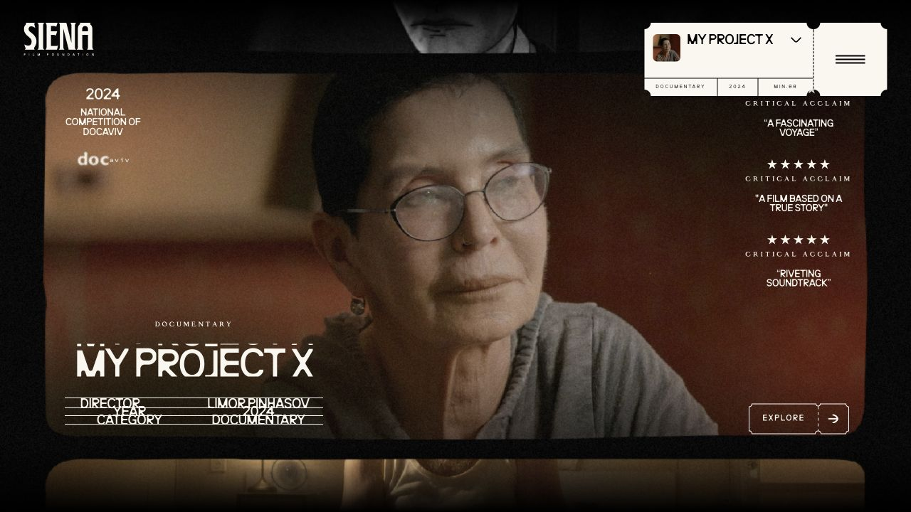
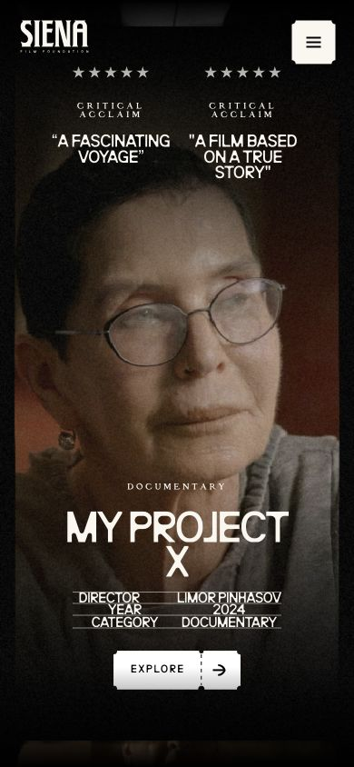

# Siena Film · 电影海报式展示

- 标识：siena-film
- 来源：https://siena.film/
- 研究日期：2026-10-05
- 适用范围：适合电影、影像作品及展览；依赖画面质量，不适合密集业务表单。
- 证据范围：实际渲染截图、可见 DOM 样式采样及下文列明的操作；不是整站审计。
- 收录依据：[Awwwards Site of the Month：March 2025；Developer Award](https://www.awwwards.com/websites/%23FAEDCD/)。奖项针对当时的网站作品，不等于本次子页面或最新版本单独获奖。

影片画面占据主体，票根式导航与演职员信息把网站组织成电影展映空间。

## 视觉证据

桌面：1280×720，文档滚动坐标 (0, 0)。嵌套容器或画布的内部位置以截图为准。

窄屏：390×844，文档滚动坐标 (0, 0)。嵌套容器或画布的内部位置以截图为准。

- [补充截图：desktop-content](screenshots/desktop-content.jpg)：滚动尝试后的同一影片，保留为局部状态证据。

## 可观察的设计关系

1. **观察与分析**：中央大画面四周留黑，上一张和下一张在边缘露出，形成连续放映的线索；作品图不是普通商品缩略图。
2. **观察与分析**：右上浅色票根式控件与深色画面形成强对比，标题、年份、时长等信息聚在一起；导航造型与电影内容相关。
3. **观察与分析**：手机重新裁切竖向人物画面，把评价置上、片名和演职员信息置下；片名字号只从 57.6px 降到 48px，主要靠换行适应。

## 实测参数

以下是对应 DOM 节点的计算样式与边界盒，单位为 CSS px；只作为定位证据，不自动等于整个组件或最终图形尺寸。截图与样式先后采样，动态过渡可能存在差异。

| 状态与元素 | 字号 / 行高 | 边界盒宽×高 | 圆角 | 证据 |
| --- | --- | --- | --- | --- |
| desktop · H2 M M Y | 57.6px / 44.352px | 334.2 × 46.4 | 0px | [elements[25]](evidence-desktop.json) |
| mobile · H2 M M Y | 48px / 36.96px | 258.3 × 76.8 | 0px | [elements[14]](evidence-mobile.json) |

原始记录：[桌面样式](evidence-desktop.json) · [窄屏样式](evidence-mobile.json)。其他元素可能被祖先裁切、覆盖或属于隐藏状态，使用前须对照截图。

## 响应式与交互

点击 ENTER 后进入作品展示，关闭教学提示。尝试 WORK 和滚动后没有确认跳到其他页面，因此不声称目录或影片切换已通过；只覆盖当前影片展示和窄屏重排。

仅验证上述两种主视口，不推断 CSS 断点。未列明的交互、键盘路径、屏幕阅读器和 WCAG 合规均未验证。

## 迁移方法（设计建议）

用自有作品海报和准确元数据重做。保留一个固定的作品选择入口和一个明确详情按钮，避免多个手势才能找内容。可用静态海报加普通前后切换替代沉浸滚动；中文片名可用较窄黑体，演职员表至少留出正常行高。

## 避免照搬与已知限制

桌面演职员信息在截图中存在重叠，不能作为排版目标照抄。DOM 含重复动画文字和隐藏菜单，未验证动画时长、全部影片、音频或键盘。

截图中的摄影、插画、商标和字体是研究证据，不是已授权的产品素材。迁移时使用自己的内容与合适授权的资源。
