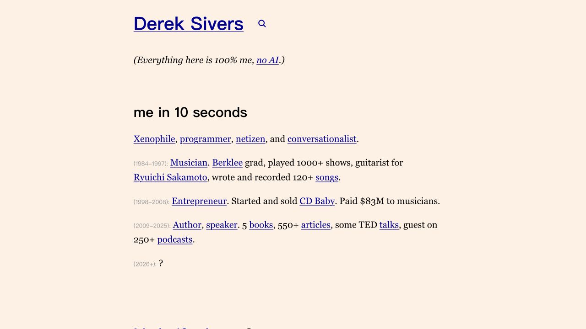
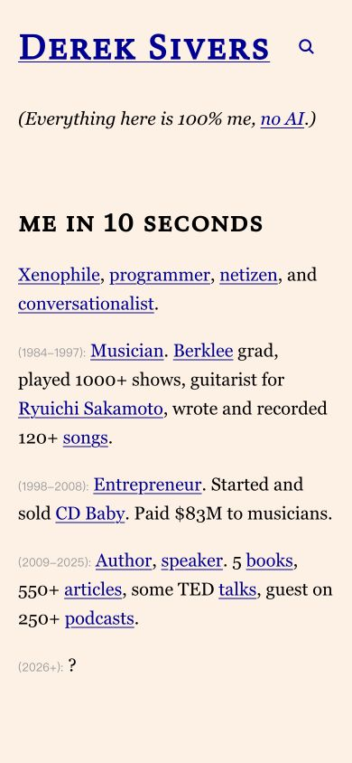

# Derek Sivers · 文字型个人网站

- 标识：sivers-personal
- 来源：https://sive.rs/
- 研究日期：2026-10-05
- 适用范围：适合个人主页、研究者和文字创作者；需要真实经历及有意义的文章/项目链接。
- 收录依据：补齐实际任务与视觉组织方式；本案例不宣称获得设计奖。
- 证据范围：实际渲染截图、可见 DOM 采样及下文列明的操作；不是整站审计。

用个人摘要、时间线和内联链接构成窄列主页，无需巨幅作品图。

## 视觉证据

桌面：1280×720，文档滚动坐标 (0, 0)。嵌套容器内部位置以截图为准。

窄屏：390×844，文档滚动坐标 (0, 0)。嵌套容器内部位置以截图为准。

- [补充截图：mobile-about](screenshots/mobile-about.jpg)：从主页进入 About 后的文字介绍与时间线。

## 可观察的设计关系

1. **观察与分析**：桌面主阅读列约 697px，名字、短声明、简历摘要沿同一左边界排列；身份通过真实文字建立，而不是靠巨幅照片和轮播项目。
2. **观察与分析**：正文为 20px/32px，姓名 40px/48px、分节标题 30px/36px；字号差异清楚，但留白比频繁的色块更承担分组。
3. **观察与分析**：经历段落以小而灰的年代引出较大的正文，正文中直接嵌入蓝色下划线链接；重要去向出现在它所解释的经历旁，不需要再造一组独立卡片。
4. **观察与分析**：手机阅读列约 350px，两侧约 20px，正文和标题采样字号不变；时间线自然换行，靠流式段落适配，而不是缩小到密密麻麻。
5. **观察与分析**：About 子页延续相同的文字列与小节结构；主页摘要可以逐层进入更长介绍，信息深度与访问意图相对应。

## 实测参数

以下是对应节点的计算样式与边界盒，单位为 CSS px；不是整页通用 token，也不证明触控区域或最终图形尺寸。数值应与同状态截图对照。

| 状态与元素 | 字号 / 行高 | 边界盒宽×高 | 圆角 | 证据 |
| --- | --- | --- | --- | --- |
| desktop · H1 Derek Sivers | 40px / 48px | 696.5 × 48.0 | 0px | [elements[1]](evidence-desktop.json) |
| desktop · P Xenophile | 20px / 32px | 696.5 × 32.0 | 0px | [elements[8]](evidence-desktop.json) |
| mobile · H1 Derek Sivers | 40px / 48px | 350.0 × 48.0 | 0px | [elements[1]](evidence-mobile.json) |
| mobile · P Xenophile | 20px / 32px | 350.0 × 64.0 | 0px | [elements[8]](evidence-mobile.json) |

原始记录：[桌面样式](evidence-desktop.json) · [窄屏样式](evidence-mobile.json)。采样只包含部分节点，祖先裁切、覆盖、字体加载与异步状态需对照截图判断。

## 响应式与交互

查看主页桌面和窄屏，并从主页进入 About，保存其开头与时间线。没有点击邮件、联系或提交内容；搜索、所有文章入口和键盘路径未测试。

仅验证上文列出的视口与操作，不推断 CSS 断点；未列明的键盘、屏幕阅读器及 WCAG 合规均未验证。

## 迁移方法（设计建议）

先写十秒能读懂的身份摘要，再给更完整的经历、文章和项目入口。时间只提供必要上下文，链接使用可解释的名称。中文可用本地宋体正文配黑体标题，保留大行距与明确下划线；人物不需要很多照片也能成立。避免把每段都做成“亮点卡片”，同时保留正常链接的键盘焦点。

## 避免照搬与已知限制

桌面标题呈无衬线，稍后手机标题呈衬线小型大写，但两份计算样式均记录 font-family 为自定义名称 v；可能是字体加载时序，不能宣称这是响应式换字体。字号和列宽是节点实测，实际字体身份未确认。这里“无特殊素材”指研究的文字区，整站其他部分仍有书籍图片。

截图中的摄影、插画、商标和字体是研究证据，不是已授权的产品素材。迁移时使用自己的内容与合适授权的资源。
