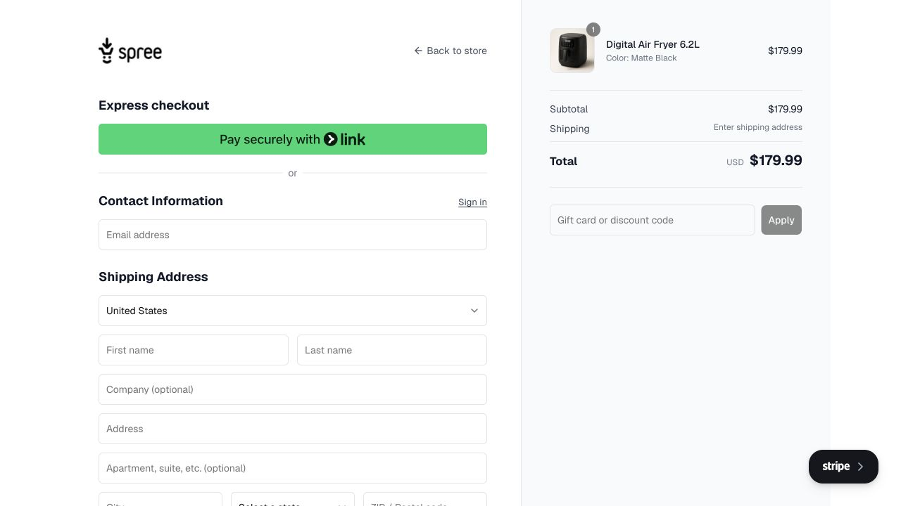
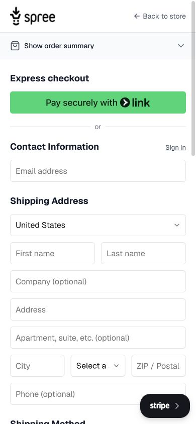

# Spree · 购物车与结账

- 标识：spree-checkout
- 来源：https://demo.spreecommerce.org/us/en
- 研究日期：2026-10-05
- 适用范围：适合实物商品结账及费用确认；需真实商品、运费和支付规则，不宜照搬美国地址字段。
- 收录依据：补齐实际任务与视觉组织方式；本案例不宣称获得设计奖。
- 证据范围：实际渲染截图、可见 DOM 采样及下文列明的操作；不是整站审计。

购物车侧抽屉衔接分组结账表单，桌面保留订单摘要，手机将摘要折叠到顶部。

## 视觉证据

桌面：1280×720，文档滚动坐标 (0, 0)。嵌套容器内部位置以截图为准。

窄屏：390×844，文档滚动坐标 (0, 0)。嵌套容器内部位置以截图为准。

- [补充截图：desktop-cart-drawer](screenshots/desktop-cart-drawer.jpg)：加购后的侧抽屉与费用摘要。
- [补充截图：desktop-delivery](screenshots/desktop-delivery.jpg)：下滚后的配送/支付区域，右侧订单摘要仍可见。
- [补充截图：mobile-summary](screenshots/mobile-summary.jpg)：展开的手机订单摘要。
- [补充截图：mobile-payment](screenshots/mobile-payment.jpg)：窄屏支付区域，仅查看，没有输入或付款。

## 可观察的设计关系

1. **观察与分析**：加购后以右侧抽屉展示商品、数量、费用和 Checkout，商品页仍在后方；先确认刚加入的对象，再进入完整结账页面。
2. **观察与分析**：桌面左侧表单约 552px 宽，右侧订单摘要独立占据浅灰区域；填写资料和核对金额各有稳定位置，下滚查看配送/支付时摘要仍可见。
3. **观察与分析**：联系资料、配送地址、配送方式和支付按业务顺序分组；主要输入高度均约 44px，姓/名各 270px，长地址独占整行，字段的业务长度决定分栏。
4. **观察与分析**：手机摘要变成顶端 Show order summary 折叠入口，展开后商品和费用出现在表单前；输入字体从 14px 变为 16px，表单宽度收至 350px。
5. **观察与分析**：手机城市、州和邮编仍挤在三列，字段文本较拥挤；这说明仅改变容器宽度不足以处理所有字段，中文结账需要重新安排地址结构。

## 实测参数

以下是对应节点的计算样式与边界盒，单位为 CSS px；不是整页通用 token，也不证明触控区域或最终图形尺寸。数值应与同状态截图对照。

| 状态与元素 | 字号 / 行高 | 边界盒宽×高 | 圆角 | 证据 |
| --- | --- | --- | --- | --- |
| desktop · INPUT Email address | 14px / 20px | 552.0 × 44.0 | 6px | [elements[6]](evidence-desktop.json) |
| desktop · INPUT First name | 14px / 20px | 270.0 × 44.0 | 6px | [elements[9]](evidence-desktop.json) |
| mobile · INPUT Email address | 16px / 24px | 350.0 × 44.0 | 6px | [elements[7]](evidence-mobile.json) |
| mobile · BUTTON Show order summary | 16px / 24px | 390.0 × 52.0 | 0px | [elements[2]](evidence-mobile.json) |

原始记录：[桌面样式](evidence-desktop.json) · [窄屏样式](evidence-mobile.json)。采样只包含部分节点，祖先裁切、覆盖、字体加载与异步状态需对照截图判断。

## 响应式与交互

在 Spree 官方演示店将一件空气炸锅加入购物车，打开结账，滚动查看配送与支付区域，并展开手机订单摘要。未输入姓名、联系方式、地址或卡号，未选择最终付款、提交订单或同意交易条款。支付界面标示测试模式，但本案例没有完成模拟交易。

仅验证上文列出的视口与操作，不推断 CSS 断点；未列明的键盘、屏幕阅读器及 WCAG 合规均未验证。

## 迁移方法（设计建议）

把费用摘要做成独立组件，与当前商品、优惠、运费、税和总额共享同一数据源。桌面可并列，手机折叠但保留总额和展开入口。中文场景合并姓名，省市区用本地地址规则，长地址单行或多行全宽。支付方式必须真实可用；演示中的快捷支付品牌按钮不能作为装饰。结账表单应补未填/错误/加载状态，最后付款的业务校验另行实现。

## 避免照搬与已知限制

结账 URL 含本次演示购物车标识，未来可能失效；来源入口使用稳定演示店地址，快照可离线使用。支付部分位于第三方 iframe，外层 DOM 采样不能证明内部支付控件尺寸。开发提示浮层会遮挡局部。配送选择依赖地址，订单成功、失败、退款和售后均未验证。

截图中的摄影、插画、商标和字体是研究证据，不是已授权的产品素材。迁移时使用自己的内容与合适授权的资源。
