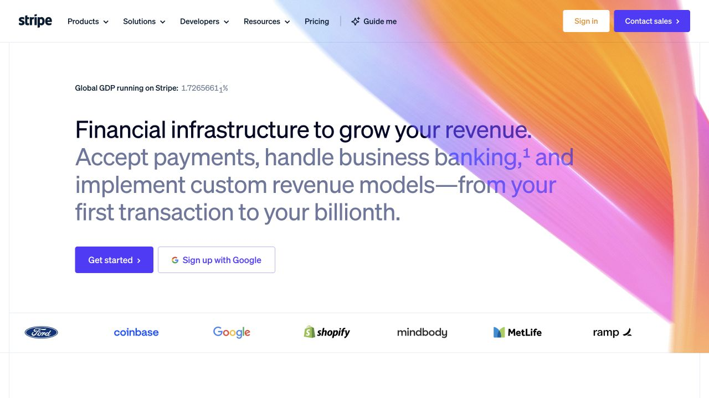

# Stripe · 宽幅价值陈述与清晰行动

- 来源：https://stripe.com/
- 研究日期：2026-10-04
- 范围：主页首屏；桌面 1280×720、窄屏 390×844，均页面顶部。
- 适合：商业服务介绍、技术平台落地页、需要解释价值并引导开始使用的页面。
- 不适合：直接搬进表格后台、长文阅读页或没有明确行动目标的作品展览。
- 素材依赖：清楚的价值陈述比大量图片更重要；原站渐变是辅助品牌视觉，客户 Logo 必须是真实且可用的证明。

## 视觉证据

桌面宽标题与说明合成一个大文字块，下面是两种层级的行动；右侧彩色图形形成方向感。窄屏缩短主陈述，将两项行动上下排列。截图中的实时数字是网站内容，不是可迁移的可信背书。

## 可观察的设计关系

- 主陈述、说明和行动保持同一左边界；用户先读价值，再决定操作。
- 渐变覆盖局部大面积背景，但清晰的文字块、间距和行动按钮组织了首屏，不靠重复小卡片堆出层级。
- 主按钮填充色，次按钮浅底描边；同一行动在不同尺寸有一致语义。
- 细线划分导航、主内容和客户标识带。我的判断：这使多彩视觉仍保留结构秩序。

## 实测参数

| 元素 | 实测值 | 来源 |
| --- | --- | --- |
| 桌面主标题 | 43.2px；行高 49.68px；字重 300；字距 -0.864px | [桌面样式](evidence-desktop.json) 中 H1 |
| 桌面标题左边界 | x=135.5px；文本容器宽约 916.7px | 同上；只适用本次视口 |
| Get started 主按钮 | 背景 rgb(83,58,253)；圆角 4px；高 48px；文字 16px | 同上，按按钮文字定位 |
| 桌面导航文字 | 14px；菜单按钮高 40px | 同上 |
| 窄屏主标题 | 34px；行高 35.02px；容器宽 358px、x=16px | [窄屏样式](evidence-mobile.json) |

字体声明是 `sohne-var` 等。H1 采用多个图层，原始计算颜色出现黄色与半透明蓝色，不能直接解释为肉眼所见的文字颜色；复用时应重新定义清晰可读的前景色，而非复制这些混合层数值。

## 响应式与交互

在 390px 宽度看到折叠菜单图标、缩短的主陈述、上下堆叠行动和下方产品模块。没有测得准确断点。菜单展开、注册、登录、动态背景时序、减少动态效果和完整键盘路径未测试。

## 迁移方法（设计建议）

用一个简明标题、一个解释段落、一项主要行动和可选次要行动组成首屏。适合把“你是谁—能解决什么—下一步怎么做”连起来。先确定文字宽度和间距，再决定是否加渐变；没有真实客户背书就删去 Logo 带。

可用系统无衬线字体替代商业字体。中文标题重新设置字号与断行，不照搬英文四行长句。不必复刻多图层文字混色；以可读性为准。

## 限制

这是首屏设计参考，不是 Stripe 的完整设计系统。没有从截图推断阴影、断点或动画时长，也没有完成 WCAG 审计。
