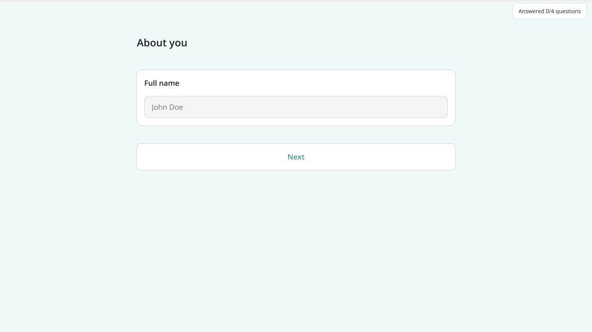
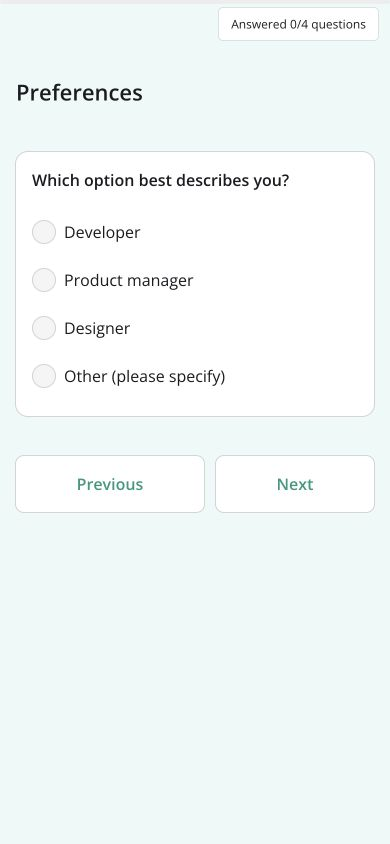

# SurveyJS · 分步与条件表单

- 标识：surveyjs-wizard
- 来源：https://surveyjs.io/form-library/examples/s/multi-step-form-wizard/reactjs/default
- 研究日期：2026-10-05
- 适用范围：适合问卷、分步资料收集与条件问题；不是保存进度和注册流程的完整范本。
- 收录依据：补齐实际任务与视觉组织方式；本案例不宣称获得设计奖。
- 证据范围：实际渲染截图、可见 DOM 采样及下文列明的操作；不是整站审计。

一次展示一个问题，错误紧贴输入，选择 Other 后就地展开补充字段。

## 视觉证据

桌面：1280×720，文档滚动坐标 (0, 0)。嵌套容器内部位置以截图为准。

窄屏：390×844，文档滚动坐标 (0, 0)。嵌套容器内部位置以截图为准。

窄屏主图是职业问题；与桌面姓名问题属于同一分步流程的不同步骤，不能用两张图比较同一字段的重排。

- [补充截图：desktop-error](screenshots/desktop-error.jpg)：无效邮箱的局部错误反馈。
- [补充截图：desktop-step3](screenshots/desktop-step3.jpg)：职业单选问题及前后导航。
- [补充截图：mobile-other](screenshots/mobile-other.jpg)：选中 Other 后出现补充文本框。

## 可观察的设计关系

1. **观察与分析**：桌面问题集中于约 688px 宽的区域，浅色背景衬出白色输入卡，底部宽按钮明确指向下一步；全页只围绕当前问题分配注意力。
2. **观察与分析**：Next 和 Previous 位于问题下方，而完成量单独显示；示例的 Answered 1/4 表示回答量，不是第一个步骤，也不能证明答案有效。
3. **观察与分析**：错误邮箱使输入边框和相邻提示区域呈红/粉色，错误与问题保持在同一局部；不要求读者滚回顶部寻找一条全局警告。
4. **观察与分析**：职业选项是单列单选，选择 Other 后在同一卡片内出现文本框；额外问题在需要时出现，不提前铺满所有可能字段。
5. **观察与分析**：窄屏保留单问题结构和 56px 高导航按钮，Previous/Next 继续并排；依靠列宽变化适配，而非把字段和按钮全部缩小。

## 实测参数

以下是对应节点的计算样式与边界盒，单位为 CSS px；不是整页通用 token，也不证明触控区域或最终图形尺寸。数值应与同状态截图对照。

| 状态与元素 | 字号 / 行高 | 边界盒宽×高 | 圆角 | 证据 |
| --- | --- | --- | --- | --- |
| desktop · INPUT John Doe | 16px / 24px | 648.0 × 40.0 | 0px | [elements[0]](evidence-desktop.json) |
| desktop · BUTTON Next | 13.3333px / normal | 688.0 × 56.0 | 8px | [elements[1]](evidence-desktop.json) |
| mobile · BUTTON Previous | 13.3333px / normal | 187.9 × 56.0 | 8px | [elements[4]](evidence-mobile.json) |
| mobile · BUTTON Next | 13.3333px / normal | 158.1 × 56.0 | 8px | [elements[5]](evidence-mobile.json) |

原始记录：[桌面样式](evidence-desktop.json) · [窄屏样式](evidence-mobile.json)。采样只包含部分节点，祖先裁切、覆盖、字体加载与异步状态需对照截图判断。

## 响应式与交互

通过官方文档打开完整示例预览。空姓名可进入下一页，说明该演示问题不全是必填；输入测试文本 not-an-email 后点击 Next，出现格式错误。清空邮箱后进入职业问题；手机选择 Other 后出现文本框，再 Previous 返回邮箱页。没有点击最终 Complete 或发送有效资料。

仅验证上文列出的视口与操作，不推断 CSS 断点；未列明的键盘、屏幕阅读器及 WCAG 合规均未验证。

## 迁移方法（设计建议）

先把问题按依赖关系排序，不机械地把所有字段都拆成单页。条件追问应紧跟触发选项，返回上一步时保持输入；若需长期续填，另加草稿保存和隐私说明。中文按钮写清动作，完成量与步骤数分开命名。采用系统字体即可；正式表单让必填、格式错误和提交错误分别可理解。

## 避免照搬与已知限制

只研究问题级分页、格式错误和条件追问；这不是完整新用户引导、身份验证或持久保存案例。某些按钮 DOM 样式为 Arial 13.3333px，是采样节点值，不能推导整个组件的设计字号。未验证服务器提交、草稿、断线和跨设备恢复。

截图中的摄影、插画、商标和字体是研究证据，不是已授权的产品素材。迁移时使用自己的内容与合适授权的资源。
