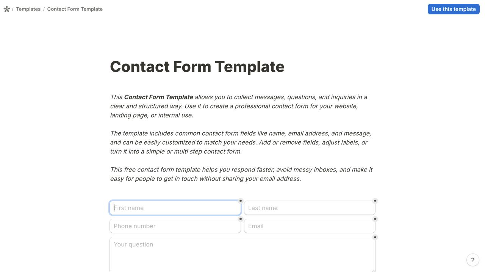
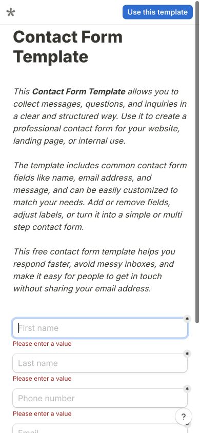

# Tally · 联系表单模板

- 标识：tally-contact
- 来源：https://tally.so/templates/contact-form-template/dnWe3O
- 研究日期：2026-10-05
- 适用范围：适合联系、问询和简短信息收集；本例是模板预览，不是完整客户业务表单。
- 证据范围：实际渲染截图、可见 DOM 样式采样及下文列明的操作；不是整站审计。
- 收录依据：补齐实际任务场景；本案例不宣称获得设计奖。

窄内容列承载说明和字段，桌面双列短字段、窄屏单列，错误紧贴对应输入。

## 视觉证据

桌面：1280×720，文档滚动坐标 (0, 0)。嵌套容器或画布的内部位置以截图为准。

窄屏：390×844，文档滚动坐标 (0, 0)。嵌套容器或画布的内部位置以截图为准。

- [补充截图：desktop-fields](screenshots/desktop-fields.jpg)：短字段双列、长答案全宽。
- [补充截图：desktop-validation](screenshots/desktop-validation.jpg)：空字段错误提示，未提交有效资料。

## 可观察的设计关系

1. **观察与分析**：桌面内容区约 700px，姓名和联系方式短字段两列，问题文本框独占整行；字段长度决定分组，避免把长答案挤进半列。
2. **观察与分析**：输入框为轻边框、8px 圆角，提交按钮黑底；视觉重量留给下一步动作，容器不再套一层重卡片。
3. **观察与分析**：空值校验在每个字段下方出现红色消息，并增加行间空间；手机短字段改为单列，错误继续跟随字段而不是只在页顶提示。

## 实测参数

以下是对应 DOM 节点的计算样式与边界盒，单位为 CSS px；只作为定位证据，不自动等于整个组件或最终图形尺寸。截图与样式先后采样，动态过渡可能存在差异。

| 状态与元素 | 字号 / 行高 | 边界盒宽×高 | 圆角 | 证据 |
| --- | --- | --- | --- | --- |
| desktop · INPUT First name | 16px / 18.4px | 345.0 × 36.0 | 8px | [elements[8]](evidence-desktop.json) |
| desktop · TEXTAREA Your question | 16px / 18.4px | 700.0 × 96.0 | 8px | [elements[12]](evidence-desktop.json) |
| mobile · INPUT First name | 16px / 18.4px | 340.0 × 36.0 | 8px | [elements[6]](evidence-mobile.json) |
| mobile · H1 Contact Form Template | 32px / 38.4px | 340.0 × 108.8 | 0px | [elements[2]](evidence-mobile.json) |

原始记录：[桌面样式](evidence-desktop.json) · [窄屏样式](evidence-mobile.json)。其他元素可能被祖先裁切、覆盖或属于隐藏状态，使用前须对照截图。

## 响应式与交互

未输入任何用户资料；点击空表单 Submit 后，各必填项出现错误文本。预览同时出现 Continue anyway，未继续。未验证成功发送、服务端校验或邮件收取。

仅验证上述两种主视口，不推断 CSS 断点。未列明的交互、键盘路径、屏幕阅读器和 WCAG 合规均未验证。

## 迁移方法（设计建议）

迁移时先删减首段说明，让用户更早看到字段。中文姓名通常无需拆姓与名；标签应常驻，不能只用 placeholder。可沿用桌面双列、手机单列与字段内联错误，提交按钮明确写“发送咨询”等结果。正式表单应阻止错误提交，不复制模板预览的跳过行为。

## 避免照搬与已知限制

本例顶部的 Use this template 属于模板工具外壳。预览允许跳过错误，不等于生产表单推荐逻辑。长说明在手机占据较多高度。

截图中的摄影、插画、商标和字体是研究证据，不是已授权的产品素材。迁移时使用自己的内容与合适授权的资源。
