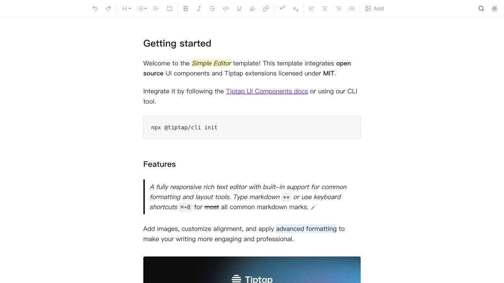
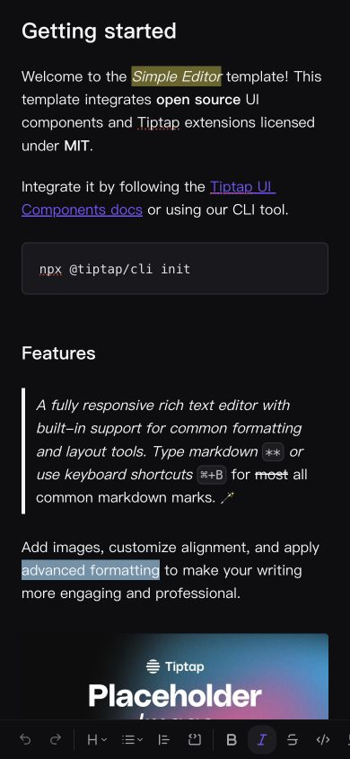

# Tiptap · 富文本编辑工作区

- 标识：tiptap-editor
- 来源：https://template.tiptap.dev/preview/templates/simple
- 研究日期：2026-10-05
- 适用范围：适合文档、笔记和内容编辑工作区；格式 UI 不等于保存、协作和权限已实现。
- 收录依据：补齐实际任务与视觉组织方式；本案例不宣称获得设计奖。
- 证据范围：实际渲染截图、可见 DOM 采样及下文列明的操作；不是整站审计。

固定格式工具条配合窄阅读列，手机工具移至底部，弹层紧邻触发位置。

## 视觉证据

桌面：1280×720，文档滚动坐标 (0, 0)。嵌套容器内部位置以截图为准。

窄屏：390×844，文档滚动坐标 (0, 0)。嵌套容器内部位置以截图为准。

窄屏主图继承深色状态；桌面主图为浅色，同主题比较请看 desktop-dark。

- [补充截图：desktop-format](screenshots/desktop-format.jpg)：标题格式菜单打开；没有改变文字格式。
- [补充截图：desktop-dark](screenshots/desktop-dark.jpg)：同一编辑工作区的深色主题。
- [补充截图：mobile-search](screenshots/mobile-search.jpg)：底部工具上方的查找/替换弹层，未执行替换。

## 可观察的设计关系

1. **观察与分析**：桌面顶部固定工具条将撤销、标题、列表、行内格式、对齐和其他操作分组，正文列约 552px 居中；操作密集，编辑内容仍保持阅读宽度。
2. **观察与分析**：正文标题 24px/36px、段落 16px/25.6px，代码与引用用局部底色或边线区分；编辑器靠文档结构组织内容，而不是所有块都套卡片。
3. **观察与分析**：点击正文使工具可用并反映光标处的格式；打开标题菜单时 Heading 1–4 就在按钮下方，菜单作用域与当前编辑位置建立联系。
4. **观察与分析**：浅色与深色状态保持相同工具顺序和内容尺寸，只调整文字、背景和分隔关系；主题变化不要求重新学习操作路径。
5. **观察与分析**：390px 下正文约 342px，两侧约 24px，工具条移至底部；搜索/替换在底部工具上方弹出，剩余工具有横向裁切，需要另行检查可发现性。

## 实测参数

以下是对应节点的计算样式与边界盒，单位为 CSS px；不是整页通用 token，也不证明触控区域或最终图形尺寸。数值应与同状态截图对照。

| 状态与元素 | 字号 / 行高 | 边界盒宽×高 | 圆角 | 证据 |
| --- | --- | --- | --- | --- |
| desktop · BUTTON Format text as heading | 14px / 16.1px | 38.0 × 32.0 | 12px | [elements[2]](evidence-desktop.json) |
| desktop · H1 Getting started | 24px / 36px | 552.0 × 36.0 | 0px | [elements[23]](evidence-desktop.json) |
| desktop · P Welcome to | 16px / 25.6px | 552.0 × 51.2 | 0px | [elements[24]](evidence-desktop.json) |
| mobile · H1 Getting started | 24px / 36px | 342.0 × 36.0 | 0px | [elements[12]](evidence-mobile.json) |

原始记录：[桌面样式](evidence-desktop.json) · [窄屏样式](evidence-mobile.json)。采样只包含部分节点，祖先裁切、覆盖、字体加载与异步状态需对照截图判断。

## 响应式与交互

点击正文聚焦编辑区后，看到格式按钮变为可用及当前格式标记；打开标题下拉并 Escape 关闭。点击主题按钮保存深色状态；手机打开 Search and replace 弹层。没有修改示例文字、查找替换、上传文件或发送内容。

仅验证上文列出的视口与操作，不推断 CSS 断点；未列明的键盘、屏幕阅读器及 WCAG 合规均未验证。

## 迁移方法（设计建议）

先挑业务真的需要的格式，不把所有按钮塞进窄屏。正文列使用 max-width，中文段落用系统字体并实测字距；工具按钮提供中文可访问名称。手机按操作频率保留核心项，低频项进入明确的更多菜单。存储状态、自动保存、撤销范围和多人冲突要由真实产品实现；没有图片上传能力时不要放一个空的上传按钮。

## 避免照搬与已知限制

这是官方 Simple Editor 模板预览，不是完整协作文档应用。32px 工具按钮属于紧凑工具 UI，不能推导触控可达性合格。手机横向工具的全部入口、软键盘遮挡、安全区、键盘快捷键、自动保存、离线和协作均未验证。

截图中的摄影、插画、商标和字体是研究证据，不是已授权的产品素材。迁移时使用自己的内容与合适授权的资源。
