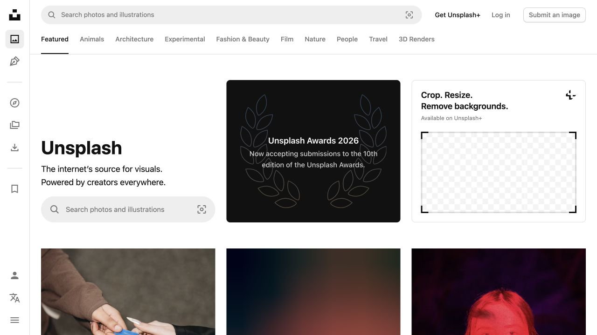
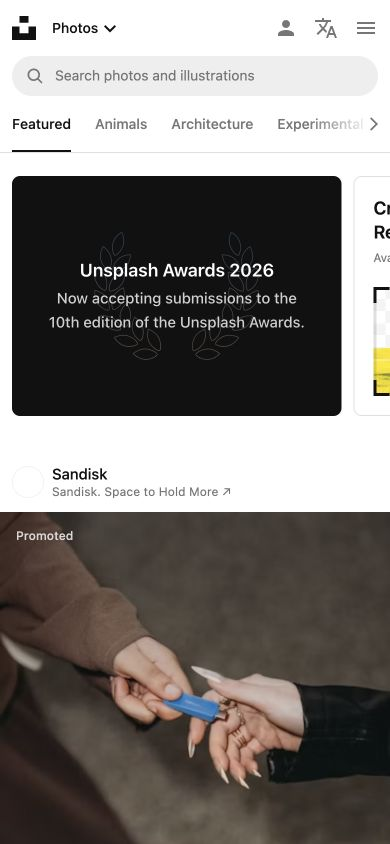

# Unsplash · 图片优先的搜索与发现

- 标识：`unsplash`
- 来源：https://unsplash.com/
- 研究日期：2026-10-05
- 范围：所列页面的局部首屏，桌面 1280×720、窄屏 390×844。
- 适合：摄影库、素材库、图库型作品展示。
- 不适合：图片质量参差或没有明确授权信息的站点。
- 素材依赖：大量高质量且权利清楚的图像及作者信息。

## 视觉证据

截图观察：桌面左侧功能栏与顶部分类导航围绕中央搜索和图像网格；窄屏收起功能栏并以内容流为主。

## 可观察的设计关系

- 搜索和分类同时存在，支持精确需求与自由探索。
- 大图网格是内容本身，界面边界和按钮尽量安静。
- 图像必须与作者、授权或下载路径相连，不能只展示漂亮缩略图。

## 实测参数

以下是指定节点的浏览器计算样式，不代表页面全局设计令牌。

| 视口 / 元素 | 字号 / 行高、字重、颜色 | 证据 |
| --- | --- | --- |
| 桌面 `h1`（internet’s source） | 18px / 28.8px，字重 400，颜色 rgb(17, 17, 17) | [桌面采样](evidence-desktop.json) |
| 窄屏 `h3`（Unsplash Awards） | 18px / 23.9999px，字重 600，颜色 rgb(255, 255, 255) | [窄屏采样](evidence-mobile.json) |

## 响应式与交互

手机首屏转为简化导航及单列发现内容；未操作搜索、收藏、下载或授权筛选。

## 迁移方法（设计建议）

建立可检索的图片标签与清楚的授权/作者信息，再选择自适应网格；图像缺失时不要以空白画廊冒充内容。

## 避免照搬与已知限制

推荐图片和活动区高度动态；桌面 H1 的 18px 是当前节点样式，不是整个首页标题系统。 本次没有做完整页面、所有断点、键盘可达性或 WCAG 审计；原站可能在研究后变更。截图、商标与作品图仅作研究证据，不作为新站资产。
