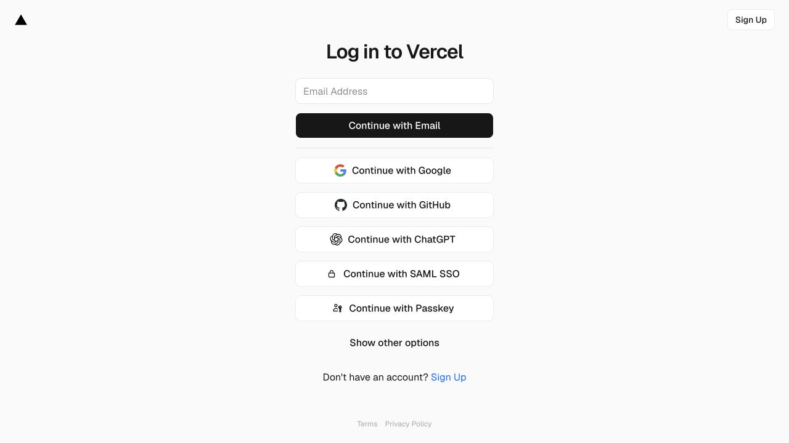
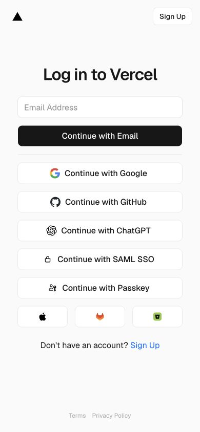

# Vercel · 登录方式选择

- 标识：vercel-login
- 来源：https://vercel.com/login
- 研究日期：2026-10-05
- 适用范围：适合工具产品登录入口；认证方式须由真实业务支持，不可为好看添加假按钮。
- 证据范围：实际渲染截图、可见 DOM 样式采样及下文列明的操作；不是整站审计。
- 收录依据：补齐实际任务场景；本案例不宣称获得设计奖。

窄列集中邮箱与第三方登录，主方式用深色按钮，备用方式渐进展开。

## 视觉证据

桌面：1280×720，文档滚动坐标 (0, 0)。嵌套容器或画布的内部位置以截图为准。

窄屏：390×844，文档滚动坐标 (0, 0)。嵌套容器或画布的内部位置以截图为准。

- [补充截图：desktop-options](screenshots/desktop-options.jpg)：展开备用登录方式后的状态。

## 可观察的设计关系

1. **观察与分析**：320px 宽表单居中，页面大部分留白；标题、邮箱和动作沿同一中轴排列，用户不会被营销内容分散。
2. **观察与分析**：邮箱按钮深色，第三方方式白底边框，组间用分隔线和间距区分；同尺寸按钮保持可比较性，权重由填充变化表达。
3. **观察与分析**：备用方式初始收起，展开后以三个紧凑图标按钮出现；390px 窄屏仍保持 320px 表单和 32px 标题，不需要把所有控件缩小。

## 实测参数

以下是对应 DOM 节点的计算样式与边界盒，单位为 CSS px；只作为定位证据，不自动等于整个组件或最终图形尺寸。截图与样式先后采样，动态过渡可能存在差异。

| 状态与元素 | 字号 / 行高 | 边界盒宽×高 | 圆角 | 证据 |
| --- | --- | --- | --- | --- |
| desktop · H1 Log in to Vercel | 32px / 40px | 222.4 × 40.0 | 0px | [elements[5]](evidence-desktop.json) |
| desktop · BUTTON Continue with Email | 16px / 24px | 320.0 × 40.0 | 8px | [elements[7]](evidence-desktop.json) |
| mobile · BUTTON Continue with Email | 16px / 24px | 320.0 × 40.0 | 8px | [elements[7]](evidence-mobile.json) |

原始记录：[桌面样式](evidence-desktop.json) · [窄屏样式](evidence-mobile.json)。其他元素可能被祖先裁切、覆盖或属于隐藏状态，使用前须对照截图。

## 响应式与交互

已展开 Show other options，出现 Apple、GitLab、Bitbucket 图标入口。没有输入账号或点击任何认证提供方；成功、失败和多因素登录未验证。

仅验证上述两种主视口，不推断 CSS 断点。未列明的交互、键盘路径、屏幕阅读器和 WCAG 合规均未验证。

## 迁移方法（设计建议）

先选一个最常用认证入口，再列真实支持的外部方式。可用本地系统字体替代 Geist，保持 16px 输入文字和充足触控高度；图标按钮仍需可访问名称。中文长按钮文案要实测宽度，错误消息预留在邮箱附近，提交后给明确加载和反馈。

## 避免照搬与已知限制

本案例只研究登录入口与备用选项，不能代表整个认证流程。页脚浅色文字的对比度未审计；品牌图标使用需遵循各自要求。

截图中的摄影、插画、商标和字体是研究证据，不是已授权的产品素材。迁移时使用自己的内容与合适授权的资源。
