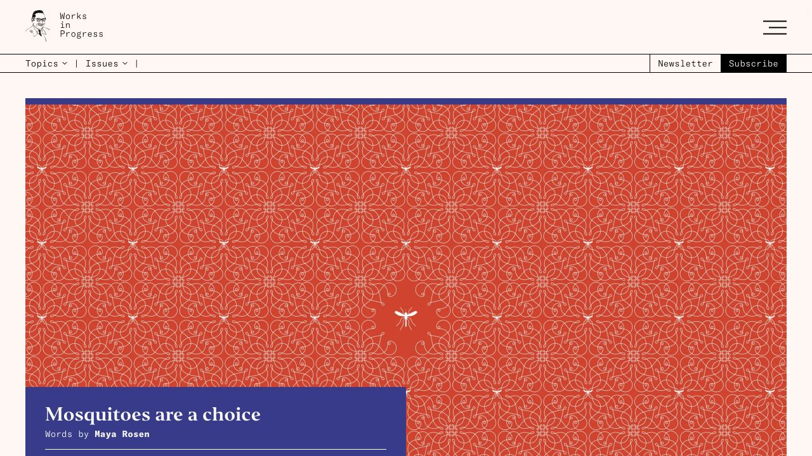
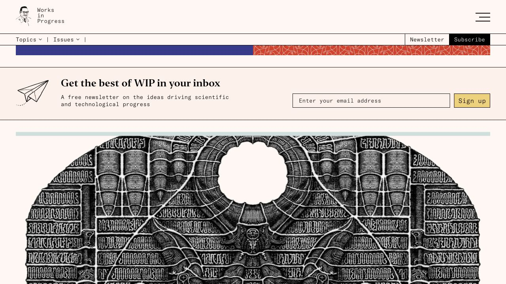
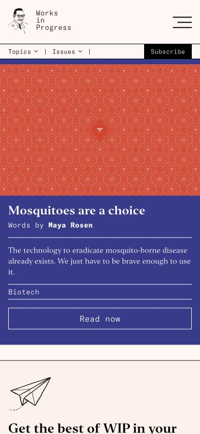
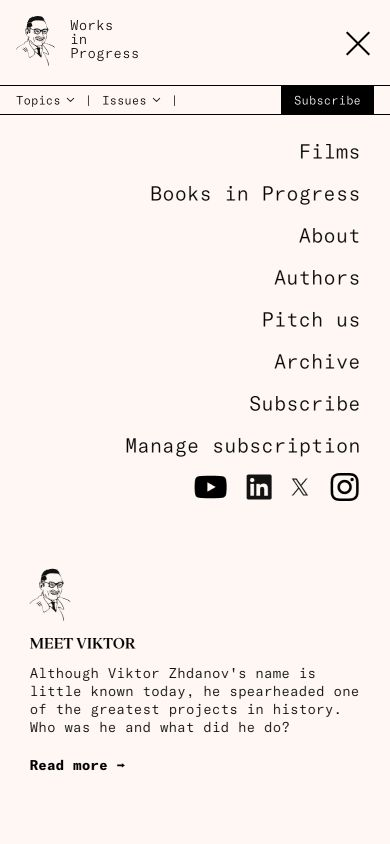

# Works in Progress · 编辑层级与纸面秩序

- 来源：https://worksinprogress.co/
- 研究日期：2026-10-04
- 范围：主页首屏、一个订阅内容区、移动菜单；桌面 1280×720、窄屏 390×844。
- 适合：研究笔记、文章合集、文化内容、专题出版与有故事的个人主页。
- 不适合：高频操作控制台；没有主次内容却机械套一个巨大的装饰封面。
- 素材依赖：原站主稿依赖插画；文字内容项目可借用标题/元信息层级和分隔方式，弱化封面面积。

## 视觉证据

桌面用通栏插画和下方/叠加的专题文字建立主稿；窄屏把图和完整说明依次堆叠。暖白底、黑色细线、衬线标题与等宽元信息构成出版感。订阅模块以横向边线与内容区分开。

## 可观察的设计关系

- 文章标题与作者/分类使用不同字形角色，不需要每项信息都放进圆角卡片。
- 分隔线贯穿版面，形成栏目与内容节奏；装饰主要由插画承担。
- 首屏专题具有明显优先级；订阅被安排为独立功能区，不混进文章正文。
- 我的判断：这种结构适合“值得停下来读”的内容。纸面颜色本身不是关键，编辑层级才是。

## 实测参数

| 元素 | 实测值 | 来源 |
| --- | --- | --- |
| BODY 底色 | rgb(255,247,244)，即 #fff7f4 | [桌面样式](evidence-desktop.json) |
| 主稿可见 H3 | `Editor-Bold, serif`；28px / 32px；CSS 字重 400 | [标题专项样式](evidence-typography.json) |
| 桌面 Topics / Issues | 14px / 18px；等宽字体角色 | [桌面样式](evidence-desktop.json) |
| 桌面主稿边距 | 左右各 40px，截图与元素位置共同确认 | 同上与截图；只适用于本次视口 |
| 内容区订阅按钮 | 背景 rgb(244,208,111)；高 36px；圆角 0 | [内容区样式](evidence-desktop-content.json) |
| 窄屏分类导航 | 12px / 15px | [窄屏样式](evidence-mobile.json) |
| 窄屏 Read now | 宽 358px；高 42px；左右各 16px | 同上 |

页面的 H1 是 1×1px 的隐藏元素，不是可见主标题。不能拿它的 48px 字号写成视觉规范。原始样式中还有屏幕右侧的隐藏菜单项目；其存在不代表关闭状态下可见。

## 响应式与交互

窄屏中图片在上，标题、作者、简介、分类与行动顺序排列在下；桌面横向订阅区在窄屏变成纵向。移动菜单已实际点击展开并关闭，展开时汉堡图标变为关闭符号，显示纵向导航。证据见移动菜单截图。

没有提交订阅、验证菜单焦点管理、完整键盘操作或 WCAG 合规；两种视口也不证明具体断点。

## 迁移方法（设计建议）

把内容区分为“本期主稿—其他笔记—作者/日期/分类”，而非每条内容等权。标题用衬线，导航和元信息用克制的无衬线或等宽字体，细线组织栏目。

中文可以用系统宋体角色（如可用的 Songti SC / SimSun）和系统黑体配对；字体缺失时回退 serif / sans-serif。正文留足行高，避免英语等宽元信息的字距直接用于长中文句子。

没有插画也可以使用原创简图或纯文字主稿，以主次和留白承接出版感。不要下载原站插画充当自己的作品。订阅没有后端时不伪造“订阅成功”，应换成真实可用的阅读/联系入口。

## 限制

仅研究首页部分区域，不是文章内页阅读体验审计。来源的主题颜色会随主稿变化，不将当期蓝紫色专题区当成整站固定品牌色。
