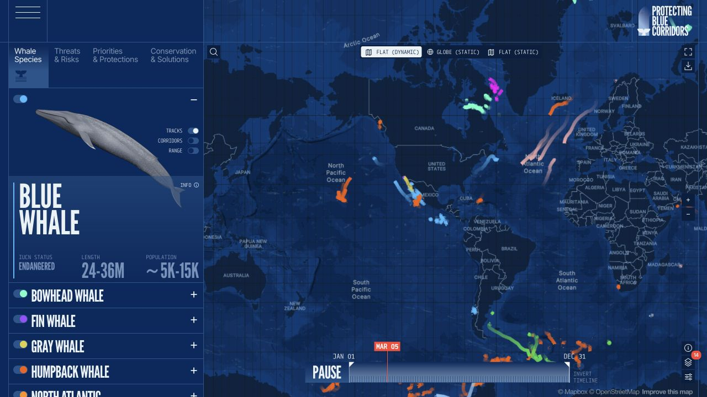
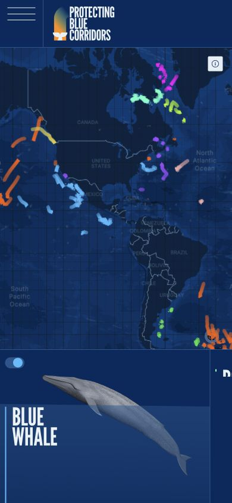

# WWF Blue Corridors · 地图数据

- 标识：wwf-blue-corridors
- 来源：https://bluecorridors.org/explore/species
- 研究日期：2026-10-05
- 适用范围：适合地理数据、生态研究及地图探索；必须有可信数据和可解释图例。
- 证据范围：实际渲染截图、可见 DOM 样式采样及下文列明的操作；不是整站审计。
- 收录依据：[2026 Webby Winner：Best Data Visualization](https://winners.webbyawards.com/2026/websites-and-mobile-sites/features-design/best-data-visualization/364937/wwf--blue-corridors)。奖项针对当时的网站作品，不等于本次子页面或最新版本单独获奖。

物种目录、迁徙图层和时间轴围绕地图组织，颜色将数据轨迹与对象关联。

## 视觉证据

桌面：1280×720，文档滚动坐标 (0, 0)。嵌套容器或画布的内部位置以截图为准。

窄屏：390×844，文档滚动坐标 (0, 0)。嵌套容器或画布的内部位置以截图为准。

- [补充截图：desktop-species](screenshots/desktop-species.jpg)：展开第二种鲸类后的侧栏。

## 可观察的设计关系

1. **观察与分析**：桌面侧栏展示物种，地图占右侧大区域；每个物种用插画、名称和少量指标建立身份，而不是在地图上堆长文本。
2. **观察与分析**：同一深蓝底让多色轨迹更醒目，颜色与物种开关相邻；视觉编码服务筛选关系，而非纯装饰。
3. **观察与分析**：时间轴贴地图底部、视图切换贴顶部，空间选择与时间选择分开；手机改成上方地图、下方物种卡，并明确功能有限。

## 实测参数

以下是对应 DOM 节点的计算样式与边界盒，单位为 CSS px；只作为定位证据，不自动等于整个组件或最终图形尺寸。截图与样式先后采样，动态过渡可能存在差异。

| 状态与元素 | 字号 / 行高 | 边界盒宽×高 | 圆角 | 证据 |
| --- | --- | --- | --- | --- |
| desktop · H2 BLUE WHALE | 60px / 48px | 111.2 × 96.0 | 0px | [elements[9]](evidence-desktop.json) |
| mobile · H2 BLUE WHALE | 41.6px / 33.28px | 104.0 × 66.6 | 0px | [elements[3]](evidence-mobile.json) |
| desktop · BUTTON Toggle Navigation | 13.3333px / normal | 70.0 × 76.0 | 0px | [elements[0]](evidence-desktop.json) |

原始记录：[桌面样式](evidence-desktop.json) · [窄屏样式](evidence-mobile.json)。其他元素可能被祖先裁切、覆盖或属于隐藏状态，使用前须对照截图。

## 响应式与交互

已展开 Bowhead Whale，侧栏出现该物种的图像和图层控制。动态时间轴可见；没有逐一核对轨迹数据、导出、投影模式或所有开关。

仅验证上述两种主视口，不推断 CSS 断点。未列明的交互、键盘路径、屏幕阅读器和 WCAG 合规均未验证。

## 迁移方法（设计建议）

先设计数据对象、颜色映射和图层层级，再布置地图控件。无地理数据时不要复制空地图，可转为区域列表和摘要图。中文物种名需要重新分配宽度；给小开关扩大点击区域，并让图例能解释颜色而不只依靠色觉。

## 避免照搬与已知限制

移动 DOM 明示 MOBILE VIEW - LIMITED FUNCTIONALITY。截图是动态地图瞬间，不能用来推断数据正确性；部分图标/图像替代文本不足，不能因获奖就宣称无障碍合格。

截图中的摄影、插画、商标和字体是研究证据，不是已授权的产品素材。迁移时使用自己的内容与合适授权的资源。
