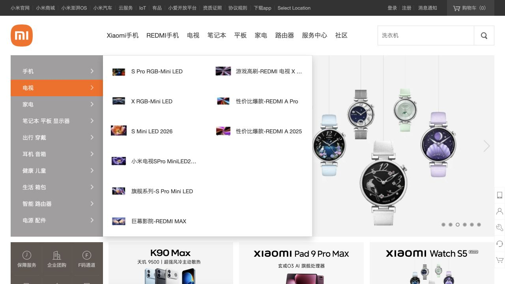
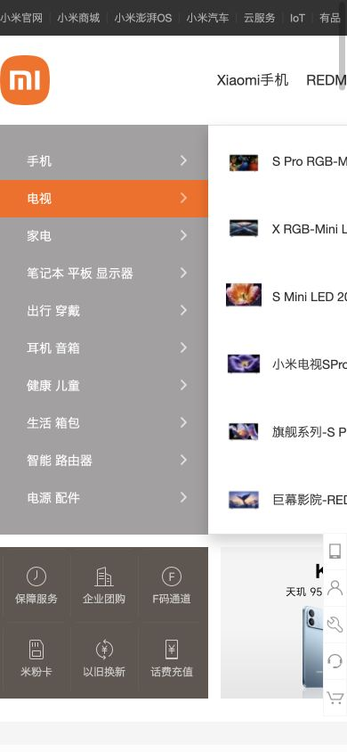

# 小米商城 · 中文商品目录

- 标识：xiaomi-shop
- 来源：https://www.mi.com/shop
- 研究日期：2026-10-05
- 适用范围：适合中文桌面商城和多品类目录；当前窄屏快照存在裁切，不作为移动范本。
- 证据范围：实际渲染截图、可见 DOM 样式采样及下文列明的操作；不是整站审计。
- 收录依据：补齐实际任务场景；本案例不宣称获得设计奖。

三级入口和统一商品网格支撑大量品类，橙色集中标记价格与当前分类。

## 视觉证据

桌面：1280×720，文档滚动坐标 (0, 0)。嵌套容器或画布的内部位置以截图为准。

窄屏：390×844，文档滚动坐标 (0, 0)。嵌套容器或画布的内部位置以截图为准。

- [补充截图：desktop-products](screenshots/desktop-products.jpg)：专区商品网格与橙色价格层级。

## 可观察的设计关系

1. **观察与分析**：最上方细密站群链接、主产品导航、左侧品类目录各占一层；高密度入口按范围分层，避免全部挤成一排。
2. **观察与分析**：分类展开区用小商品图配短名称，主体专区则用更大的统一商品图和独立价格；选类别与选具体商品使用不同展示密度。
3. **观察与分析**：专区标题 22px，商品名 14px，价格用橙色而非再放大；在白底商品格和浅灰区块之间建立可扫描的商业节奏。

## 实测参数

以下是对应 DOM 节点的计算样式与边界盒，单位为 CSS px；只作为定位证据，不自动等于整个组件或最终图形尺寸。截图与样式先后采样，动态过渡可能存在差异。

| 状态与元素 | 字号 / 行高 | 边界盒宽×高 | 圆角 | 证据 |
| --- | --- | --- | --- | --- |
| desktop · A 小米商城 | 12px / 40px | 48.0 × 40.0 | 0px | [elements[1]](evidence-desktop.json) |
| desktop-products · H2 智能穿戴 | 22px / 58px | 1226.0 × 58.0 | 0px | [elements[17]](evidence-desktop-products.json) |
| desktop-products · H3 REDMI 头戴降噪耳机 | 14px / 21px | 214.0 × 21.0 | 0px | [elements[20]](evidence-desktop-products.json) |

原始记录：[桌面样式](evidence-desktop.json) · [窄屏样式](evidence-mobile.json)。其他元素可能被祖先裁切、覆盖或属于隐藏状态，使用前须对照截图。

## 响应式与交互

滚动查看智能穿戴专区，指针经过电视类时分类面板展开，截图保留该状态。未搜索、登录、加购或支付。

仅验证上述两种主视口，不推断 CSS 断点。未列明的交互、键盘路径、屏幕阅读器和 WCAG 合规均未验证。

## 迁移方法（设计建议）

先整理商品分类和统一图片比例，再做专区。中文商品名建议限制两行，卖点次要化，价格和单位独立。少量商品不必保留多层导航。手机应重新设计两列卡片和抽屉分类；不能用固定桌面宽度加横向裁切交付。

## 避免照搬与已知限制

390px 下仍显示宽桌面布局，导航和内容被截断；这只是桌面浏览器改视口，不代表独立移动站或 App。轮播自动变化，价格及型号为当时页面数据。

截图中的摄影、插画、商标和字体是研究证据，不是已授权的产品素材。迁移时使用自己的内容与合适授权的资源。
